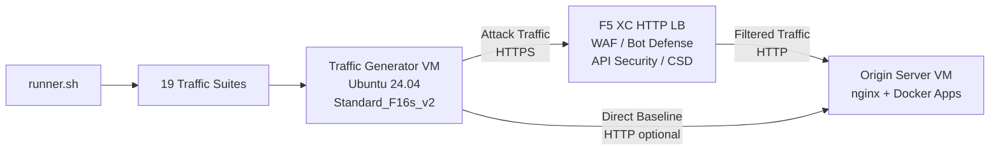

## الغرض

يوفر هذا المكون منصة آلية لتوليد حركة المرور تنتج حركة مرور هجومية، ومسحاً استكشافياً، ومحاكاة للروبوتات، وإساءة استخدام واجهات API ضد موازن تحميل HTTP في F5 Distributed Cloud. وهو يمثل "المهاجم" في بنية العرض التوضيحي النموذجية -- أي مصدر حركة المرور الخبيثة والمشبوهة التي صُممت ميزات أمان F5 XC لاكتشافها وحظرها.

في بنية العرض التوضيحي:

```
Traffic Generator VM -> F5 XC HTTP LB (WAF/Bot/API/CSD) -> Origin Server VM
```

يرسل مولد حركة المرور الطلبات إلى FQDN العام لموازن تحميل F5 XC. تقوم منصة F5 XC بفحص وتصفية حركة المرور قبل إعادة توجيه الطلبات المشروعة إلى خادم الأصل. ثم يراجع المشغل سجلات أحداث أمان F5 XC لإظهار الاكتشاف والتطبيق.

## البنية المعمارية



يعمل جهاز مولد حركة المرور الافتراضي على Azure مع:

- **Ubuntu 24.04 LTS** كصورة أساسية
- **أكثر من 50 أداة أمان** مثبتة عبر cloud-init أثناء التهيئة
- **19 مجموعة حركة مرور منظمة** مع نصوص برمجية مرقمة تُنفذ بالترتيب
- **runner.sh** كمنسق لتنفيذ المجموعات مع تسجيل النتائج
- **config.env** لتكوين الهدف (FQDN، عنوان IP لخادم الأصل)

## فئات الأدوات

| الفئة | الأدوات | الغرض |
|---|---|---|
| اختبار تطبيقات الويب | nikto, sqlmap, nuclei, dalfox, ffuf, gobuster, feroxbuster, dirb, whatweb | توليد حمولات هجوم WAF |
| تحليل الشبكة | nmap, masscan, tshark, hping3, tcpdump, netcat, ngrep, iperf3, mtr | الاستكشاف وفحص الشبكة |
| اعتراض وتوكيل | mitmproxy, socat | اعتراض حركة المرور والتلاعب بها |
| اختبار SSL/TLS | sslscan, sslyze, testssl.sh | مسح تكوين TLS |
| أتمتة المتصفح | playwright, puppeteer, puppeteer-extra-plugin-stealth | محاكاة الروبوتات باستخدام Chrome بدون واجهة |
| النطاقات الفرعية وDNS | subfinder, httpx, amass, dnsrecon, fierce, whois, dnsutils | الاستكشاف والتعداد |
| اختبار بيانات الاعتماد | hydra, medusa, ncrack | محاكاة هجمات المصادقة |
| اختبار تجاوز WAF | gotestwaf, waf-bypass, wfuzz | تجاوز الترميز متعدد الطبقات وتقييم تجاوز WAF |
| أطر الاستغلال | ZAP, Metasploit (المستوى الكامل فقط) | فحص شامل للثغرات الأمنية |

## مستويات التثبيت

يدعم مولد حركة المرور مستويين للتثبيت يتم التحكم بهما عبر متغير Terraform المسمى `tool_tier`:

### المستوى القياسي (الافتراضي)

يثبت جميع الأدوات المدرجة في كتالوج الأدوات باستثناء ZAP وMetasploit. تكتمل التهيئة في 15-20 دقيقة. يغطي هذا المستوى جميع مجموعات حركة المرور الـ 19 وهو كافٍ لمعظم سيناريوهات العرض التوضيحي.

### المستوى الكامل

يضيف OWASP ZAP وMetasploit Framework فوق المستوى القياسي. تستغرق التهيئة حوالي 25 دقيقة. هذه الأدوات كبيرة الحجم (ZAP حوالي 500 ميبي بايت، Metasploit حوالي 1 جيبي بايت) وتكون مطلوبة فقط لعروض فحص الثغرات المتقدمة.

راجع حاسبة أسعار Azure للاطلاع على تكاليف الأجهزة الافتراضية الحالية. النوع الافتراضي Standard_F16s_v2 هو مثيل محسّن للحوسبة مناسب لتوليد حركة مرور مستدامة.

:::tip
استخدم `terraform destroy` عندما لا يكون المختبر قيد الاستخدام لتجنب الرسوم المستمرة. راجع [إيقاف التشغيل](../08-teardown/) للاطلاع على الإجراء.
:::

## نقاط التكامل

يتكامل هذا المكون مع مكونين آخرين في العرض التوضيحي:

- **خادم الأصل** -- الخادم الخلفي المستهدف الذي يستضيف Juice Shop وDVWA وVAmPI وhttpbin وwhoami. يرسل مولد حركة المرور حركة مرور هجومية عبر F5 XC للوصول إلى هذه التطبيقات. راجع [التكامل](../07-integrate/) للاطلاع على تفاصيل البنية الكاملة.

- **عرض CSD التوضيحي** -- تطبيق العرض التوضيحي لدفاع جانب العميل على خادم الأصل. تولد مجموعة حركة المرور `javascript-exploits` حمولات حقن نصوص برمجية بأسلوب Magecart يكتشفها دفاع جانب العميل في F5 XC. يتحقق هذا من وظائف CSD المرحلة 2.

## تصميم المكونات المعيارية

كل مكون في المختبر مستقل بذاته ويُنشر بشكل مستقل:

- **مولد حركة المرور** (هذا المكون) يوفر مصدر الهجوم
- **خادم الأصل** يوفر أهداف التطبيقات المعرضة للثغرات
- **محاكي CDN** يوفر طبقة التخزين المؤقت لحافة CDN (اختياري)
- **تكوين F5 XC** يوفر سياسات WAF وBot Defense وAPI Security وCSD

يقوم المشغل البشري أو المساعد بالذكاء الاصطناعي بإضافة المكونات واحداً تلو الآخر. انشر خادم الأصل أولاً، ثم قم بتكوين F5 XC أمامه، ثم انشر مولد حركة المرور مستهدفاً FQDN لموازن تحميل F5 XC.
