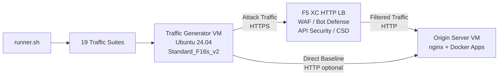

## الغرض

يوفر هذا المكوّن منصة آلية لتوليد حركة المرور تنتج حركة مرور هجومية، وعمليات مسح استطلاعية، ومحاكاة للبوتات، وإساءة استخدام واجهات API ضد موازن تحميل HTTP في F5 Distributed Cloud. وهو يمثل "المهاجم" في بنية العرض التوضيحي النموذجية -- مصدر حركة المرور الخبيثة والمشبوهة التي صُممت ميزات أمان F5 XC لاكتشافها وحظرها.

في بنية العرض التوضيحي:

```
Traffic Generator VM -> F5 XC HTTP LB (WAF/Bot/API/CSD) -> Origin Server VM
```

يرسل مولّد حركة المرور الطلبات إلى FQDN العام لموازن تحميل F5 XC. تقوم منصة F5 XC بفحص وتصفية حركة المرور قبل إعادة توجيه الطلبات المشروعة إلى خادم الأصل. ثم يراجع المشغّل سجلات أحداث الأمان في F5 XC لإثبات قدرات الاكتشاف والتنفيذ.

## البنية المعمارية



يعمل جهاز مولّد حركة المرور الافتراضي على Azure مع:

- **Ubuntu 24.04 LTS** كصورة أساسية
- **أكثر من 50 أداة أمنية** مثبتة عبر cloud-init أثناء التوفير
- **19 مجموعة حركة مرور منظمة** مع نصوص برمجية مرقّمة تُنفَّذ بالترتيب
- **runner.sh** كمنسّق لتنفيذ المجموعات مع تسجيل النتائج
- **config.env** لتكوين الهدف (FQDN، عنوان IP للأصل)

## فئات الأدوات

| الفئة | الأدوات | الغرض |
|---|---|---|
| اختبار تطبيقات الويب | nikto, sqlmap, nuclei, dalfox, ffuf, gobuster, feroxbuster, dirb, whatweb | توليد حمولات هجوم WAF |
| تحليل الشبكات | nmap, masscan, tshark, hping3, tcpdump, netcat, ngrep, iperf3, mtr | الاستطلاع وفحص الشبكة |
| MITM والوكيل | mitmproxy, socat | اعتراض حركة المرور والتلاعب بها |
| اختبار SSL/TLS | sslscan, sslyze, testssl.sh | مسح تكوين TLS |
| أتمتة المتصفح | playwright, puppeteer, puppeteer-extra-plugin-stealth | محاكاة البوتات باستخدام Chrome بدون واجهة |
| النطاقات الفرعية وDNS | subfinder, httpx, amass, dnsrecon, fierce, whois, dnsutils | الاستطلاع والتعداد |
| اختبار بيانات الاعتماد | hydra, medusa, ncrack | محاكاة هجمات المصادقة |
| اختبار تجاوز WAF | gotestwaf, waf-bypass, wfuzz | التجاوز بالترميز متعدد الطبقات وتقييم تجاوز WAF |
| أطر الاستغلال | ZAP, Metasploit (المستوى الكامل فقط) | فحص شامل للثغرات الأمنية |

## مستويات التثبيت

يدعم مولّد حركة المرور مستويين من التثبيت يتم التحكم بهما عبر متغير Terraform المسمى `tool_tier`:

### المستوى القياسي (الافتراضي)

يقوم بتثبيت جميع الأدوات المدرجة في كتالوج الأدوات باستثناء ZAP وMetasploit. يكتمل التوفير خلال 15-20 دقيقة. يغطي هذا المستوى جميع مجموعات حركة المرور الـ19 وهو كافٍ لمعظم سيناريوهات العرض التوضيحي.

### المستوى الكامل

يضيف OWASP ZAP وMetasploit Framework فوق المستوى القياسي. يستغرق التوفير حوالي 25 دقيقة. هذه الأدوات كبيرة الحجم (ZAP حوالي 500 ميبي بايت، Metasploit حوالي 1 جيبي بايت) وتكون مطلوبة فقط لعروض فحص الثغرات المتقدمة.

راجع حاسبة أسعار Azure للاطلاع على تكاليف الأجهزة الافتراضية الحالية. الإعداد الافتراضي Standard_F16s_v2 هو مثيل محسّن للحوسبة ومناسب لتوليد حركة المرور المستدامة.

:::tip
استخدم `terraform destroy` عندما لا يكون المختبر قيد الاستخدام لتجنب الرسوم المستمرة. راجع [الإزالة](../08-teardown/) للاطلاع على الإجراء.
:::

## نقاط التكامل

يتكامل هذا المكوّن مع مكوّنين آخرين من مكوّنات العرض التوضيحي:

- **خادم الأصل** -- الخادم الخلفي المستهدف الذي يستضيف Juice Shop وDVWA وVAmPI وhttpbin وwhoami. يرسل مولّد حركة المرور حركة المرور الهجومية عبر F5 XC للوصول إلى هذه التطبيقات. راجع [التكامل](../07-integrate/) للاطلاع على تفاصيل البنية الكاملة.

- **عرض CSD التوضيحي** -- تطبيق عرض Client-Side Defense التوضيحي على خادم الأصل. تقوم مجموعة حركة المرور `javascript-exploits` بتوليد حمولات حقن نصوص برمجية بأسلوب Magecart التي يكتشفها F5 XC Client-Side Defense. يتحقق هذا من وظائف المرحلة الثانية من CSD.

## تصميم المكوّنات المعيارية

كل مكوّن في المختبر مستقل بذاته ويُنشر بشكل مستقل:

- **مولّد حركة المرور** (هذا المكوّن) يوفر مصدر الهجوم
- **خادم الأصل** يوفر أهداف التطبيقات المعرّضة للثغرات
- **محاكي CDN** يوفر طبقة التخزين المؤقت لحافة CDN (اختياري)
- **تكوين F5 XC** يوفر سياسات WAF وBot Defense وAPI Security وCSD

يقوم المشغّل البشري أو المساعد الذكي بإضافة المكوّنات واحدًا تلو الآخر. قم بنشر خادم الأصل أولاً، ثم قم بتكوين F5 XC أمامه، ثم قم بنشر مولّد حركة المرور الذي يستهدف FQDN لموازن تحميل F5 XC.
