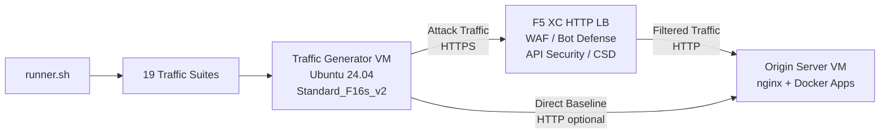

## الغرض

يوفر هذا المكون منصة أتمتة لتوليد حركة المرور تنتج حركة مرور هجومية وعمليات مسح استطلاعية ومحاكاة للبوتات وإساءة استخدام API ضد موازن تحميل HTTP الخاص بـ F5 Distributed Cloud. وهو يمثل دور "المهاجم" في بنية العرض التوضيحي النموذجية -- المصدر الذي تنبع منه حركة المرور الضارة والمشبوهة التي تم تصميم ميزات الأمان في F5 XC للكشف عنها وحجبها.

في بنية العرض التوضيحي:

```
Traffic Generator VM -> F5 XC HTTP LB (WAF/Bot/API/CSD) -> Origin Server VM
```

يرسل مولد حركة المرور الطلبات إلى FQDN العام لموازن تحميل F5 XC. تقوم منصة F5 XC بفحص حركة المرور وتصفيتها قبل إعادة توجيه الطلبات المشروعة إلى خادم المصدر. يقوم المشغل بعد ذلك بمراجعة سجلات أحداث الأمان في F5 XC لإثبات الكشف والتطبيق.

## البنية المعمارية



يعمل جهاز VM الخاص بمولد حركة المرور على Azure مع:

- **Ubuntu 24.04 LTS** كصورة أساسية
- **أكثر من 50 أداة أمان** مثبتة عبر cloud-init أثناء التوفير
- **19 مجموعة حركة مرور منظمة** مع نصوص برمجية مرقمة تُنفَّذ بالترتيب
- **runner.sh** كمنسق لتنفيذ المجموعات مع تسجيل النتائج
- **config.env** لتكوين الهدف (FQDN، عنوان IP للمصدر)

## فئات الأدوات

| الفئة | الأدوات | الغرض |
|---|---|---|
| اختبار تطبيقات الويب | nikto, sqlmap, nuclei, dalfox, ffuf, gobuster, feroxbuster, dirb, whatweb | توليد حمولات هجوم WAF |
| تحليل الشبكة | nmap, masscan, tshark, hping3, tcpdump, netcat, ngrep, iperf3, mtr | الاستطلاع وفحص الشبكة |
| الوكيل والاعتراض في المنتصف | mitmproxy, socat | اعتراض حركة المرور والتلاعب بها |
| اختبار SSL/TLS | sslscan, sslyze, testssl.sh | فحص تكوين TLS |
| أتمتة المتصفح | playwright, puppeteer, puppeteer-extra-plugin-stealth | محاكاة البوت مع Chrome بدون واجهة |
| النطاقات الفرعية وDNS | subfinder, httpx, amass, dnsrecon, fierce, whois, dnsutils | الاستطلاع والتعداد |
| اختبار بيانات الاعتماد | hydra, medusa, ncrack | محاكاة هجمات المصادقة |
| اختبار التحايل على WAF | gotestwaf, waf-bypass, wfuzz | التحايل متعدد الطبقات بالترميز وتقييم تجاوز WAF |
| أطر الاستغلال | ZAP, Metasploit (الطبقة الكاملة فقط) | فحص شامل للثغرات الأمنية |

## التثبيت متدرج المستويات

يدعم مولد حركة المرور مستويَي تثبيت يتحكم فيهما متغير Terraform المسمى `tool_tier`:

### المستوى القياسي (الافتراضي)

يثبت جميع الأدوات المدرجة في كتالوج الأدوات باستثناء ZAP وMetasploit. يكتمل التوفير في غضون 15-20 دقيقة. يغطي هذا المستوى جميع مجموعات حركة المرور الـ 19 وهو كافٍ لمعظم سيناريوهات العرض التوضيحي.

### المستوى الكامل

يضيف OWASP ZAP وMetasploit Framework فوق المستوى القياسي. يستغرق التوفير ما يقارب 25 دقيقة. هذه الأدوات كبيرة الحجم (ZAP ~500 ميجابايت، Metasploit ~1 جيجابايت) ولا تكون مطلوبة إلا في عروض الفحص المتقدم للثغرات الأمنية.

راجع حاسبة أسعار Azure للاطلاع على تكاليف VM الحالية. الإصدار الافتراضي Standard_F16s_v2 هو نموذج محسّن للحوسبة ومناسب لتوليد حركة مرور مستمرة.

:::tip
استخدم `terraform destroy` عند عدم استخدام المختبر لتجنب الرسوم المستمرة. راجع [التفكيك](../08-teardown/) للاطلاع على الإجراء.
:::

## نقاط التكامل

يتكامل هذا المكون مع مكوني العرض التوضيحي الآخرين:

- **خادم المصدر** -- الواجهة الخلفية المستهدفة التي تستضيف Juice Shop وDVWA وVAmPI وhttpbin وwhoami. يرسل مولد حركة المرور حركة مرور الهجوم عبر F5 XC للوصول إلى هذه التطبيقات. راجع [التكامل](../07-integrate/) للاطلاع على تفاصيل البنية الكاملة.

- **عرض CSD التوضيحي** -- تطبيق العرض التوضيحي للدفاع من جهة العميل على خادم المصدر. تولد مجموعة حركة المرور `javascript-exploits` حمولات حقن نصوص برمجية على غرار Magecart، والتي يكشف عنها الدفاع من جهة العميل في F5 XC. يتحقق هذا من وظائف CSD في المرحلة الثانية.

## تصميم المكونات المعيارية

كل مكون من مكونات المختبر مكتفٍ بذاته ومنشور بصورة مستقلة:

- **مولد حركة المرور** (هذا المكون) يوفر مصدر الهجوم
- **خادم المصدر** يوفر أهداف التطبيقات الضعيفة
- **محاكي CDN** يوفر طبقة التخزين المؤقت على حافة شبكة CDN (اختياري)
- **تكوين F5 XC** يوفر سياسات جدار حماية تطبيقات الويب (WAF) ودفاع Bot وأمان API وCSD

يضيف المشغل البشري أو مساعد الذكاء الاصطناعي المكونات واحدًا في كل مرة. انشر خادم المصدر أولاً، ثم قم بتكوين F5 XC أمامه، ثم انشر مولد حركة المرور مستهدفاً FQDN موازن تحميل F5 XC.
