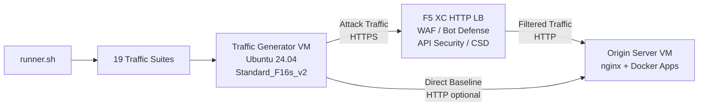

## الغرض

يوفر هذا المكون منصة آلية لتوليد حركة المرور تنتج حركة هجومية، وعمليات استطلاع، ومحاكاة بوتات، وإساءة استخدام واجهات برمجة التطبيقات ضد موازن تحميل HTTP في F5 Distributed Cloud. وهو يمثل دور "المهاجم" في بنية العرض التوضيحي النموذجية -- أي مصدر حركة المرور الخبيثة والمشبوهة التي صُممت ميزات الأمان في F5 XC لاكتشافها وحظرها.

في بنية العرض التوضيحي:

```
Traffic Generator VM -> F5 XC HTTP LB (WAF/Bot/API/CSD) -> Origin Server VM
```

يرسل مولد حركة المرور الطلبات إلى اسم النطاق المؤهل بالكامل (FQDN) العام لموازن تحميل F5 XC. تقوم منصة F5 XC بفحص وتصفية حركة المرور قبل إعادة توجيه الطلبات المشروعة إلى الخادم الأصلي. ثم يقوم المشغّل بمراجعة سجلات أحداث الأمان في F5 XC لإظهار قدرات الاكتشاف والتطبيق.

## البنية المعمارية



يعمل الجهاز الافتراضي لمولد حركة المرور على Azure مع:

- **Ubuntu 24.04 LTS** كصورة أساسية
- **أكثر من 50 أداة أمان** مثبتة عبر cloud-init أثناء التهيئة
- **19 مجموعة حركة مرور منظمة** مع سكربتات مرقمة تُنفذ بالترتيب
- **runner.sh** كمنسق لتنفيذ المجموعات مع تسجيل النتائج
- **config.env** لتكوين الهدف (FQDN، عنوان IP للخادم الأصلي)

## فئات الأدوات

| الفئة | الأدوات | الغرض |
|---|---|---|
| اختبار تطبيقات الويب | nikto, sqlmap, nuclei, dalfox, ffuf, gobuster, feroxbuster, dirb, whatweb | توليد حمولات هجومية لجدار حماية تطبيقات الويب |
| تحليل الشبكات | nmap, masscan, tshark, hping3, tcpdump, netcat, ngrep, iperf3, mtr | الاستطلاع وفحص الشبكات |
| اعتراض وتوسيط الحركة | mitmproxy, socat | اعتراض حركة المرور والتلاعب بها |
| اختبار SSL/TLS | sslscan, sslyze, testssl.sh | فحص تكوين TLS |
| أتمتة المتصفح | playwright, puppeteer, puppeteer-extra-plugin-stealth | محاكاة البوتات باستخدام Chrome بدون واجهة |
| النطاقات الفرعية وDNS | subfinder, httpx, amass, dnsrecon, fierce, whois, dnsutils | الاستطلاع والتعداد |
| اختبار بيانات الاعتماد | hydra, medusa, ncrack | محاكاة هجمات المصادقة |
| اختبار تجاوز WAF | gotestwaf, waf-bypass, wfuzz | التجاوز بالترميز متعدد الطبقات وتقييم تجاوز WAF |
| أطر الاستغلال | ZAP, Metasploit (المستوى الكامل فقط) | فحص شامل للثغرات الأمنية |

## مستويات التثبيت

يدعم مولد حركة المرور مستويي تثبيت يتم التحكم بهما عبر متغير Terraform المسمى `tool_tier`:

### المستوى القياسي (الافتراضي)

يثبت جميع الأدوات المدرجة في كتالوج الأدوات باستثناء ZAP وMetasploit. يكتمل التهيئة في 15-20 دقيقة. يغطي هذا المستوى جميع مجموعات حركة المرور الـ 19 وهو كافٍ لمعظم سيناريوهات العرض التوضيحي.

### المستوى الكامل

يضيف OWASP ZAP وMetasploit Framework فوق المستوى القياسي. تستغرق التهيئة حوالي 25 دقيقة. هذه الأدوات كبيرة الحجم (ZAP حوالي 500 ميبي بايت، Metasploit حوالي 1 جيبي بايت) ولا تُحتاج إلا لعروض فحص الثغرات المتقدمة.

راجع حاسبة أسعار Azure للتعرف على تكاليف الأجهزة الافتراضية الحالية. الجهاز الافتراضي الافتراضي Standard_F16s_v2 هو مثيل محسّن للحوسبة ومناسب لتوليد حركة المرور المستدامة.

:::tip
استخدم `terraform destroy` عندما لا يكون المختبر قيد الاستخدام لتجنب الرسوم المستمرة. راجع [الإزالة](../08-teardown/) للاطلاع على الإجراء.
:::

## نقاط التكامل

يتكامل هذا المكون مع مكونين آخرين في العرض التوضيحي:

- **الخادم الأصلي** -- الخلفية المستهدفة التي تستضيف Juice Shop وDVWA وVAmPI وhttpbin وwhoami. يرسل مولد حركة المرور حركة هجومية عبر F5 XC للوصول إلى هذه التطبيقات. راجع [التكامل](../07-integrate/) للاطلاع على تفاصيل البنية الكاملة.

- **عرض CSD التوضيحي** -- تطبيق العرض التوضيحي للدفاع من جهة العميل على الخادم الأصلي. تولد مجموعة حركة المرور `javascript-exploits` حمولات حقن سكربتات بأسلوب Magecart التي يكتشفها نظام الدفاع من جهة العميل في F5 XC. وهذا يتحقق من وظائف المرحلة الثانية من CSD.

## تصميم المكونات المعيارية

كل مكون في المختبر مستقل بذاته ويُنشر بشكل مستقل:

- **مولد حركة المرور** (هذا المكون) يوفر مصدر الهجوم
- **الخادم الأصلي** يوفر أهداف التطبيقات المعرضة للثغرات
- **محاكي CDN** يوفر طبقة التخزين المؤقت لحافة CDN (اختياري)
- **تكوين F5 XC** يوفر سياسات WAF وBot Defense وAPI Security وCSD

يضيف المشغّل البشري أو المساعد الذكي المكونات واحداً تلو الآخر. قم بنشر الخادم الأصلي أولاً، ثم قم بتكوين F5 XC أمامه، ثم قم بنشر مولد حركة المرور مستهدفاً اسم النطاق المؤهل بالكامل (FQDN) لموازن تحميل F5 XC.
