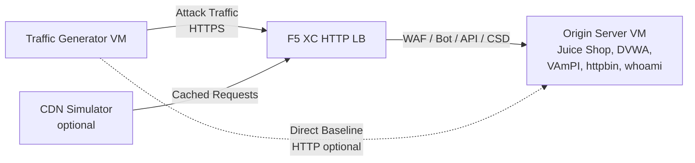

## المعمارية الكاملة

مولد حركة المرور هو أحد المكونات في بيئة عرض توضيحي متعددة الطبقات. المعمارية الكاملة عند نشر جميع المكونات:

```
Traffic Generator -> F5 XC HTTP LB (WAF/Bot/API/CSD) -> Origin Server
                         |
               CDN Simulator (optional)
```



يتم نشر كل مكون وتكوينه بشكل مستقل عبر Terraform. يستهدف مولد حركة المرور الاسم المؤهل بالكامل (FQDN) لموازن تحميل F5 XC، وليس خادم المصدر مباشرةً.

## تكامل خادم المصدر

يوفر [خادم المصدر](https://f5xc-salesdemos.github.io/origin-server/) تطبيقات الواجهة الخلفية التي تستهدفها مجموعات هجوم مولد حركة المرور:

| مجموعة حركة المرور | تطبيق المصدر | المسار |
|---|---|---|
| api-attacks | VAmPI | `/vampi/` |
| bot-simulation | جميع التطبيقات | جميع المسارات |
| cdn-load-testing | محاكي CDN | نقطة نهاية CDN |
| crapi-exploits | crAPI | `/crapi/` |
| csd-demo-attacks | عرض CSD التوضيحي | `/csd-demo/` |
| dvga-exploits | DVGA | `/dvga/` |
| dvwa-exploits | DVWA | `/dvwa/` |
| javascript-exploits | عرض CSD التوضيحي | `/csd-demo/` |
| juice-shop-exploits | Juice Shop | `/juice-shop/` |
| mitre-attack | جميع التطبيقات | جميع المسارات |
| owasp-scanning | جميع التطبيقات | جميع المسارات |
| performance-testing | جميع التطبيقات | جميع المسارات |
| reconnaissance | جميع التطبيقات | جميع المسارات |
| restaurant-exploits | Restaurant API | `/restaurant/` |
| ssl-scanning | موازن تحميل F5 XC (وليس المصدر مباشرةً) | غير متاح |
| traffic-generation | جميع التطبيقات | جميع المسارات |
| web-app-attacks | Juice Shop, DVWA | `/juice-shop/`, `/dvwa/` |

### ترتيب النشر

1. انشر **خادم المصدر** أولاً -- فهو يوفر تطبيقات الواجهة الخلفية
2. قم بتكوين **موازن تحميل HTTP في F5 XC** مع خادم المصدر كمجموعة مصدر
3. أرفق سياسات **جدار حماية تطبيقات الويب (WAF)، ودفاع Bot، وأمان API، وCSD** بموازن التحميل
4. انشر **مولد حركة المرور** مع تعيين `target_fqdn` على نطاق موازن تحميل F5 XC

### تكوين الاستهداف

يربط ملف `config.env` الخاص بمولد حركة المرور المكوّن ببقية المعمارية:

```bash
# Target the F5 XC load balancer (traffic passes through security policies)
TARGET_FQDN=demo.example.com

# Optional: target the origin server directly (bypasses F5 XC)
TARGET_ORIGIN_IP=20.10.5.100
```

عند تعيين `TARGET_FQDN`، ترسل جميع نصوص المجموعات حركة المرور إلى `https://<TARGET_FQDN>/...`. يتلقى موازن تحميل F5 XC الطلبات، ويطبّق سياسات الأمان، ويُمرر حركة المرور المسموح بها إلى خادم المصدر.

## تكامل عرض CSD التوضيحي

مجموعة `javascript-exploits` مصممة خصيصاً للعرض التوضيحي للدفاع من جهة العميل على خادم المصدر. تتحقق هذه المجموعة من وظائف CSD في المرحلة الثانية:

**تدفق المرحلة الثانية:**

1. يستضيف خادم المصدر صفحة عرض CSD التوضيحي على `/csd-demo/`
2. يحقن F5 XC CSD كود JavaScript الخاص بالمراقبة في الصفحة
3. تحاول مجموعة javascript-exploits الخاصة بمولد حركة المرور:
   - حقن نصوص برمجية مضمّنة تحاكي أدوات سرقة Magecart
   - تعديل عناصر DOM لإعادة توجيه إرسال النماذج
   - تحميل JavaScript غير مصرح به من جهات خارجية
4. يكتشف F5 XC CSD هذه التعديلات ويُبلغ عنها في لوحة تحكم CSD

لاستخدام مجموعة javascript-exploits:

```bash
# Ensure CSD is enabled on the F5 XC HTTP LB for the /csd-demo/ path
# Then run the suite
/opt/traffic-generator/suites/runner.sh javascript-exploits
```

## تكامل محاكي CDN

عند نشر محاكي CDN، تُضيف المعمارية طبقة تخزين مؤقت:

```
Traffic Generator -> CDN Simulator -> F5 XC HTTP LB -> Origin Server
```

يقع محاكي CDN أمام موازن تحميل F5 XC، ويخزّن الاستجابات مؤقتاً ويضيف رؤوس شبيهة بـ CDN. لتوجيه حركة المرور عبر CDN:

```bash
# Set TARGET_FQDN to the CDN Simulator's endpoint instead of F5 XC directly
TARGET_FQDN=cdn.demo.example.com
```

يفيد هذا في توضيح كيفية تعامل F5 XC مع حركة المرور الواردة عبر CDN، بما في ذلك:

- تحديد عنوان IP الحقيقي للعميل خلف رؤوس وكيل CDN
- تطبيق قواعد جدار حماية تطبيقات الويب (WAF) على الطلبات التي ربما عدّلها CDN
- تصنيف دفاع Bot عند تعديل CDN لبصمات المتصفح

## مقارنة حركة المرور المباشرة مقابل موازن التحميل

يدعم مولد حركة المرور إرسال حركة المرور عبر F5 XC ومباشرةً إلى المصدر. توضح هذه المقارنة قيمة ميزات أمان F5 XC:

### عبر F5 XC (الافتراضي)

```bash
# Traffic goes: Generator -> F5 XC LB -> Origin
TARGET_FQDN=demo.example.com /opt/traffic-generator/suites/runner.sh web-app-attacks
```

المتوقع: يحجب جدار حماية تطبيقات الويب (WAF) حمولات حقن SQL وXSS وحقن الأوامر. تعرض لوحة تحكم أحداث الأمان الطلبات المحجوبة مع تفاصيل الانتهاكات.

### مباشرةً إلى المصدر (الخط الأساسي)

```bash
# Traffic goes: Generator -> Origin (no security layer)
TARGET_FQDN=20.10.5.100 /opt/traffic-generator/suites/runner.sh web-app-attacks
```

المتوقع: تصل جميع الحمولات إلى تطبيقات المصدر دون تصفية. تعالج Juice Shop وDVWA حمولات الهجوم. يوضح هذا ما يحدث بدون حماية F5 XC.

### تدفق العرض التوضيحي المتوازي

لعرض توضيحي مقنع، شغّل المجموعة نفسها بكلا الطريقتين:

1. شغّل `web-app-attacks` مباشرةً ضد المصدر -- اعرض نجاح الهجمات
2. شغّل `web-app-attacks` عبر F5 XC -- اعرض حجب الهجمات
3. افتح لوحة تحكم أحداث الأمان في F5 XC لعرض الطلبات المحجوبة
4. قارن نتائج `meta.json` الخاصة بالمجموعة: تُظهر عمليات التشغيل المباشرة المزيد من "نجحت" (الهجمات نجحت)، بينما تُظهر عمليات تشغيل موازن التحميل المزيد من "فشلت" (الهجمات محجوبة)

```bash
TGEN_IP=$(terraform output -raw public_ip)
ORIGIN_IP="20.10.5.100"
LB_FQDN="demo.example.com"

# Run 1: Direct (baseline)
ssh azureuser@${TGEN_IP} "TARGET_FQDN=${ORIGIN_IP} /opt/traffic-generator/suites/runner.sh web-app-attacks"

# Run 2: Through F5 XC
ssh azureuser@${TGEN_IP} "TARGET_FQDN=${LB_FQDN} /opt/traffic-generator/suites/runner.sh web-app-attacks"

# Compare results
ssh azureuser@${TGEN_IP} 'for d in $(ls -t /opt/traffic-generator/results/ | head -2); do echo "=== $d ==="; cat /opt/traffic-generator/results/$d/meta.json; echo; done'
```

## النشر متعدد المكونات باستخدام Terraform

عند نشر بيئة المختبر الكاملة، استخدم مساحات عمل أو مجلدات Terraform منفصلة لكل مكون:

```bash
# 1. Deploy origin server
cd origin-server
terraform apply -var="subscription_id=YOUR_SUB_ID"
ORIGIN_IP=$(terraform output -raw public_ip)

# 2. Configure F5 XC (manual or via separate Terraform)
# Create origin pool -> HTTP LB -> attach WAF/Bot/API/CSD policies
# LB_FQDN=demo.example.com

# 3. Deploy traffic generator targeting the F5 XC LB
cd ../traffic-generator
terraform apply \
  -var="subscription_id=YOUR_SUB_ID" \
  -var="target_fqdn=demo.example.com" \
  -var="target_origin_ip=${ORIGIN_IP}"

# 4. Generate traffic
TGEN_IP=$(terraform output -raw public_ip)
ssh azureuser@${TGEN_IP} '/opt/traffic-generator/suites/runner.sh web-app-attacks'
```
