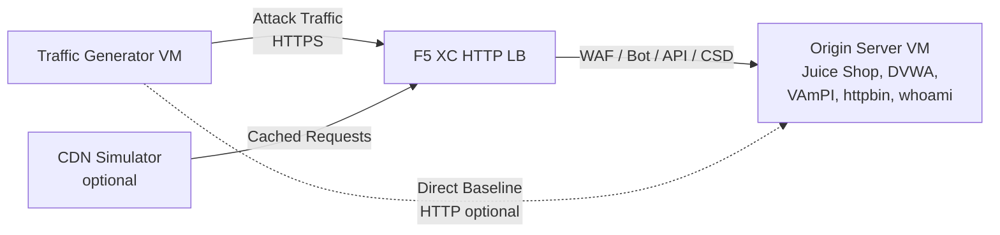

## البنية الكاملة

مولد حركة المرور هو أحد المكونات في بيئة عرض توضيحي متعددة الطبقات. البنية الكاملة عند نشر جميع المكونات:

```
Traffic Generator -> F5 XC HTTP LB (WAF/Bot/API/CSD) -> Origin Server
                         |
               CDN Simulator (optional)
```



يتم نشر كل مكون وتكوينه بشكل مستقل عبر Terraform. يستهدف مولد حركة المرور اسم النطاق المؤهل بالكامل (FQDN) لموازن الحمل F5 XC، وليس خادم الأصل مباشرة.

## التكامل مع خادم الأصل

يوفر [خادم الأصل](https://f5xc-salesdemos.github.io/origin-server/) تطبيقات الواجهة الخلفية التي تستهدفها مجموعات الهجوم الخاصة بمولد حركة المرور:

| مجموعة حركة المرور | تطبيق الأصل | المسار |
|---|---|---|
| api-attacks | VAmPI | `/vampi/` |
| bot-simulation | جميع التطبيقات | جميع المسارات |
| cdn-load-testing | CDN Simulator | نقطة نهاية CDN |
| crapi-exploits | crAPI | `/crapi/` |
| csd-demo-attacks | CSD Demo | `/csd-demo/` |
| dvga-exploits | DVGA | `/dvga/` |
| dvwa-exploits | DVWA | `/dvwa/` |
| javascript-exploits | CSD Demo | `/csd-demo/` |
| juice-shop-exploits | Juice Shop | `/juice-shop/` |
| mitre-attack | جميع التطبيقات | جميع المسارات |
| owasp-scanning | جميع التطبيقات | جميع المسارات |
| performance-testing | جميع التطبيقات | جميع المسارات |
| reconnaissance | جميع التطبيقات | جميع المسارات |
| restaurant-exploits | Restaurant API | `/restaurant/` |
| ssl-scanning | F5 XC LB (ليس الأصل مباشرة) | غير متاح |
| traffic-generation | جميع التطبيقات | جميع المسارات |
| web-app-attacks | Juice Shop, DVWA | `/juice-shop/`, `/dvwa/` |

### ترتيب النشر

1. قم بنشر **خادم الأصل** أولاً -- فهو يوفر تطبيقات الواجهة الخلفية
2. قم بتكوين **موازن الحمل HTTP الخاص بـ F5 XC** مع خادم الأصل كمجموعة الأصل
3. قم بإرفاق **سياسات WAF وBot Defense وAPI Security وCSD** بموازن الحمل
4. قم بنشر **مولد حركة المرور** مع تعيين `target_fqdn` إلى نطاق موازن الحمل F5 XC

### تكوين الاستهداف

يقوم ملف `config.env` الخاص بمولد حركة المرور بربطه ببقية البنية:

```bash
# Target the F5 XC load balancer (traffic passes through security policies)
TARGET_FQDN=demo.example.com

# Optional: target the origin server directly (bypasses F5 XC)
TARGET_ORIGIN_IP=20.10.5.100
```

عند تعيين `TARGET_FQDN`، ترسل جميع نصوص المجموعات حركة المرور إلى `https://<TARGET_FQDN>/...`. يستقبل موازن الحمل F5 XC الطلبات، ويطبق سياسات الأمان، ويعيد توجيه حركة المرور المسموح بها إلى خادم الأصل.

## التكامل مع عرض CSD التوضيحي

تم تصميم مجموعة `javascript-exploits` خصيصاً لعرض Client-Side Defense التوضيحي على خادم الأصل. تتحقق هذه المجموعة من وظائف المرحلة الثانية من CSD:

**تدفق المرحلة الثانية:**

1. يستضيف خادم الأصل صفحة عرض CSD التوضيحي على المسار `/csd-demo/`
2. يقوم F5 XC CSD بحقن كود JavaScript الخاص بالمراقبة في الصفحة
3. تحاول مجموعة javascript-exploits الخاصة بمولد حركة المرور:
   - حقن نصوص مضمنة تحاكي أدوات التجسس من نوع Magecart
   - تعديل عناصر DOM لإعادة توجيه إرسال النماذج
   - تحميل كود JavaScript غير مصرح به من أطراف ثالثة
4. يكتشف F5 XC CSD هذه التعديلات ويبلغ عنها في لوحة معلومات CSD

لاستخدام مجموعة javascript-exploits:

```bash
# Ensure CSD is enabled on the F5 XC HTTP LB for the /csd-demo/ path
# Then run the suite
/opt/traffic-generator/suites/runner.sh javascript-exploits
```

## التكامل مع محاكي CDN

عند نشر محاكي CDN، تضاف طبقة تخزين مؤقت إلى البنية:

```
Traffic Generator -> CDN Simulator -> F5 XC HTTP LB -> Origin Server
```

يتموضع محاكي CDN أمام موازن الحمل F5 XC، حيث يخزن الاستجابات مؤقتاً ويضيف رؤوساً شبيهة بـ CDN. لتوجيه حركة المرور عبر CDN:

```bash
# Set TARGET_FQDN to the CDN Simulator's endpoint instead of F5 XC directly
TARGET_FQDN=cdn.demo.example.com
```

هذا مفيد لتوضيح كيفية تعامل F5 XC مع حركة المرور التي تصل عبر CDN، بما في ذلك:

- تحديد عنوان IP الحقيقي للعميل خلف رؤوس وكيل CDN
- تطبيق قواعد WAF على الطلبات التي ربما تم تعديلها بواسطة CDN
- تصنيف Bot Defense عندما يقوم CDN بتعديل بصمات المتصفح

## المقارنة بين حركة المرور المباشرة وعبر موازن الحمل

يدعم مولد حركة المرور إرسال حركة المرور عبر F5 XC ومباشرة إلى خادم الأصل في آن واحد. توضح هذه المقارنة قيمة ميزات الأمان في F5 XC:

### عبر F5 XC (الافتراضي)

```bash
# Traffic goes: Generator -> F5 XC LB -> Origin
TARGET_FQDN=demo.example.com /opt/traffic-generator/suites/runner.sh web-app-attacks
```

المتوقع: يقوم WAF بحظر حمولات حقن SQL وXSS وحقن الأوامر. تعرض لوحة معلومات أحداث الأمان الطلبات المحظورة مع تفاصيل الانتهاكات.

### مباشرة إلى الأصل (خط الأساس)

```bash
# Traffic goes: Generator -> Origin (no security layer)
TARGET_FQDN=20.10.5.100 /opt/traffic-generator/suites/runner.sh web-app-attacks
```

المتوقع: تصل جميع الحمولات إلى تطبيقات الأصل دون تصفية. يقوم Juice Shop وDVWA بمعالجة حمولات الهجوم. هذا يوضح ما يحدث بدون حماية F5 XC.

### تدفق العرض التوضيحي جنباً إلى جنب

للحصول على عرض توضيحي مقنع، قم بتشغيل نفس المجموعة بكلتا الطريقتين:

1. قم بتشغيل `web-app-attacks` مباشرة ضد الأصل -- أظهر أن الهجمات تنجح
2. قم بتشغيل `web-app-attacks` عبر F5 XC -- أظهر أن الهجمات يتم حظرها
3. افتح لوحة معلومات أحداث الأمان في F5 XC لعرض الطلبات المحظورة
4. قارن نتائج `meta.json` الخاصة بالمجموعة: التشغيل المباشر يظهر المزيد من "passed" (الهجمات نجحت)، والتشغيل عبر موازن الحمل يظهر المزيد من "failed" (الهجمات حُظرت)

```bash
TGEN_IP=$(terraform output -raw public_ip)
ORIGIN_IP="20.10.5.100"
LB_FQDN="demo.example.com"

# Run 1: Direct (baseline)
ssh azureuser@${TGEN_IP} "TARGET_FQDN=${ORIGIN_IP} /opt/traffic-generator/suites/runner.sh web-app-attacks"

# Run 2: Through F5 XC
ssh azureuser@${TGEN_IP} "TARGET_FQDN=${LB_FQDN} /opt/traffic-generator/suites/runner.sh web-app-attacks"

# Compare results
ssh azureuser@${TGEN_IP} 'for d in $(ls -t /opt/traffic-generator/results/ | head -2); do echo "=== $d ==="; cat /opt/traffic-generator/results/$d/meta.json; echo; done'
```

## نشر Terraform متعدد المكونات

عند نشر بيئة المختبر الكاملة، استخدم مساحات عمل أو مجلدات Terraform منفصلة لكل مكون:

```bash
# 1. Deploy origin server
cd origin-server
terraform apply -var="subscription_id=YOUR_SUB_ID"
ORIGIN_IP=$(terraform output -raw public_ip)

# 2. Configure F5 XC (manual or via separate Terraform)
# Create origin pool -> HTTP LB -> attach WAF/Bot/API/CSD policies
# LB_FQDN=demo.example.com

# 3. Deploy traffic generator targeting the F5 XC LB
cd ../traffic-generator
terraform apply \
  -var="subscription_id=YOUR_SUB_ID" \
  -var="target_fqdn=demo.example.com" \
  -var="target_origin_ip=${ORIGIN_IP}"

# 4. Generate traffic
TGEN_IP=$(terraform output -raw public_ip)
ssh azureuser@${TGEN_IP} '/opt/traffic-generator/suites/runner.sh web-app-attacks'
```
