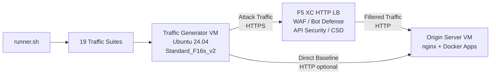

## Zweck

Diese Komponente stellt eine automatisierte Plattform zur Traffic-Generierung bereit, die Angriffsverkehr, Reconnaissance-Scans, Bot-Simulationen und API-Missbrauch gegen einen F5 Distributed Cloud HTTP Load Balancer erzeugt. Sie ist der "Angreifer" in einer typischen Demo-Architektur – die Quelle für bösartigen und verdächtigen Datenverkehr, den die Sicherheitsfunktionen von F5 XC erkennen und blockieren sollen.

In der Demo-Architektur:

```
Traffic Generator VM -> F5 XC HTTP LB (WAF/Bot/API/CSD) -> Origin Server VM
```

Der Traffic Generator sendet Anfragen an den öffentlichen FQDN des F5 XC Load Balancers. Die F5 XC-Plattform inspiziert und filtert den Datenverkehr, bevor sie legitime Anfragen an den Origin Server weiterleitet. Der Operator überprüft anschließend die F5 XC-Sicherheitsereignisprotokolle, um die Erkennung und Durchsetzung zu demonstrieren.

## Architektur



Die Traffic Generator VM läuft auf Azure mit:

- **Ubuntu 24.04 LTS** als Basis-Image
- **Über 50 Sicherheitstools**, installiert via cloud-init während der Bereitstellung
- **19 organisierte Traffic-Suiten** mit nummerierten Skripten, die in Reihenfolge ausgeführt werden
- **runner.sh** als Orchestrator für die Suite-Ausführung mit Ergebnisprotokollierung
- **config.env** für die Zielkonfiguration (FQDN, Origin-IP)

## Tool-Kategorien

| Kategorie | Tools | Zweck |
|---|---|---|
| Webanwendungstests | nikto, sqlmap, nuclei, dalfox, ffuf, gobuster, feroxbuster, dirb, whatweb | WAF-Angriffs-Payload-Generierung |
| Netzwerkanalyse | nmap, masscan, tshark, hping3, tcpdump, netcat, ngrep, iperf3, mtr | Reconnaissance und Netzwerk-Probing |
| MITM und Proxy | mitmproxy, socat | Traffic-Abfangen und -Manipulation |
| SSL/TLS-Tests | sslscan, sslyze, testssl.sh | TLS-Konfigurationsscanning |
| Browser-Automatisierung | playwright, puppeteer, puppeteer-extra-plugin-stealth | Bot-Simulation mit Headless Chrome |
| Subdomain und DNS | subfinder, httpx, amass, dnsrecon, fierce, whois, dnsutils | Reconnaissance und Enumeration |
| Credential-Tests | hydra, medusa, ncrack | Authentifizierungsangriffssimulation |
| WAF-Evasion-Tests | gotestwaf, waf-bypass, wfuzz | Multi-Layer-Encoding-Evasion und WAF-Bypass-Bewertung |
| Exploit-Frameworks | ZAP, Metasploit (nur Full-Tier) | Umfassendes Schwachstellenscanning |

## Gestufte Installation

Der Traffic Generator unterstützt zwei Installationsstufen, die über die Terraform-Variable `tool_tier` gesteuert werden:

### Standard-Tier (Standard)

Installiert alle im Tool-Katalog aufgeführten Tools außer ZAP und Metasploit. Die Bereitstellung wird in 15-20 Minuten abgeschlossen. Diese Stufe deckt alle 19 Traffic-Suiten ab und ist für die meisten Demo-Szenarien ausreichend.

### Full-Tier

Fügt OWASP ZAP und das Metasploit Framework zusätzlich zum Standard-Tier hinzu. Die Bereitstellung dauert ungefähr 25 Minuten. Diese Tools sind groß (ZAP ~500 MiB, Metasploit ~1 GiB) und werden nur für fortgeschrittene Schwachstellenscanning-Demos benötigt.

Aktuelle VM-Kosten finden Sie im Azure-Preisrechner. Die standardmäßige Standard_F16s_v2 ist eine compute-optimierte Instanz, die für nachhaltige Traffic-Generierung geeignet ist.

:::tip
Verwenden Sie `terraform destroy`, wenn das Lab nicht in Benutzung ist, um laufende Kosten zu vermeiden. Siehe [Abbau](../08-teardown/) für die Vorgehensweise.
:::

## Integrationspunkte

Diese Komponente integriert sich mit zwei weiteren Demo-Komponenten:

- **Origin Server** – Das Ziel-Backend, das Juice Shop, DVWA, VAmPI, httpbin und whoami hostet. Der Traffic Generator sendet Angriffsverkehr über F5 XC, um diese Anwendungen zu erreichen. Siehe [Integration](../07-integrate/) für vollständige Architekturdetails.

- **CSD-Demo** – Die Client-Side Defense Demo-Anwendung auf dem Origin Server. Die `javascript-exploits` Traffic-Suite generiert Magecart-artige Script-Injection-Payloads, die F5 XC Client-Side Defense erkennt. Dies validiert die CSD Phase 2-Funktionalität.

## Modulares Komponentendesign

Jede Lab-Komponente ist eigenständig und wird unabhängig bereitgestellt:

- **Traffic Generator** (diese Komponente) stellt die Angriffsquelle bereit
- **Origin Server** stellt die verwundbaren Anwendungsziele bereit
- **CDN Simulator** stellt die CDN-Edge-Caching-Schicht bereit (optional)
- **F5 XC-Konfiguration** stellt WAF-, Bot Defense-, API Security- und CSD-Richtlinien bereit

Der menschliche Operator oder KI-Assistent fügt Komponenten einzeln hinzu. Stellen Sie zuerst den Origin Server bereit, konfigurieren Sie F5 XC davor und stellen Sie dann den Traffic Generator bereit, der auf den FQDN des F5 XC Load Balancers zielt.
