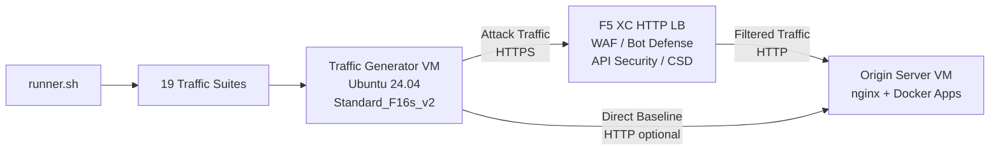

## Zweck

Diese Komponente stellt eine automatisierte Plattform zur Datenverkehrsgenerierung bereit, die Angriffsdatenverkehr, Reconnaissance-Scans, Bot-Simulation und API-Missbrauch gegen einen F5 Distributed Cloud HTTP-Lastverteiler erzeugt. Sie ist der „Angreifer" in einer typischen Demo-Architektur – die Quelle von schädlichem und verdächtigem Datenverkehr, den die Sicherheitsfunktionen von F5 XC erkennen und blockieren sollen.

In der Demo-Architektur:

```
Traffic Generator VM -> F5 XC HTTP LB (WAF/Bot/API/CSD) -> Origin Server VM
```

Der Datenverkehrsgenerator sendet Anfragen an den öffentlichen FQDN des F5 XC-Lastverteilers. Die F5 XC-Plattform prüft und filtert den Datenverkehr, bevor legitime Anfragen an den Ursprungsserver weitergeleitet werden. Der Operator überprüft anschließend die F5 XC-Sicherheitsereignisprotokolle, um Erkennung und Durchsetzung zu demonstrieren.

## Architektur



Die Traffic Generator VM läuft auf Azure mit:

- **Ubuntu 24.04 LTS** als Basis-Image
- **50+ Sicherheitswerkzeuge**, die über cloud-init während der Bereitstellung installiert werden
- **19 organisierten Traffic-Suites** mit nummerierten Skripten, die der Reihe nach ausgeführt werden
- **runner.sh** als Orchestrator für die Suite-Ausführung mit Ergebnisprotokollierung
- **config.env** für die Zielkonfiguration (FQDN, Ursprungs-IP)

## Werkzeugkategorien

| Kategorie | Werkzeuge | Zweck |
|---|---|---|
| Web-Anwendungstests | nikto, sqlmap, nuclei, dalfox, ffuf, gobuster, feroxbuster, dirb, whatweb | Generierung von WAF-Angriffs-Payloads |
| Netzwerkanalyse | nmap, masscan, tshark, hping3, tcpdump, netcat, ngrep, iperf3, mtr | Reconnaissance und Netzwerk-Probing |
| MITM und Proxy | mitmproxy, socat | Abfangen und Manipulation von Datenverkehr |
| SSL/TLS-Tests | sslscan, sslyze, testssl.sh | TLS-Konfigurationsscanning |
| Browser-Automatisierung | playwright, puppeteer, puppeteer-extra-plugin-stealth | Bot-Simulation mit Headless Chrome |
| Subdomain und DNS | subfinder, httpx, amass, dnsrecon, fierce, whois, dnsutils | Reconnaissance und Enumeration |
| Credential-Tests | hydra, medusa, ncrack | Simulation von Authentifizierungsangriffen |
| WAF-Umgehungstests | gotestwaf, waf-bypass, wfuzz | Mehrstufige Kodierungsumgehung und WAF-Bypass-Bewertung |
| Exploit-Frameworks | ZAP, Metasploit (nur Full-Tier) | Umfassendes Schwachstellen-Scanning |

## Gestufte Installation

Der Datenverkehrsgenerator unterstützt zwei Installationsstufen, die über die Terraform-Variable `tool_tier` gesteuert werden:

### Standard-Tier (Standard)

Installiert alle im Werkzeugkatalog aufgeführten Werkzeuge außer ZAP und Metasploit. Die Bereitstellung wird in 15–20 Minuten abgeschlossen. Diese Stufe deckt alle 19 Traffic-Suites ab und ist für die meisten Demo-Szenarien ausreichend.

### Full-Tier

Fügt OWASP ZAP und das Metasploit-Framework zusätzlich zur Standard-Stufe hinzu. Die Bereitstellung dauert ungefähr 25 Minuten. Diese Werkzeuge sind umfangreich (ZAP ~500 MiB, Metasploit ~1 GiB) und werden nur für erweiterte Demos zum Schwachstellen-Scanning benötigt.

Aktuelle VM-Kosten entnehmen Sie dem Azure-Preisrechner. Das standardmäßige Standard_F16s_v2 ist eine rechenoptimierte Instanz, die für die dauerhafte Datenverkehrsgenerierung geeignet ist.

:::tip
Verwenden Sie `terraform destroy`, wenn das Labor nicht in Betrieb ist, um laufende Kosten zu vermeiden. Weitere Informationen finden Sie unter [Teardown](../08-teardown/).
:::

## Integrationspunkte

Diese Komponente integriert sich mit zwei weiteren Demo-Komponenten:

- **Ursprungsserver** – Das Ziel-Backend, das Juice Shop, DVWA, VAmPI, httpbin und whoami hostet. Der Datenverkehrsgenerator sendet Angriffsdatenverkehr über F5 XC, um diese Anwendungen zu erreichen. Weitere Details zur Architektur finden Sie unter [Integration](../07-integrate/).

- **CSD-Demo** – Die Demo-Anwendung für clientseitige Abwehr auf dem Ursprungsserver. Die Traffic-Suite `javascript-exploits` generiert Magecart-artige Script-Injection-Payloads, die F5 XC Clientseitige Abwehr erkennt. Dies validiert die CSD-Phase-2-Funktionalität.

## Modulares Komponentendesign

Jede Lab-Komponente ist eigenständig und wird unabhängig bereitgestellt:

- **Datenverkehrsgenerator** (diese Komponente) stellt die Angriffsquelle bereit
- **Ursprungsserver** stellt die verwundbaren Anwendungsziele bereit
- **CDN-Simulator** stellt die CDN-Edge-Caching-Schicht bereit (optional)
- **F5 XC-Konfiguration** stellt WAF-, Bot-Abwehr-, API-Sicherheits- und CSD-Richtlinien bereit

Der menschliche Operator oder KI-Assistent fügt Komponenten einzeln hinzu. Stellen Sie zuerst den Ursprungsserver bereit, konfigurieren Sie F5 XC davor, und stellen Sie dann den Datenverkehrsgenerator bereit, der auf den FQDN des F5 XC-Lastverteilers abzielt.
