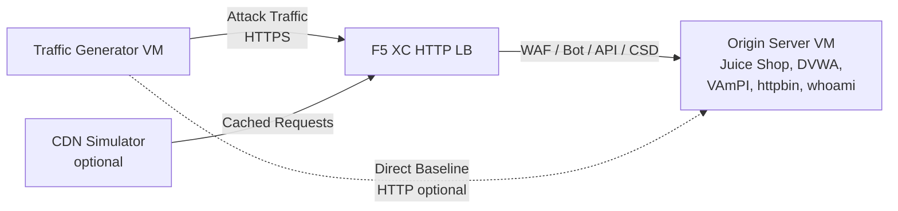

## Vollständige Architektur

Der Traffic-Generator ist eine Komponente in einer mehrschichtigen Demo-Umgebung. Die vollständige Architektur bei Bereitstellung aller Komponenten:

```
Traffic Generator -> F5 XC HTTP LB (WAF/Bot/API/CSD) -> Origin Server
                         |
               CDN Simulator (optional)
```



Jede Komponente wird unabhängig bereitgestellt und über Terraform konfiguriert. Der Traffic-Generator zielt auf den F5 XC Load Balancer FQDN, nicht direkt auf den Origin-Server.

## Origin-Server-Integration

Der [Origin-Server](https://f5xc-salesdemos.github.io/origin-server/) stellt die Backend-Anwendungen bereit, auf die die Angriffs-Suites des Traffic-Generators abzielen:

| Traffic-Suite | Origin-Anwendung | Pfad |
|---|---|---|
| api-attacks | VAmPI | `/vampi/` |
| bot-simulation | Alle Anwendungen | Alle Pfade |
| cdn-load-testing | CDN-Simulator | CDN-Endpunkt |
| crapi-exploits | crAPI | `/crapi/` |
| csd-demo-attacks | CSD-Demo | `/csd-demo/` |
| dvga-exploits | DVGA | `/dvga/` |
| dvwa-exploits | DVWA | `/dvwa/` |
| javascript-exploits | CSD-Demo | `/csd-demo/` |
| juice-shop-exploits | Juice Shop | `/juice-shop/` |
| mitre-attack | Alle Anwendungen | Alle Pfade |
| owasp-scanning | Alle Anwendungen | Alle Pfade |
| performance-testing | Alle Anwendungen | Alle Pfade |
| reconnaissance | Alle Anwendungen | Alle Pfade |
| restaurant-exploits | Restaurant API | `/restaurant/` |
| ssl-scanning | F5 XC LB (nicht direkt Origin) | N/A |
| traffic-generation | Alle Anwendungen | Alle Pfade |
| web-app-attacks | Juice Shop, DVWA | `/juice-shop/`, `/dvwa/` |

### Bereitstellungsreihenfolge

1. Stellen Sie zuerst den **Origin-Server** bereit – er liefert die Backend-Anwendungen
2. Konfigurieren Sie den **F5 XC HTTP Load Balancer** mit dem Origin-Server als Origin-Pool
3. Fügen Sie **WAF-, Bot-Defense-, API-Security- und CSD-Richtlinien** am Load Balancer hinzu
4. Stellen Sie den **Traffic-Generator** bereit, wobei `target_fqdn` auf die F5 XC LB-Domain gesetzt ist

### Zielkonfiguration

Die `config.env` des Traffic-Generators verbindet ihn mit der restlichen Architektur:

```bash
# Ziel ist der F5 XC Load Balancer (Traffic durchläuft Sicherheitsrichtlinien)
TARGET_FQDN=demo.example.com

# Optional: Ziel ist direkt der Origin-Server (umgeht F5 XC)
TARGET_ORIGIN_IP=20.10.5.100
```

Wenn `TARGET_FQDN` gesetzt ist, senden alle Suite-Skripte Traffic an `https://<TARGET_FQDN>/...`. Der F5 XC Load Balancer empfängt die Anfragen, wendet Sicherheitsrichtlinien an und leitet erlaubten Traffic an den Origin-Server weiter.

## CSD-Demo-Integration

Die `javascript-exploits`-Suite ist speziell für die Client-Side-Defense-Demo auf dem Origin-Server konzipiert. Diese Suite validiert die CSD-Phase-2-Funktionalität:

**Phase-2-Ablauf:**

1. Der Origin-Server hostet die CSD-Demo-Seite unter `/csd-demo/`
2. F5 XC CSD injiziert sein Überwachungs-JavaScript in die Seite
3. Die javascript-exploits-Suite des Traffic-Generators versucht:
   - Inline-Skripte zu injizieren, die Magecart-Skimmer imitieren
   - DOM-Elemente zu modifizieren, um Formularübermittlungen umzuleiten
   - Nicht autorisiertes Drittanbieter-JavaScript zu laden
4. F5 XC CSD erkennt diese Änderungen und meldet sie im CSD-Dashboard

Verwendung der javascript-exploits-Suite:

```bash
# Stellen Sie sicher, dass CSD auf dem F5 XC HTTP LB für den Pfad /csd-demo/ aktiviert ist
# Dann führen Sie die Suite aus
/opt/traffic-generator/suites/runner.sh javascript-exploits
```

## CDN-Simulator-Integration

Wenn der CDN-Simulator bereitgestellt ist, fügt die Architektur eine Caching-Schicht hinzu:

```
Traffic Generator -> CDN Simulator -> F5 XC HTTP LB -> Origin Server
```

Der CDN-Simulator sitzt vor dem F5 XC Load Balancer, cached Antworten und fügt CDN-ähnliche Header hinzu. Um Traffic über den CDN zu leiten:

```bash
# Setzen Sie TARGET_FQDN auf den Endpunkt des CDN-Simulators anstatt direkt auf F5 XC
TARGET_FQDN=cdn.demo.example.com
```

Dies ist nützlich, um zu demonstrieren, wie F5 XC Traffic verarbeitet, der über einen CDN ankommt, einschließlich:

- Identifizierung der tatsächlichen Client-IP hinter CDN-Proxy-Headern
- Anwendung von WAF-Regeln auf Anfragen, die möglicherweise vom CDN modifiziert wurden
- Bot-Defense-Klassifizierung, wenn der CDN Browser-Fingerprints verändert

## Vergleich: Direkter Traffic vs. LB-Traffic

Der Traffic-Generator unterstützt das Senden von Traffic sowohl über F5 XC als auch direkt zum Origin. Dieser Vergleich demonstriert den Wert der F5 XC-Sicherheitsfunktionen:

### Über F5 XC (Standard)

```bash
# Traffic-Weg: Generator -> F5 XC LB -> Origin
TARGET_FQDN=demo.example.com /opt/traffic-generator/suites/runner.sh web-app-attacks
```

Erwartet: WAF blockiert SQL-Injection-, XSS- und Command-Injection-Payloads. Das Security-Events-Dashboard zeigt blockierte Anfragen mit Verletzungsdetails an.

### Direkt zum Origin (Baseline)

```bash
# Traffic-Weg: Generator -> Origin (keine Sicherheitsschicht)
TARGET_FQDN=20.10.5.100 /opt/traffic-generator/suites/runner.sh web-app-attacks
```

Erwartet: Alle Payloads erreichen die Origin-Anwendungen ungefiltert. Juice Shop und DVWA verarbeiten die Angriffs-Payloads. Dies demonstriert, was ohne F5 XC-Schutz passiert.

### Seite-an-Seite-Demo-Ablauf

Für eine überzeugende Demo führen Sie dieselbe Suite auf beide Arten aus:

1. Führen Sie `web-app-attacks` direkt gegen den Origin aus – zeigen Sie, dass die Angriffe erfolgreich sind
2. Führen Sie `web-app-attacks` über F5 XC aus – zeigen Sie, dass die Angriffe blockiert werden
3. Öffnen Sie das F5 XC Security-Events-Dashboard, um die blockierten Anfragen anzuzeigen
4. Vergleichen Sie die `meta.json`-Ergebnisse der Suite: Direkte Durchläufe zeigen mehr "passed" (Angriffe erfolgreich), LB-Durchläufe zeigen mehr "failed" (Angriffe blockiert)

```bash
TGEN_IP=$(terraform output -raw public_ip)
ORIGIN_IP="20.10.5.100"
LB_FQDN="demo.example.com"

# Durchlauf 1: Direkt (Baseline)
ssh azureuser@${TGEN_IP} "TARGET_FQDN=${ORIGIN_IP} /opt/traffic-generator/suites/runner.sh web-app-attacks"

# Durchlauf 2: Über F5 XC
ssh azureuser@${TGEN_IP} "TARGET_FQDN=${LB_FQDN} /opt/traffic-generator/suites/runner.sh web-app-attacks"

# Ergebnisse vergleichen
ssh azureuser@${TGEN_IP} 'for d in $(ls -t /opt/traffic-generator/results/ | head -2); do echo "=== $d ==="; cat /opt/traffic-generator/results/$d/meta.json; echo; done'
```

## Multi-Komponenten-Terraform-Bereitstellung

Bei der Bereitstellung der vollständigen Lab-Umgebung verwenden Sie separate Terraform-Workspaces oder -Verzeichnisse für jede Komponente:

```bash
# 1. Origin-Server bereitstellen
cd origin-server
terraform apply -var="subscription_id=YOUR_SUB_ID"
ORIGIN_IP=$(terraform output -raw public_ip)

# 2. F5 XC konfigurieren (manuell oder über separates Terraform)
# Origin-Pool erstellen -> HTTP LB -> WAF/Bot/API/CSD-Richtlinien anhängen
# LB_FQDN=demo.example.com

# 3. Traffic-Generator mit Ziel F5 XC LB bereitstellen
cd ../traffic-generator
terraform apply \
  -var="subscription_id=YOUR_SUB_ID" \
  -var="target_fqdn=demo.example.com" \
  -var="target_origin_ip=${ORIGIN_IP}"

# 4. Traffic generieren
TGEN_IP=$(terraform output -raw public_ip)
ssh azureuser@${TGEN_IP} '/opt/traffic-generator/suites/runner.sh web-app-attacks'
```
