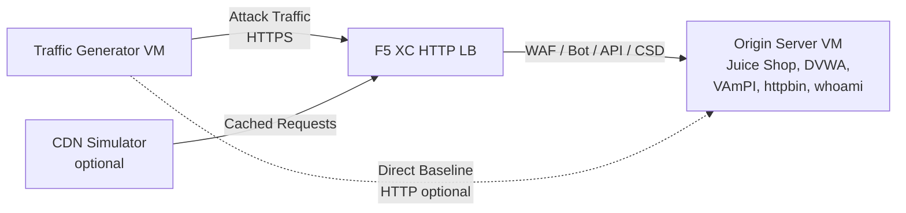

## Vollständige Architektur

Der Datenverkehrsgenerator ist eine Komponente in einer mehrschichtigen Demo-Umgebung. Die vollständige Architektur, wenn alle Komponenten bereitgestellt sind:

```
Traffic Generator -> F5 XC HTTP LB (WAF/Bot/API/CSD) -> Origin Server
                         |
               CDN Simulator (optional)
```



Jede Komponente wird unabhängig bereitgestellt und über Terraform konfiguriert. Der Datenverkehrsgenerator zielt auf den FQDN des F5 XC-Lastverteilers ab, nicht direkt auf den Ursprungsserver.

## Integration des Ursprungsservers

Der [Ursprungsserver](https://f5-sales-demo.github.io/origin-server/) stellt die Backend-Anwendungen bereit, auf die die Angriffspakete des Datenverkehrsgenerators abzielen:

| Datenverkehrspaket | Ursprungsanwendung | Pfad |
|---|---|---|
| api-attacks | VAmPI | `/vampi/` |
| bot-simulation | Alle Anwendungen | Alle Pfade |
| cdn-load-testing | CDN-Simulator | CDN-Endpunkt |
| crapi-exploits | crAPI | `/crapi/` |
| csd-demo-attacks | CSD-Demo | `/csd-demo/` |
| dvga-exploits | DVGA | `/dvga/` |
| dvwa-exploits | DVWA | `/dvwa/` |
| javascript-exploits | CSD-Demo | `/csd-demo/` |
| juice-shop-exploits | Juice Shop | `/juice-shop/` |
| mitre-attack | Alle Anwendungen | Alle Pfade |
| owasp-scanning | Alle Anwendungen | Alle Pfade |
| performance-testing | Alle Anwendungen | Alle Pfade |
| reconnaissance | Alle Anwendungen | Alle Pfade |
| restaurant-exploits | Restaurant-API | `/restaurant/` |
| ssl-scanning | F5 XC LB (nicht direkt Ursprungsserver) | N/A |
| traffic-generation | Alle Anwendungen | Alle Pfade |
| web-app-attacks | Juice Shop, DVWA | `/juice-shop/`, `/dvwa/` |

### Reihenfolge der Bereitstellung

1. Zuerst den **Ursprungsserver** bereitstellen -- er stellt die Backend-Anwendungen bereit
2. Den **F5 XC HTTP-Lastverteiler** mit dem Ursprungsserver als Ursprungspool konfigurieren
3. **WAF-, Bot-Abwehr-, API-Sicherheits- und CSD-Richtlinien** an den Lastverteiler anhängen
4. Den **Datenverkehrsgenerator** mit `target_fqdn` auf die F5 XC LB-Domain gesetzt bereitstellen

### Zielkonfiguration

Die `config.env` des Datenverkehrsgenerators verbindet ihn mit dem Rest der Architektur:

```bash
# Target the F5 XC load balancer (traffic passes through security policies)
TARGET_FQDN=demo.example.com

# Optional: target the origin server directly (bypasses F5 XC)
TARGET_ORIGIN_IP=20.10.5.100
```

Wenn `TARGET_FQDN` gesetzt ist, senden alle Paketskripte Datenverkehr an `https://<TARGET_FQDN>/...`. Der F5 XC-Lastverteiler empfängt die Anfragen, wendet Sicherheitsrichtlinien an und leitet erlaubten Datenverkehr an den Ursprungsserver weiter.

## Integration der CSD-Demo

Das Paket `javascript-exploits` ist speziell für die Demo der Clientseitigen Abwehr auf dem Ursprungsserver konzipiert. Dieses Paket validiert die CSD-Phase-2-Funktionalität:

**Phase-2-Ablauf:**

1. Der Ursprungsserver hostet die CSD-Demo-Seite unter `/csd-demo/`
2. F5 XC CSD injiziert sein Überwachungs-JavaScript in die Seite
3. Das Paket javascript-exploits des Datenverkehrsgenerators versucht:
   - Inline-Skripte zu injizieren, die Magecart-Skimmer imitieren
   - DOM-Elemente zu modifizieren, um Formularübermittlungen umzuleiten
   - Nicht autorisiertes JavaScript von Drittanbietern zu laden
4. F5 XC CSD erkennt diese Modifikationen und meldet sie im CSD-Dashboard

So verwenden Sie das Paket javascript-exploits:

```bash
# Ensure CSD is enabled on the F5 XC HTTP LB for the /csd-demo/ path
# Then run the suite
/opt/traffic-generator/suites/runner.sh javascript-exploits
```

## Integration des CDN-Simulators

Wenn der CDN-Simulator bereitgestellt ist, fügt die Architektur eine Caching-Schicht hinzu:

```
Traffic Generator -> CDN Simulator -> F5 XC HTTP LB -> Origin Server
```

Der CDN-Simulator ist dem F5 XC-Lastverteiler vorgelagert, speichert Antworten zwischen und fügt CDN-ähnliche Header hinzu. So wird Datenverkehr über das CDN geleitet:

```bash
# Set TARGET_FQDN to the CDN Simulator's endpoint instead of F5 XC directly
TARGET_FQDN=cdn.demo.example.com
```

Dies ist nützlich, um zu demonstrieren, wie F5 XC Datenverkehr verarbeitet, der über ein CDN eingeht, einschließlich:

- Ermittlung der echten Client-IP hinter CDN-Proxy-Headern
- Anwendung von WAF-Regeln auf Anfragen, die möglicherweise vom CDN verändert wurden
- Bot-Abwehr-Klassifizierung, wenn das CDN Browser-Fingerabdrücke modifiziert

## Vergleich von direktem und LB-Datenverkehr

Der Datenverkehrsgenerator unterstützt das Senden von Datenverkehr sowohl über F5 XC als auch direkt zum Ursprungsserver. Dieser Vergleich demonstriert den Mehrwert der F5 XC-Sicherheitsfunktionen:

### Über F5 XC (Standard)

```bash
# Traffic goes: Generator -> F5 XC LB -> Origin
TARGET_FQDN=demo.example.com /opt/traffic-generator/suites/runner.sh web-app-attacks
```

Erwartet: WAF blockiert SQL-Injection-, XSS- und Command-Injection-Payloads. Das Dashboard für Sicherheitsereignisse zeigt blockierte Anfragen mit Verletzungsdetails an.

### Direkt zum Ursprungsserver (Baseline)

```bash
# Traffic goes: Generator -> Origin (no security layer)
TARGET_FQDN=20.10.5.100 /opt/traffic-generator/suites/runner.sh web-app-attacks
```

Erwartet: Alle Payloads erreichen die Ursprungsanwendungen ungefiltert. Juice Shop und DVWA verarbeiten die Angriffs-Payloads. Dies demonstriert, was ohne F5 XC-Schutz passiert.

### Side-by-Side-Demo-Ablauf

Für eine überzeugende Demo wird dasselbe Paket auf beide Arten ausgeführt:

1. `web-app-attacks` direkt gegen den Ursprungsserver ausführen -- zeigen, dass Angriffe erfolgreich sind
2. `web-app-attacks` über F5 XC ausführen -- zeigen, dass Angriffe blockiert werden
3. Das F5 XC-Dashboard für Sicherheitsereignisse öffnen, um die blockierten Anfragen anzuzeigen
4. Die `meta.json`-Ergebnisse des Pakets vergleichen: direkte Ausführungen zeigen mehr „bestanden" (Angriffe erfolgreich), LB-Ausführungen zeigen mehr „fehlgeschlagen" (Angriffe blockiert)

```bash
TGEN_IP=$(terraform output -raw public_ip)
ORIGIN_IP="20.10.5.100"
LB_FQDN="demo.example.com"

# Run 1: Direct (baseline)
ssh azureuser@${TGEN_IP} "TARGET_FQDN=${ORIGIN_IP} /opt/traffic-generator/suites/runner.sh web-app-attacks"

# Run 2: Through F5 XC
ssh azureuser@${TGEN_IP} "TARGET_FQDN=${LB_FQDN} /opt/traffic-generator/suites/runner.sh web-app-attacks"

# Compare results
ssh azureuser@${TGEN_IP} 'for d in $(ls -t /opt/traffic-generator/results/ | head -2); do echo "=== $d ==="; cat /opt/traffic-generator/results/$d/meta.json; echo; done'
```

## Terraform-Bereitstellung mehrerer Komponenten

Wenn die vollständige Laborumgebung bereitgestellt wird, sollten separate Terraform-Arbeitsbereiche oder -Verzeichnisse für jede Komponente verwendet werden:

```bash
# 1. Deploy origin server
cd origin-server
terraform apply -var="subscription_id=YOUR_SUB_ID"
ORIGIN_IP=$(terraform output -raw public_ip)

# 2. Configure F5 XC (manual or via separate Terraform)
# Create origin pool -> HTTP LB -> attach WAF/Bot/API/CSD policies
# LB_FQDN=demo.example.com

# 3. Deploy traffic generator targeting the F5 XC LB
cd ../traffic-generator
terraform apply \
  -var="subscription_id=YOUR_SUB_ID" \
  -var="target_fqdn=demo.example.com" \
  -var="target_origin_ip=${ORIGIN_IP}"

# 4. Generate traffic
TGEN_IP=$(terraform output -raw public_ip)
ssh azureuser@${TGEN_IP} '/opt/traffic-generator/suites/runner.sh web-app-attacks'
```
