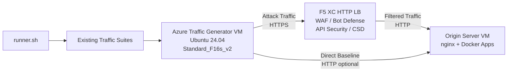
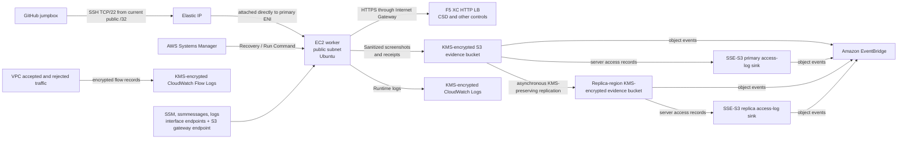

## Purpose

This component provides an automated traffic generation platform that produces attack traffic, reconnaissance scans, bot simulation, and API abuse against an F5 Distributed Cloud HTTP load balancer. It is the "attacker" in a typical demo architecture -- the source of malicious and suspicious traffic that F5 XC security features are designed to detect and block.

In the demo architecture:

```text
Traffic Generator VM -> F5 XC HTTP LB (WAF/Bot/API/CSD) -> Origin Server VM
```

The Traffic Generator sends requests to the F5 XC load balancer's public FQDN. The F5 XC platform inspects and filters the traffic before forwarding legitimate requests to the origin server. The operator then reviews the F5 XC security event logs to demonstrate detection and enforcement.

## Choose a Deployment

Azure and AWS are parallel deployment choices with separate Terraform roots and state. They share the repository's traffic-suite intent, but operators must not assume identical infrastructure, installed tooling, browser behavior, throughput, or F5 Distributed Cloud detections.

| Choice | Terraform root   | Access model                                                                        | Primary runtime                                                                                  |
| ------ | ---------------- | ----------------------------------------------------------------------------------- | ------------------------------------------------------------------------------------------------ |
| Azure  | `terraform/`     | Existing public-IP and SSH workflow                                                 | Existing cloud-init tool installation                                                            |
| AWS    | `terraform/aws/` | Elastic IP; Ubuntu SSH from one revalidated jumpbox `/32`; Systems Manager recovery | Immutable source checkout, verified Node 22 and Chrome for Testing archives, Xvfb headed browser |

## Azure Architecture



The Azure Traffic Generator VM uses:

- **Ubuntu 24.04 LTS** as the base image
- **50+ security tools** installed via cloud-init during provisioning
- **19 organized traffic suites** with numbered scripts executed in order
- **runner.sh** orchestrator for suite execution with results logging
- **config.env** for target configuration (FQDN, origin IP)

## AWS Architecture



The AWS deployment targets account `280469140135`, profile `Users-280469140135`, and region `us-east-1`;
Terraform guards reject a different execution context. The worker is placed in the public subnet without
automatic public addressing. Its Elastic IP is attached directly to the primary network interface so the
addressing relationship is explicit before first boot. The worker security group permits TCP/22 only from
`operator_ssh_cidr`, which must be one canonical IPv4 `/32`; the VPC default security group is managed with
no ingress or egress. Systems Manager remains the recovery and constrained scenario-execution path.

Terraform creates an EC2 key pair by reading an existing public key from `ssh_public_key_path` with `file(pathexpand(...))`. Public key bytes are not committed and the private key never enters Terraform configuration or state. The current observed jumpbox address `142.127.218.190/32` is an example only and must be revalidated immediately before every plan or apply.

AWS provisioning checks out an exact 40-character source commit and verifies pinned Node 22 and Chrome for Testing archives before installation. Browser scenarios run under Xvfb with a headed Chrome process.

Each primitive scenario step and the final scenario produce sanitized screenshots; sanitized execution
receipts and evidence are written outside Git and uploaded to the protected evidence bucket. Source and
replica buckets, plus both terminal access-log sinks, publish object events to EventBridge. Server access
records go to dedicated same-region sinks: the primary sink in `us-east-1` and the replica sink in
`us-east-2`. AWS requires S3-managed encryption for server-access-log destinations, so those terminal
sinks use SSE-S3 and carry narrow resource-local KMS-check exemptions; enabling self-logging would recurse.

Evidence objects replicate asynchronously to a versioned, customer-managed KMS-encrypted bucket in
`us-east-2`; an upload is not considered replicated until its destination version reports a completed
replication status. These controls confirm storage and execution evidence, not that F5 Distributed Cloud
generated a detection.

The AWS deployment creates billable resources including EC2, one Elastic IP, interface endpoints, two KMS
keys, CloudWatch Runtime and VPC Flow Logs, S3 request storage, two regional access-log sinks, cross-region
replication transfer and replica storage, and EventBridge event ingestion when rules consume those events.
It does not create a NAT Gateway or private worker subnet. Source evidence, replicas, and both access-log
sinks have independent retention and teardown consequences.

## Tool Categories

| Category                | Tools                                                                     | Purpose                                                |
| ----------------------- | ------------------------------------------------------------------------- | ------------------------------------------------------ |
| Web Application Testing | nikto, sqlmap, nuclei, dalfox, ffuf, gobuster, feroxbuster, dirb, whatweb | WAF attack payload generation                          |
| Network Analysis        | nmap, masscan, tshark, hping3, tcpdump, netcat, ngrep, iperf3, mtr        | Reconnaissance and network probing                     |
| MITM and Proxy          | mitmproxy, socat                                                          | Traffic interception and manipulation                  |
| SSL/TLS Testing         | sslscan, sslyze, testssl.sh                                               | TLS configuration scanning                             |
| Browser Automation      | playwright, puppeteer, puppeteer-extra-plugin-stealth                     | Bot simulation with headless Chrome                    |
| Subdomain and DNS       | subfinder, httpx, amass, dnsrecon, fierce, whois, dnsutils                | Reconnaissance and enumeration                         |
| Credential Testing      | hydra, medusa, ncrack                                                     | Authentication attack simulation                       |
| WAF Evasion Testing     | gotestwaf, waf-bypass, wfuzz                                              | Multi-layer encoding evasion and WAF bypass assessment |
| Exploit Frameworks      | ZAP, Metasploit (full tier only)                                          | Comprehensive vulnerability scanning                   |

## Tiered Installation

The Traffic Generator supports two installation tiers controlled by the `tool_tier` Terraform variable:

### Standard Tier (default)

Installs all tools listed in the tool catalog except ZAP and Metasploit. Provisioning completes in 15-20 minutes. This tier covers all 19 traffic suites and is sufficient for most demo scenarios.

### Full Tier

Adds OWASP ZAP and Metasploit Framework on top of the standard tier. Provisioning takes approximately 25 minutes. These tools are large (ZAP ~500 MiB, Metasploit ~1 GiB) and are only needed for advanced vulnerability scanning demos.

See the Azure pricing calculator for current VM costs. The default Standard_F16s_v2 is a compute-optimized instance suitable for sustained traffic generation.

:::tip
Use `terraform destroy` when the lab is not in use to avoid ongoing charges. See [Teardown](../08-teardown/) for the procedure.
:::

## Integration Points

This component integrates with two other demo components:

- **Origin Server** -- The target backend that hosts Juice Shop, DVWA, VAmPI, httpbin, and whoami. The Traffic Generator sends attack traffic through F5 XC to reach these applications. See [Integration](../07-integrate/) for full architecture details.

- **CSD Demo** -- The AWS worker runs only the maintained `csd-violations` suite against the authorized Juice Shop target. Its browser evidence must be correlated separately with F5 Distributed Cloud telemetry.

## Modular Component Design

Each lab component is self-contained and deployed independently:

- **Traffic Generator** (this component) provides the attack source
- **Origin Server** provides the vulnerable application targets
- **CDN Simulator** provides the CDN edge caching layer (optional)
- **F5 XC configuration** provides WAF, Bot Defense, API Security, and CSD policies

The human operator or AI assistant adds components one at a time. Deploy the origin server first, configure F5 XC in front of it, then deploy the traffic generator targeting the F5 XC load balancer FQDN.
