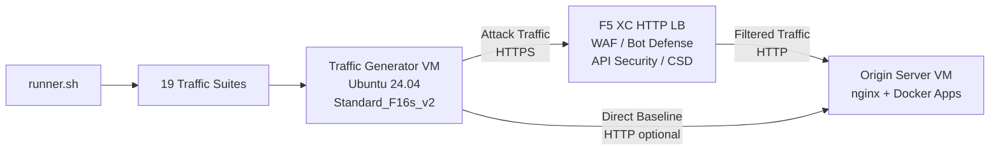

## Propósito

Este componente proporciona una plataforma automatizada de generación de tráfico que produce tráfico de ataque, escaneos de reconocimiento, simulación de bots y abuso de API contra un balanceador de carga HTTP de F5 Distributed Cloud. Es el "atacante" en una arquitectura de demostración típica -- la fuente de tráfico malicioso y sospechoso que las funciones de seguridad de F5 XC están diseñadas para detectar y bloquear.

En la arquitectura de demostración:

```
Traffic Generator VM -> F5 XC HTTP LB (WAF/Bot/API/CSD) -> Origin Server VM
```

El Generador de tráfico envía solicitudes al FQDN público del balanceador de carga F5 XC. La Plataforma F5 XC inspecciona y filtra el tráfico antes de reenviar las solicitudes legítimas al servidor de origen. El operador luego revisa los registros de eventos de seguridad de F5 XC para demostrar la detección y el cumplimiento.

## Arquitectura



La VM del Generador de tráfico se ejecuta en Azure con:

- **Ubuntu 24.04 LTS** como imagen base
- **Más de 50 herramientas de seguridad** instaladas mediante cloud-init durante el aprovisionamiento
- **19 suites de tráfico organizadas** con scripts numerados ejecutados en orden
- Orquestador **runner.sh** para la ejecución de suites con registro de resultados
- **config.env** para la configuración del destino (FQDN, IP de origen)

## Categorías de herramientas

| Categoría | Herramientas | Propósito |
|---|---|---|
| Pruebas de aplicaciones web | nikto, sqlmap, nuclei, dalfox, ffuf, gobuster, feroxbuster, dirb, whatweb | Generación de payloads de ataque para WAF |
| Análisis de red | nmap, masscan, tshark, hping3, tcpdump, netcat, ngrep, iperf3, mtr | Reconocimiento y sondeo de red |
| MITM y Proxy | mitmproxy, socat | Interceptación y manipulación de tráfico |
| Pruebas SSL/TLS | sslscan, sslyze, testssl.sh | Escaneo de configuración TLS |
| Automatización de navegador | playwright, puppeteer, puppeteer-extra-plugin-stealth | Simulación de bots con Chrome sin interfaz gráfica |
| Subdominios y DNS | subfinder, httpx, amass, dnsrecon, fierce, whois, dnsutils | Reconocimiento y enumeración |
| Pruebas de credenciales | hydra, medusa, ncrack | Simulación de ataques de autenticación |
| Pruebas de evasión de WAF | gotestwaf, waf-bypass, wfuzz | Evasión de codificación multicapa y evaluación de bypass de WAF |
| Frameworks de explotación | ZAP, Metasploit (solo nivel completo) | Escaneo integral de vulnerabilidades |

## Instalación por niveles

El Generador de tráfico admite dos niveles de instalación controlados por la variable de Terraform `tool_tier`:

### Nivel estándar (predeterminado)

Instala todas las herramientas enumeradas en el catálogo de herramientas, excepto ZAP y Metasploit. El aprovisionamiento se completa en 15-20 minutos. Este nivel cubre las 19 suites de tráfico y es suficiente para la mayoría de los escenarios de demostración.

### Nivel completo

Agrega OWASP ZAP y Metasploit Framework sobre el nivel estándar. El aprovisionamiento tarda aproximadamente 25 minutos. Estas herramientas son de gran tamaño (ZAP ~500 MiB, Metasploit ~1 GiB) y solo son necesarias para demostraciones avanzadas de escaneo de vulnerabilidades.

Consulte la calculadora de precios de Azure para conocer los costos actuales de las VM. El Standard_F16s_v2 predeterminado es una instancia optimizada para cómputo, adecuada para la generación de tráfico sostenido.

:::tip
Use `terraform destroy` cuando el laboratorio no esté en uso para evitar cargos continuos. Consulte [Teardown](../08-teardown/) para conocer el procedimiento.
:::

## Puntos de integración

Este componente se integra con otros dos componentes de demostración:

- **Servidor de origen** -- El backend de destino que aloja Juice Shop, DVWA, VAmPI, httpbin y whoami. El Generador de tráfico envía tráfico de ataque a través de F5 XC para llegar a estas aplicaciones. Consulte [Integration](../07-integrate/) para obtener detalles completos de la arquitectura.

- **Demo CSD** -- La aplicación de demostración de Defensa del lado del cliente en el servidor de origen. La suite de tráfico `javascript-exploits` genera payloads de inyección de scripts al estilo Magecart que F5 XC Client-Side Defense detecta. Esto valida la funcionalidad de la Fase 2 de CSD.

## Diseño de componentes modulares

Cada componente del laboratorio es autónomo y se implementa de forma independiente:

- El **Generador de tráfico** (este componente) proporciona la fuente de ataque
- El **Servidor de origen** proporciona los objetivos de aplicaciones vulnerables
- El **Simulador CDN** proporciona la capa de caché de borde CDN (opcional)
- La **configuración de F5 XC** proporciona las políticas de Firewall de aplicaciones web (WAF), Bot Defense, Seguridad de API y CSD

El operador humano o el asistente de IA agrega componentes de uno en uno. Implemente primero el servidor de origen, configure F5 XC delante de él y luego implemente el generador de tráfico apuntando al FQDN del balanceador de carga F5 XC.
