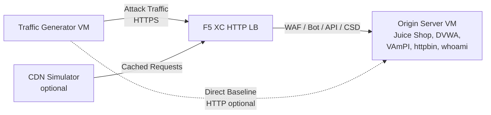

## Arquitectura completa

El generador de tráfico es uno de los componentes de un entorno de demostración multicapa. La arquitectura completa cuando todos los componentes están desplegados:

```
Traffic Generator -> F5 XC HTTP LB (WAF/Bot/API/CSD) -> Origin Server
                         |
               CDN Simulator (optional)
```



Cada componente se despliega y configura de forma independiente mediante Terraform. El generador de tráfico apunta al FQDN del balanceador de carga de F5 XC, no directamente al servidor de origen.

## Integración con el Servidor de origen

El [servidor de origen](https://f5-sales-demo.github.io/origin-server/) proporciona las aplicaciones backend a las que se dirigen los conjuntos de ataques del generador de tráfico:

| Conjunto de tráfico | Aplicación de origen | Ruta |
|---|---|---|
| api-attacks | VAmPI | `/vampi/` |
| bot-simulation | Todas las aplicaciones | Todas las rutas |
| cdn-load-testing | Simulador CDN | Endpoint de CDN |
| crapi-exploits | crAPI | `/crapi/` |
| csd-demo-attacks | CSD Demo | `/csd-demo/` |
| dvga-exploits | DVGA | `/dvga/` |
| dvwa-exploits | DVWA | `/dvwa/` |
| javascript-exploits | CSD Demo | `/csd-demo/` |
| juice-shop-exploits | Juice Shop | `/juice-shop/` |
| mitre-attack | Todas las aplicaciones | Todas las rutas |
| owasp-scanning | Todas las aplicaciones | Todas las rutas |
| performance-testing | Todas las aplicaciones | Todas las rutas |
| reconnaissance | Todas las aplicaciones | Todas las rutas |
| restaurant-exploits | Restaurant API | `/restaurant/` |
| ssl-scanning | F5 XC LB (no directamente al origen) | N/A |
| traffic-generation | Todas las aplicaciones | Todas las rutas |
| web-app-attacks | Juice Shop, DVWA | `/juice-shop/`, `/dvwa/` |

### Orden de despliegue

1. Desplegar primero el **servidor de origen** -- proporciona las aplicaciones backend
2. Configurar el **balanceador de carga HTTP de F5 XC** con el servidor de origen como grupo de origen
3. Adjuntar las **políticas de Firewall de aplicaciones web (WAF), Defensa Bot, Seguridad de API y CSD** al balanceador de carga
4. Desplegar el **generador de tráfico** con `target_fqdn` apuntando al dominio del LB de F5 XC

### Configuración de destino

El archivo `config.env` del generador de tráfico lo conecta al resto de la arquitectura:

```bash
# Target the F5 XC load balancer (traffic passes through security policies)
TARGET_FQDN=demo.example.com

# Optional: target the origin server directly (bypasses F5 XC)
TARGET_ORIGIN_IP=20.10.5.100
```

Cuando se establece `TARGET_FQDN`, todos los scripts de los conjuntos envían tráfico a `https://<TARGET_FQDN>/...`. El balanceador de carga de F5 XC recibe las solicitudes, aplica las políticas de seguridad y reenvía el tráfico permitido al servidor de origen.

## Integración con la demo de CSD

El conjunto `javascript-exploits` está diseñado específicamente para la demo de Defensa del lado del cliente en el servidor de origen. Este conjunto valida la funcionalidad de la Fase 2 de CSD:

**Flujo de la Fase 2:**

1. El servidor de origen aloja la página de demo de CSD en `/csd-demo/`
2. F5 XC CSD inyecta su JavaScript de monitoreo en la página
3. El conjunto javascript-exploits del generador de tráfico intenta:
   - Inyectar scripts en línea que imitan los skimmers de Magecart
   - Modificar elementos del DOM para redirigir los envíos de formularios
   - Cargar JavaScript de terceros no autorizado
4. F5 XC CSD detecta estas modificaciones y las registra en el panel de control de CSD

Para utilizar el conjunto javascript-exploits:

```bash
# Ensure CSD is enabled on the F5 XC HTTP LB for the /csd-demo/ path
# Then run the suite
/opt/traffic-generator/suites/runner.sh javascript-exploits
```

## Integración con el Simulador CDN

Cuando se despliega el Simulador CDN, la arquitectura añade una capa de caché:

```
Traffic Generator -> CDN Simulator -> F5 XC HTTP LB -> Origin Server
```

El Simulador CDN se sitúa frente al balanceador de carga de F5 XC, almacenando respuestas en caché y añadiendo cabeceras similares a las de un CDN. Para dirigir el tráfico a través del CDN:

```bash
# Set TARGET_FQDN to the CDN Simulator's endpoint instead of F5 XC directly
TARGET_FQDN=cdn.demo.example.com
```

Esto es útil para demostrar cómo F5 XC gestiona el tráfico que llega a través de un CDN, incluyendo:

- Identificar la IP real del cliente detrás de las cabeceras de proxy del CDN
- Aplicar reglas de Firewall de aplicaciones web (WAF) a solicitudes que pueden haber sido modificadas por el CDN
- Clasificación de Defensa Bot cuando el CDN modifica las huellas digitales del navegador

## Comparación de tráfico directo vs. a través del LB

El generador de tráfico permite enviar tráfico tanto a través de F5 XC como directamente al origen. Esta comparación demuestra el valor de las funciones de seguridad de F5 XC:

### A través de F5 XC (predeterminado)

```bash
# Traffic goes: Generator -> F5 XC LB -> Origin
TARGET_FQDN=demo.example.com /opt/traffic-generator/suites/runner.sh web-app-attacks
```

Resultado esperado: el Firewall de aplicaciones web (WAF) bloquea las cargas de inyección SQL, XSS e inyección de comandos. El panel de Eventos de Seguridad muestra las solicitudes bloqueadas con los detalles de las infracciones.

### Directo al origen (línea base)

```bash
# Traffic goes: Generator -> Origin (no security layer)
TARGET_FQDN=20.10.5.100 /opt/traffic-generator/suites/runner.sh web-app-attacks
```

Resultado esperado: todas las cargas llegan a las aplicaciones de origen sin filtrar. Juice Shop y DVWA procesan las cargas de ataque. Esto demuestra lo que ocurre sin la protección de F5 XC.

### Flujo de demostración en paralelo

Para una demostración convincente, ejecute el mismo conjunto de ambas formas:

1. Ejecutar `web-app-attacks` directamente contra el origen -- mostrar que los ataques tienen éxito
2. Ejecutar `web-app-attacks` a través de F5 XC -- mostrar que los ataques son bloqueados
3. Abrir el panel de Eventos de Seguridad de F5 XC para mostrar las solicitudes bloqueadas
4. Comparar los resultados de `meta.json` del conjunto: las ejecuciones directas muestran más "passed" (ataques exitosos), las ejecuciones a través del LB muestran más "failed" (ataques bloqueados)

```bash
TGEN_IP=$(terraform output -raw public_ip)
ORIGIN_IP="20.10.5.100"
LB_FQDN="demo.example.com"

# Run 1: Direct (baseline)
ssh azureuser@${TGEN_IP} "TARGET_FQDN=${ORIGIN_IP} /opt/traffic-generator/suites/runner.sh web-app-attacks"

# Run 2: Through F5 XC
ssh azureuser@${TGEN_IP} "TARGET_FQDN=${LB_FQDN} /opt/traffic-generator/suites/runner.sh web-app-attacks"

# Compare results
ssh azureuser@${TGEN_IP} 'for d in $(ls -t /opt/traffic-generator/results/ | head -2); do echo "=== $d ==="; cat /opt/traffic-generator/results/$d/meta.json; echo; done'
```

## Despliegue multi-componente con Terraform

Al desplegar el entorno de laboratorio completo, utilice espacios de trabajo o directorios de Terraform independientes para cada componente:

```bash
# 1. Deploy origin server
cd origin-server
terraform apply -var="subscription_id=YOUR_SUB_ID"
ORIGIN_IP=$(terraform output -raw public_ip)

# 2. Configure F5 XC (manual or via separate Terraform)
# Create origin pool -> HTTP LB -> attach WAF/Bot/API/CSD policies
# LB_FQDN=demo.example.com

# 3. Deploy traffic generator targeting the F5 XC LB
cd ../traffic-generator
terraform apply \
  -var="subscription_id=YOUR_SUB_ID" \
  -var="target_fqdn=demo.example.com" \
  -var="target_origin_ip=${ORIGIN_IP}"

# 4. Generate traffic
TGEN_IP=$(terraform output -raw public_ip)
ssh azureuser@${TGEN_IP} '/opt/traffic-generator/suites/runner.sh web-app-attacks'
```
