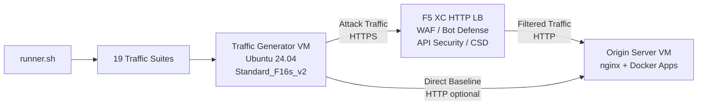

## Objectif

Ce composant fournit une plateforme automatisée de génération de trafic qui produit du trafic d'attaque, des scans de reconnaissance, de la simulation de bots et de l'abus d'API contre un répartiteur de charge HTTP F5 Distributed Cloud. Il constitue l'« attaquant » dans une architecture de démonstration typique — la source du trafic malveillant et suspect que les fonctionnalités de sécurité F5 XC sont conçues pour détecter et bloquer.

Dans l'architecture de démonstration :

```
Traffic Generator VM -> F5 XC HTTP LB (WAF/Bot/API/CSD) -> Origin Server VM
```

Le générateur de trafic envoie des requêtes vers le FQDN public du répartiteur de charge F5 XC. La plateforme F5 XC inspecte et filtre le trafic avant de transmettre les requêtes légitimes au serveur d'origine. L'opérateur consulte ensuite les journaux d'événements de sécurité F5 XC pour démontrer la détection et l'application des règles.

## Architecture



La VM du générateur de trafic s'exécute sur Azure avec :

- **Ubuntu 24.04 LTS** comme image de base
- **Plus de 50 outils de sécurité** installés via cloud-init lors du provisionnement
- **19 suites de trafic organisées** avec des scripts numérotés exécutés dans l'ordre
- **runner.sh** comme orchestrateur pour l'exécution des suites avec journalisation des résultats
- **config.env** pour la configuration de la cible (FQDN, IP d'origine)

## Catégories d'outils

| Catégorie | Outils | Objectif |
|---|---|---|
| Tests d'applications web | nikto, sqlmap, nuclei, dalfox, ffuf, gobuster, feroxbuster, dirb, whatweb | Génération de charges d'attaque WAF |
| Analyse réseau | nmap, masscan, tshark, hping3, tcpdump, netcat, ngrep, iperf3, mtr | Reconnaissance et sondage réseau |
| MITM et proxy | mitmproxy, socat | Interception et manipulation du trafic |
| Tests SSL/TLS | sslscan, sslyze, testssl.sh | Scan de configuration TLS |
| Automatisation de navigateur | playwright, puppeteer, puppeteer-extra-plugin-stealth | Simulation de bots avec Chrome headless |
| Sous-domaines et DNS | subfinder, httpx, amass, dnsrecon, fierce, whois, dnsutils | Reconnaissance et énumération |
| Tests d'authentification | hydra, medusa, ncrack | Simulation d'attaques d'authentification |
| Tests d'évasion WAF | gotestwaf, waf-bypass, wfuzz | Évasion par encodage multi-couches et évaluation de contournement WAF |
| Frameworks d'exploitation | ZAP, Metasploit (niveau complet uniquement) | Scan complet de vulnérabilités |

## Installation par niveaux

Le générateur de trafic prend en charge deux niveaux d'installation contrôlés par la variable Terraform `tool_tier` :

### Niveau standard (par défaut)

Installe tous les outils listés dans le catalogue d'outils à l'exception de ZAP et Metasploit. Le provisionnement se termine en 15 à 20 minutes. Ce niveau couvre les 19 suites de trafic et est suffisant pour la plupart des scénarios de démonstration.

### Niveau complet

Ajoute OWASP ZAP et Metasploit Framework en plus du niveau standard. Le provisionnement prend environ 25 minutes. Ces outils sont volumineux (ZAP ~500 Mio, Metasploit ~1 Gio) et ne sont nécessaires que pour les démonstrations avancées de scan de vulnérabilités.

Consultez le calculateur de prix Azure pour les coûts actuels des VM. L'instance par défaut Standard_F16s_v2 est une instance optimisée pour le calcul, adaptée à la génération de trafic soutenu.

:::tip
Utilisez `terraform destroy` lorsque le laboratoire n'est pas en cours d'utilisation pour éviter les frais continus. Consultez [Démontage](../08-teardown/) pour la procédure.
:::

## Points d'intégration

Ce composant s'intègre avec deux autres composants de démonstration :

- **Serveur d'origine** — Le backend cible qui héberge Juice Shop, DVWA, VAmPI, httpbin et whoami. Le générateur de trafic envoie du trafic d'attaque à travers F5 XC pour atteindre ces applications. Consultez [Intégration](../07-integrate/) pour les détails complets de l'architecture.

- **Démo CSD** — L'application de démonstration Client-Side Defense sur le serveur d'origine. La suite de trafic `javascript-exploits` génère des charges d'injection de scripts de type Magecart que F5 XC Client-Side Defense détecte. Cela valide la fonctionnalité CSD Phase 2.

## Conception modulaire des composants

Chaque composant du laboratoire est autonome et déployé indépendamment :

- **Générateur de trafic** (ce composant) fournit la source d'attaque
- **Serveur d'origine** fournit les applications cibles vulnérables
- **Simulateur CDN** fournit la couche de mise en cache CDN en périphérie (optionnel)
- **Configuration F5 XC** fournit les politiques WAF, Bot Defense, API Security et CSD

L'opérateur humain ou l'assistant IA ajoute les composants un par un. Déployez d'abord le serveur d'origine, configurez F5 XC devant celui-ci, puis déployez le générateur de trafic ciblant le FQDN du répartiteur de charge F5 XC.
