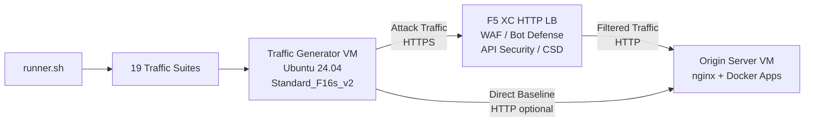

## Objectif

Ce composant fournit une plateforme de génération de trafic automatisée qui produit du trafic d'attaque, des scans de reconnaissance, des simulations de bots et des abus d'API contre un équilibreur de charge HTTP F5 Distributed Cloud. Il représente l'« attaquant » dans une architecture de démonstration typique -- la source du trafic malveillant et suspect que les fonctionnalités de sécurité F5 XC sont conçues pour détecter et bloquer.

Dans l'architecture de démonstration :

```
Traffic Generator VM -> F5 XC HTTP LB (WAF/Bot/API/CSD) -> Origin Server VM
```

Le Générateur de trafic envoie des requêtes vers le FQDN public de l'équilibreur de charge F5 XC. La Plateforme F5 XC inspecte et filtre le trafic avant de transmettre les requêtes légitimes au serveur d'origine. L'opérateur consulte ensuite les journaux d'événements de sécurité F5 XC pour démontrer la détection et l'application des politiques.

## Architecture



La VM du Générateur de trafic s'exécute sur Azure avec :

- **Ubuntu 24.04 LTS** comme image de base
- **Plus de 50 outils de sécurité** installés via cloud-init lors du provisionnement
- **19 suites de trafic organisées** avec des scripts numérotés exécutés dans l'ordre
- L'orchestrateur **runner.sh** pour l'exécution des suites avec journalisation des résultats
- **config.env** pour la configuration de la cible (FQDN, IP d'origine)

## Catégories d'outils

| Catégorie | Outils | Objectif |
|---|---|---|
| Tests d'applications web | nikto, sqlmap, nuclei, dalfox, ffuf, gobuster, feroxbuster, dirb, whatweb | Génération de charges utiles d'attaque WAF |
| Analyse réseau | nmap, masscan, tshark, hping3, tcpdump, netcat, ngrep, iperf3, mtr | Reconnaissance et sondage réseau |
| MITM et proxy | mitmproxy, socat | Interception et manipulation du trafic |
| Tests SSL/TLS | sslscan, sslyze, testssl.sh | Analyse de la configuration TLS |
| Automatisation du navigateur | playwright, puppeteer, puppeteer-extra-plugin-stealth | Simulation de bots avec Chrome sans interface graphique |
| Sous-domaines et DNS | subfinder, httpx, amass, dnsrecon, fierce, whois, dnsutils | Reconnaissance et énumération |
| Tests d'authentification | hydra, medusa, ncrack | Simulation d'attaques sur l'authentification |
| Tests d'évasion WAF | gotestwaf, waf-bypass, wfuzz | Évasion multi-couches par encodage et évaluation de contournement WAF |
| Frameworks d'exploitation | ZAP, Metasploit (niveau complet uniquement) | Analyse complète des vulnérabilités |

## Installation par niveaux

Le Générateur de trafic prend en charge deux niveaux d'installation contrôlés par la variable Terraform `tool_tier` :

### Niveau standard (par défaut)

Installe tous les outils listés dans le catalogue d'outils, à l'exception de ZAP et Metasploit. Le provisionnement se termine en 15 à 20 minutes. Ce niveau couvre l'ensemble des 19 suites de trafic et est suffisant pour la plupart des scénarios de démonstration.

### Niveau complet

Ajoute OWASP ZAP et Metasploit Framework en complément du niveau standard. Le provisionnement prend environ 25 minutes. Ces outils sont volumineux (ZAP ~500 Mio, Metasploit ~1 Gio) et ne sont nécessaires que pour les démonstrations avancées d'analyse de vulnérabilités.

Consultez la calculatrice de tarification Azure pour les coûts actuels des VM. La machine Standard_F16s_v2 par défaut est une instance optimisée pour le calcul, adaptée à une génération de trafic soutenue.

:::tip
Utilisez `terraform destroy` lorsque le lab n'est pas en cours d'utilisation afin d'éviter des frais continus. Consultez [Teardown](../08-teardown/) pour la procédure.
:::

## Points d'intégration

Ce composant s'intègre avec deux autres composants de démonstration :

- **Serveur d'origine** -- Le backend cible qui héberge Juice Shop, DVWA, VAmPI, httpbin et whoami. Le Générateur de trafic envoie du trafic d'attaque via F5 XC pour atteindre ces applications. Consultez [Integration](../07-integrate/) pour les détails complets de l'architecture.

- **Démonstration CSD** -- L'application de démonstration de Défense côté client sur le serveur d'origine. La suite de trafic `javascript-exploits` génère des charges utiles d'injection de scripts de style Magecart que la Défense côté client F5 XC détecte. Cela valide la fonctionnalité CSD de phase 2.

## Conception modulaire des composants

Chaque composant du lab est autonome et déployé de manière indépendante :

- **Générateur de trafic** (ce composant) fournit la source des attaques
- **Serveur d'origine** fournit les cibles d'applications vulnérables
- **Simulateur CDN** fournit la couche de mise en cache CDN en périphérie (optionnel)
- **La configuration F5 XC** fournit les politiques de Pare-feu applicatif (WAF), Défense Bot, Sécurité des API et CSD

L'opérateur humain ou l'assistant IA ajoute les composants un par un. Déployez d'abord le serveur d'origine, configurez F5 XC devant celui-ci, puis déployez le générateur de trafic en ciblant le FQDN de l'équilibreur de charge F5 XC.
