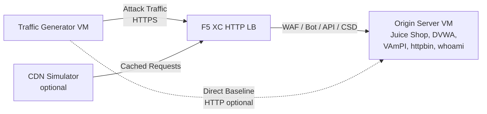

## Architecture complète

Le générateur de trafic est un composant dans un environnement de démonstration multi-couches. L'architecture complète lorsque tous les composants sont déployés :

```
Traffic Generator -> F5 XC HTTP LB (WAF/Bot/API/CSD) -> Origin Server
                         |
               CDN Simulator (optional)
```



Chaque composant est déployé et configuré indépendamment via Terraform. Le générateur de trafic cible le FQDN du répartiteur de charge F5 XC, et non le serveur d'origine directement.

## Intégration du serveur d'origine

Le [serveur d'origine](https://f5xc-salesdemos.github.io/origin-server/) fournit les applications backend que les suites d'attaques du générateur de trafic ciblent :

| Suite de trafic | Application d'origine | Chemin |
|---|---|---|
| api-attacks | VAmPI | `/vampi/` |
| bot-simulation | Toutes les applications | Tous les chemins |
| cdn-load-testing | CDN Simulator | Point de terminaison CDN |
| crapi-exploits | crAPI | `/crapi/` |
| csd-demo-attacks | CSD Demo | `/csd-demo/` |
| dvga-exploits | DVGA | `/dvga/` |
| dvwa-exploits | DVWA | `/dvwa/` |
| javascript-exploits | CSD Demo | `/csd-demo/` |
| juice-shop-exploits | Juice Shop | `/juice-shop/` |
| mitre-attack | Toutes les applications | Tous les chemins |
| owasp-scanning | Toutes les applications | Tous les chemins |
| performance-testing | Toutes les applications | Tous les chemins |
| reconnaissance | Toutes les applications | Tous les chemins |
| restaurant-exploits | Restaurant API | `/restaurant/` |
| ssl-scanning | F5 XC LB (pas directement l'origine) | N/A |
| traffic-generation | Toutes les applications | Tous les chemins |
| web-app-attacks | Juice Shop, DVWA | `/juice-shop/`, `/dvwa/` |

### Ordre de déploiement

1. Déployez le **serveur d'origine** en premier -- il fournit les applications backend
2. Configurez le **répartiteur de charge HTTP F5 XC** avec le serveur d'origine comme pool d'origine
3. Attachez les **politiques WAF, Bot Defense, API Security et CSD** au répartiteur de charge
4. Déployez le **générateur de trafic** avec `target_fqdn` défini sur le domaine du LB F5 XC

### Configuration du ciblage

Le fichier `config.env` du générateur de trafic le connecte au reste de l'architecture :

```bash
# Target the F5 XC load balancer (traffic passes through security policies)
TARGET_FQDN=demo.example.com

# Optional: target the origin server directly (bypasses F5 XC)
TARGET_ORIGIN_IP=20.10.5.100
```

Lorsque `TARGET_FQDN` est défini, tous les scripts de suite envoient le trafic vers `https://<TARGET_FQDN>/...`. Le répartiteur de charge F5 XC reçoit les requêtes, applique les politiques de sécurité et transmet le trafic autorisé au serveur d'origine.

## Intégration de la démo CSD

La suite `javascript-exploits` est spécifiquement conçue pour la démonstration Client-Side Defense sur le serveur d'origine. Cette suite valide la fonctionnalité CSD Phase 2 :

**Flux de la Phase 2 :**

1. Le serveur d'origine héberge la page de démo CSD à `/csd-demo/`
2. F5 XC CSD injecte son JavaScript de surveillance dans la page
3. La suite javascript-exploits du générateur de trafic tente de :
   - Injecter des scripts inline imitant des skimmers Magecart
   - Modifier des éléments DOM pour rediriger les soumissions de formulaires
   - Charger du JavaScript tiers non autorisé
4. F5 XC CSD détecte ces modifications et les signale dans le tableau de bord CSD

Pour utiliser la suite javascript-exploits :

```bash
# Ensure CSD is enabled on the F5 XC HTTP LB for the /csd-demo/ path
# Then run the suite
/opt/traffic-generator/suites/runner.sh javascript-exploits
```

## Intégration du simulateur CDN

Lorsque le simulateur CDN est déployé, l'architecture ajoute une couche de mise en cache :

```
Traffic Generator -> CDN Simulator -> F5 XC HTTP LB -> Origin Server
```

Le simulateur CDN se place devant le répartiteur de charge F5 XC, mettant en cache les réponses et ajoutant des en-têtes de type CDN. Pour diriger le trafic via le CDN :

```bash
# Set TARGET_FQDN to the CDN Simulator's endpoint instead of F5 XC directly
TARGET_FQDN=cdn.demo.example.com
```

Ceci est utile pour démontrer comment F5 XC gère le trafic qui arrive via un CDN, notamment :

- Identifier la véritable IP client derrière les en-têtes proxy du CDN
- Appliquer les règles WAF aux requêtes qui ont pu être modifiées par le CDN
- Classification Bot Defense lorsque le CDN modifie les empreintes du navigateur

## Comparaison trafic direct vs via le LB

Le générateur de trafic prend en charge l'envoi de trafic à la fois via F5 XC et directement vers l'origine. Cette comparaison démontre la valeur des fonctionnalités de sécurité F5 XC :

### Via F5 XC (par défaut)

```bash
# Traffic goes: Generator -> F5 XC LB -> Origin
TARGET_FQDN=demo.example.com /opt/traffic-generator/suites/runner.sh web-app-attacks
```

Résultat attendu : le WAF bloque les charges utiles d'injection SQL, XSS et d'injection de commandes. Le tableau de bord Security Events affiche les requêtes bloquées avec les détails des violations.

### Directement vers l'origine (référence)

```bash
# Traffic goes: Generator -> Origin (no security layer)
TARGET_FQDN=20.10.5.100 /opt/traffic-generator/suites/runner.sh web-app-attacks
```

Résultat attendu : toutes les charges utiles atteignent les applications d'origine sans filtrage. Juice Shop et DVWA traitent les charges utiles d'attaque. Cela démontre ce qui se passe sans la protection F5 XC.

### Flux de démonstration côte à côte

Pour une démonstration convaincante, exécutez la même suite des deux manières :

1. Exécutez `web-app-attacks` directement contre l'origine -- montrez que les attaques réussissent
2. Exécutez `web-app-attacks` via F5 XC -- montrez que les attaques sont bloquées
3. Ouvrez le tableau de bord F5 XC Security Events pour afficher les requêtes bloquées
4. Comparez les résultats `meta.json` de la suite : les exécutions directes affichent plus de « passed » (attaques réussies), les exécutions via le LB affichent plus de « failed » (attaques bloquées)

```bash
TGEN_IP=$(terraform output -raw public_ip)
ORIGIN_IP="20.10.5.100"
LB_FQDN="demo.example.com"

# Run 1: Direct (baseline)
ssh azureuser@${TGEN_IP} "TARGET_FQDN=${ORIGIN_IP} /opt/traffic-generator/suites/runner.sh web-app-attacks"

# Run 2: Through F5 XC
ssh azureuser@${TGEN_IP} "TARGET_FQDN=${LB_FQDN} /opt/traffic-generator/suites/runner.sh web-app-attacks"

# Compare results
ssh azureuser@${TGEN_IP} 'for d in $(ls -t /opt/traffic-generator/results/ | head -2); do echo "=== $d ==="; cat /opt/traffic-generator/results/$d/meta.json; echo; done'
```

## Déploiement Terraform multi-composants

Lors du déploiement de l'environnement de laboratoire complet, utilisez des espaces de travail ou des répertoires Terraform séparés pour chaque composant :

```bash
# 1. Deploy origin server
cd origin-server
terraform apply -var="subscription_id=YOUR_SUB_ID"
ORIGIN_IP=$(terraform output -raw public_ip)

# 2. Configure F5 XC (manual or via separate Terraform)
# Create origin pool -> HTTP LB -> attach WAF/Bot/API/CSD policies
# LB_FQDN=demo.example.com

# 3. Deploy traffic generator targeting the F5 XC LB
cd ../traffic-generator
terraform apply \
  -var="subscription_id=YOUR_SUB_ID" \
  -var="target_fqdn=demo.example.com" \
  -var="target_origin_ip=${ORIGIN_IP}"

# 4. Generate traffic
TGEN_IP=$(terraform output -raw public_ip)
ssh azureuser@${TGEN_IP} '/opt/traffic-generator/suites/runner.sh web-app-attacks'
```
