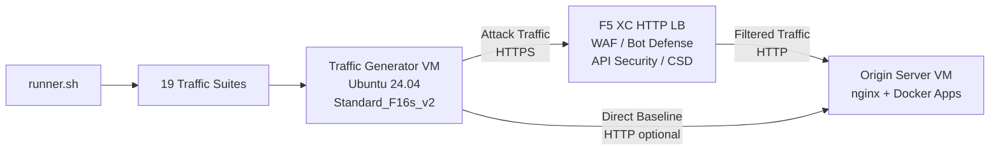

## उद्देश्य

यह घटक एक स्वचालित ट्रैफ़िक जनरेटर प्लेटफ़ॉर्म प्रदान करता है जो F5 Distributed Cloud HTTP लोड बैलेंसर के विरुद्ध अटैक ट्रैफ़िक, रिकॉनेसेंस स्कैन, बॉट सिमुलेशन और API दुरुपयोग उत्पन्न करता है। यह एक सामान्य डेमो आर्किटेक्चर में "अटैकर" है -- दुर्भावनापूर्ण और संदिग्ध ट्रैफ़िक का स्रोत जिसे F5 XC सुरक्षा सुविधाएँ पहचानने और ब्लॉक करने के लिए डिज़ाइन की गई हैं।

डेमो आर्किटेक्चर में:

```
Traffic Generator VM -> F5 XC HTTP LB (WAF/Bot/API/CSD) -> Origin Server VM
```

ट्रैफ़िक जनरेटर F5 XC लोड बैलेंसर के सार्वजनिक FQDN पर अनुरोध भेजता है। F5 XC प्लेटफ़ॉर्म ट्रैफ़िक का निरीक्षण और फ़िल्टरिंग करता है, फिर वैध अनुरोधों को ऑरिजिन सर्वर पर अग्रेषित करता है। ऑपरेटर तब F5 XC सुरक्षा इवेंट लॉग की समीक्षा करता है ताकि पहचान और प्रवर्तन का प्रदर्शन किया जा सके।

## आर्किटेक्चर



ट्रैफ़िक जनरेटर VM Azure पर निम्नलिखित के साथ चलता है:

- **Ubuntu 24.04 LTS** बेस इमेज के रूप में
- **50+ सुरक्षा उपकरण** प्रोविज़निंग के दौरान cloud-init के माध्यम से स्थापित
- **19 व्यवस्थित ट्रैफ़िक सूट** क्रमांकित स्क्रिप्ट के साथ जो क्रम में निष्पादित होती हैं
- **runner.sh** परिणाम लॉगिंग के साथ सूट निष्पादन के लिए ऑर्केस्ट्रेटर
- **config.env** लक्ष्य कॉन्फ़िगरेशन के लिए (FQDN, origin IP)

## उपकरण श्रेणियाँ

| श्रेणी | उपकरण | उद्देश्य |
|---|---|---|
| वेब एप्लिकेशन परीक्षण | nikto, sqlmap, nuclei, dalfox, ffuf, gobuster, feroxbuster, dirb, whatweb | वेब ऐप फ़ायरवॉल (WAF) अटैक पेलोड जनरेशन |
| नेटवर्क विश्लेषण | nmap, masscan, tshark, hping3, tcpdump, netcat, ngrep, iperf3, mtr | रिकॉनेसेंस और नेटवर्क प्रोबिंग |
| MITM और प्रॉक्सी | mitmproxy, socat | ट्रैफ़िक इंटरसेप्शन और हेरफेर |
| SSL/TLS परीक्षण | sslscan, sslyze, testssl.sh | TLS कॉन्फ़िगरेशन स्कैनिंग |
| ब्राउज़र स्वचालन | playwright, puppeteer, puppeteer-extra-plugin-stealth | हेडलेस Chrome के साथ बॉट सिमुलेशन |
| सबडोमेन और DNS | subfinder, httpx, amass, dnsrecon, fierce, whois, dnsutils | रिकॉनेसेंस और एनुमेरेशन |
| क्रेडेंशियल परीक्षण | hydra, medusa, ncrack | प्रमाणीकरण अटैक सिमुलेशन |
| वेब ऐप फ़ायरवॉल (WAF) इवेज़न परीक्षण | gotestwaf, waf-bypass, wfuzz | मल्टी-लेयर एन्कोडिंग इवेज़न और वेब ऐप फ़ायरवॉल (WAF) बाईपास मूल्यांकन |
| एक्सप्लॉइट फ्रेमवर्क | ZAP, Metasploit (केवल full tier) | व्यापक भेद्यता स्कैनिंग |

## स्तरीय स्थापना

ट्रैफ़िक जनरेटर `tool_tier` Terraform वेरिएबल द्वारा नियंत्रित दो इंस्टॉलेशन स्तरों का समर्थन करता है:

### Standard Tier (डिफ़ॉल्ट)

ZAP और Metasploit को छोड़कर उपकरण कैटलॉग में सूचीबद्ध सभी उपकरण स्थापित करता है। प्रोविज़निंग 15-20 मिनट में पूरी होती है। यह स्तर सभी 19 ट्रैफ़िक सूट को कवर करता है और अधिकांश डेमो परिदृश्यों के लिए पर्याप्त है।

### Full Tier

standard tier के ऊपर OWASP ZAP और Metasploit Framework जोड़ता है। प्रोविज़निंग में लगभग 25 मिनट लगते हैं। ये उपकरण बड़े हैं (ZAP ~500 MiB, Metasploit ~1 GiB) और केवल उन्नत भेद्यता स्कैनिंग डेमो के लिए आवश्यक हैं।

वर्तमान VM लागत के लिए Azure मूल्य निर्धारण कैलकुलेटर देखें। डिफ़ॉल्ट Standard_F16s_v2 एक कंप्यूट-ऑप्टिमाइज़्ड इंस्टेंस है जो निरंतर ट्रैफ़िक जनरेशन के लिए उपयुक्त है।

:::tip
लैब उपयोग में न होने पर चल रहे शुल्कों से बचने के लिए `terraform destroy` का उपयोग करें। प्रक्रिया के लिए [Teardown](../08-teardown/) देखें।
:::

## एकीकरण बिंदु

यह घटक दो अन्य डेमो घटकों के साथ एकीकृत होता है:

- **ऑरिजिन सर्वर** -- लक्ष्य बैकएंड जो Juice Shop, DVWA, VAmPI, httpbin और whoami होस्ट करता है। ट्रैफ़िक जनरेटर इन एप्लिकेशन तक पहुँचने के लिए F5 XC के माध्यम से अटैक ट्रैफ़िक भेजता है। पूर्ण आर्किटेक्चर विवरण के लिए [Integration](../07-integrate/) देखें।

- **CSD Demo** -- ऑरिजिन सर्वर पर क्लाइंट-साइड डिफेंस डेमो एप्लिकेशन। `javascript-exploits` ट्रैफ़िक सूट Magecart-स्टाइल स्क्रिप्ट इंजेक्शन पेलोड उत्पन्न करता है जिसे F5 XC क्लाइंट-साइड डिफेंस पहचानता है। यह CSD Phase 2 कार्यक्षमता को मान्य करता है।

## मॉड्यूलर घटक डिज़ाइन

प्रत्येक लैब घटक स्व-निहित है और स्वतंत्र रूप से तैनात किया गया है:

- **ट्रैफ़िक जनरेटर** (यह घटक) अटैक स्रोत प्रदान करता है
- **ऑरिजिन सर्वर** भेद्य एप्लिकेशन लक्ष्य प्रदान करता है
- **CDN सिम्युलेटर** CDN एज कैशिंग परत प्रदान करता है (वैकल्पिक)
- **F5 XC कॉन्फ़िगरेशन** वेब ऐप फ़ायरवॉल (WAF), Bot उन्नत रक्षा, API सुरक्षा और CSD नीतियाँ प्रदान करता है

मानव ऑपरेटर या AI सहायक एक समय में एक घटक जोड़ता है। पहले ऑरिजिन सर्वर तैनात करें, उसके सामने F5 XC कॉन्फ़िगर करें, फिर F5 XC लोड बैलेंसर FQDN को लक्षित करने वाला ट्रैफ़िक जनरेटर तैनात करें।
