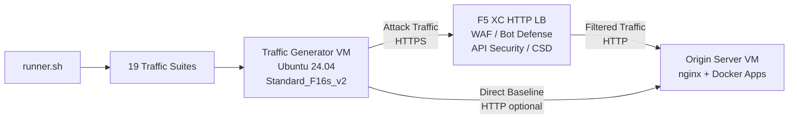

## उद्देश्य

यह कंपोनेंट एक स्वचालित ट्रैफिक जनरेशन प्लेटफॉर्म प्रदान करता है जो F5 Distributed Cloud HTTP लोड बैलेंसर के विरुद्ध अटैक ट्रैफिक, रिकॉनेसेंस स्कैन, बॉट सिमुलेशन, और API दुरुपयोग उत्पन्न करता है। यह एक सामान्य डेमो आर्किटेक्चर में "अटैकर" है -- दुर्भावनापूर्ण और संदिग्ध ट्रैफिक का स्रोत जिसे F5 XC सुरक्षा सुविधाएँ पहचानने और अवरुद्ध करने के लिए डिज़ाइन की गई हैं।

डेमो आर्किटेक्चर में:

```
Traffic Generator VM -> F5 XC HTTP LB (WAF/Bot/API/CSD) -> Origin Server VM
```

ट्रैफिक जनरेटर F5 XC लोड बैलेंसर के सार्वजनिक FQDN को रिक्वेस्ट भेजता है। F5 XC प्लेटफॉर्म ट्रैफिक का निरीक्षण और फ़िल्टरिंग करता है और फिर वैध रिक्वेस्ट को ओरिजिन सर्वर तक फॉरवर्ड करता है। इसके बाद ऑपरेटर पहचान और प्रवर्तन को प्रदर्शित करने के लिए F5 XC सुरक्षा ईवेंट लॉग की समीक्षा करता है।

## आर्किटेक्चर



ट्रैफिक जनरेटर VM Azure पर चलता है, जिसमें:

- **Ubuntu 24.04 LTS** बेस इमेज के रूप में
- **50+ सुरक्षा उपकरण** प्रोविज़निंग के दौरान cloud-init के माध्यम से स्थापित
- **19 व्यवस्थित ट्रैफिक सुइट्स** क्रमांकित स्क्रिप्ट के साथ क्रम में निष्पादित
- **runner.sh** सुइट निष्पादन के लिए ऑर्केस्ट्रेटर जिसमें परिणाम लॉगिंग शामिल है
- **config.env** लक्ष्य कॉन्फ़िगरेशन के लिए (FQDN, ओरिजिन IP)

## उपकरण श्रेणियाँ

| श्रेणी | उपकरण | उद्देश्य |
|---|---|---|
| वेब एप्लिकेशन टेस्टिंग | nikto, sqlmap, nuclei, dalfox, ffuf, gobuster, feroxbuster, dirb, whatweb | WAF अटैक पेलोड जनरेशन |
| नेटवर्क विश्लेषण | nmap, masscan, tshark, hping3, tcpdump, netcat, ngrep, iperf3, mtr | रिकॉनेसेंस और नेटवर्क प्रोबिंग |
| MITM और प्रॉक्सी | mitmproxy, socat | ट्रैफिक इंटरसेप्शन और मैनिपुलेशन |
| SSL/TLS टेस्टिंग | sslscan, sslyze, testssl.sh | TLS कॉन्फ़िगरेशन स्कैनिंग |
| ब्राउज़र ऑटोमेशन | playwright, puppeteer, puppeteer-extra-plugin-stealth | हेडलेस Chrome के साथ बॉट सिमुलेशन |
| सबडोमेन और DNS | subfinder, httpx, amass, dnsrecon, fierce, whois, dnsutils | रिकॉनेसेंस और एन्युमरेशन |
| क्रेडेंशियल टेस्टिंग | hydra, medusa, ncrack | ऑथेंटिकेशन अटैक सिमुलेशन |
| WAF इवेज़न टेस्टिंग | gotestwaf, waf-bypass, wfuzz | मल्टी-लेयर एन्कोडिंग इवेज़न और WAF बाइपास मूल्यांकन |
| एक्सप्लॉइट फ्रेमवर्क | ZAP, Metasploit (केवल फुल टियर) | व्यापक भेद्यता स्कैनिंग |

## टियर्ड इंस्टॉलेशन

ट्रैफिक जनरेटर `tool_tier` Terraform वेरिएबल द्वारा नियंत्रित दो इंस्टॉलेशन टियर का समर्थन करता है:

### स्टैंडर्ड टियर (डिफ़ॉल्ट)

ZAP और Metasploit को छोड़कर टूल कैटलॉग में सूचीबद्ध सभी उपकरण स्थापित करता है। प्रोविज़निंग 15-20 मिनट में पूर्ण होती है। यह टियर सभी 19 ट्रैफिक सुइट्स को कवर करता है और अधिकांश डेमो परिदृश्यों के लिए पर्याप्त है।

### फुल टियर

स्टैंडर्ड टियर के ऊपर OWASP ZAP और Metasploit Framework जोड़ता है। प्रोविज़निंग में लगभग 25 मिनट लगते हैं। ये उपकरण बड़े हैं (ZAP ~500 MiB, Metasploit ~1 GiB) और केवल उन्नत भेद्यता स्कैनिंग डेमो के लिए आवश्यक हैं।

वर्तमान VM लागत के लिए Azure मूल्य निर्धारण कैलकुलेटर देखें। डिफ़ॉल्ट Standard_F16s_v2 एक कम्प्यूट-ऑप्टिमाइज़्ड इंस्टेंस है जो निरंतर ट्रैफिक जनरेशन के लिए उपयुक्त है।

:::tip
चालू शुल्कों से बचने के लिए जब लैब उपयोग में न हो तो `terraform destroy` का उपयोग करें। प्रक्रिया के लिए [टियरडाउन](../08-teardown/) देखें।
:::

## इंटीग्रेशन पॉइंट्स

यह कंपोनेंट दो अन्य डेमो कंपोनेंट्स के साथ इंटीग्रेट होता है:

- **ओरिजिन सर्वर** -- लक्ष्य बैकएंड जो Juice Shop, DVWA, VAmPI, httpbin, और whoami होस्ट करता है। ट्रैफिक जनरेटर इन एप्लिकेशनों तक पहुँचने के लिए F5 XC के माध्यम से अटैक ट्रैफिक भेजता है। पूर्ण आर्किटेक्चर विवरण के लिए [इंटीग्रेशन](../07-integrate/) देखें।

- **CSD डेमो** -- ओरिजिन सर्वर पर Client-Side Defense डेमो एप्लिकेशन। `javascript-exploits` ट्रैफिक सुइट Magecart-शैली स्क्रिप्ट इंजेक्शन पेलोड उत्पन्न करता है जिन्हें F5 XC Client-Side Defense पहचानता है। यह CSD फेज़ 2 कार्यक्षमता को सत्यापित करता है।

## मॉड्यूलर कंपोनेंट डिज़ाइन

प्रत्येक लैब कंपोनेंट स्व-निहित है और स्वतंत्र रूप से डिप्लॉय किया जाता है:

- **ट्रैफिक जनरेटर** (यह कंपोनेंट) अटैक स्रोत प्रदान करता है
- **ओरिजिन सर्वर** कमज़ोर एप्लिकेशन लक्ष्य प्रदान करता है
- **CDN सिम्युलेटर** CDN एज कैशिंग लेयर प्रदान करता है (वैकल्पिक)
- **F5 XC कॉन्फ़िगरेशन** WAF, Bot Defense, API Security, और CSD पॉलिसीज़ प्रदान करता है

मानव ऑपरेटर या AI सहायक एक समय में एक कंपोनेंट जोड़ता है। पहले ओरिजिन सर्वर डिप्लॉय करें, उसके सामने F5 XC कॉन्फ़िगर करें, फिर F5 XC लोड बैलेंसर FQDN को लक्षित करते हुए ट्रैफिक जनरेटर डिप्लॉय करें।
