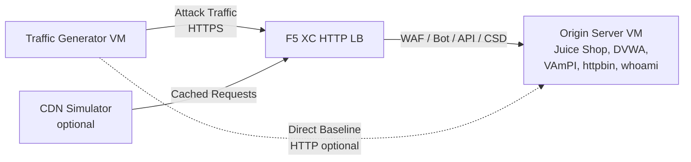

## पूर्ण आर्किटेक्चर

ट्रैफ़िक जनरेटर एक बहु-स्तरीय डेमो वातावरण में एक घटक है। जब सभी घटक तैनात होते हैं तो पूर्ण आर्किटेक्चर इस प्रकार होता है:

```
Traffic Generator -> F5 XC HTTP LB (WAF/Bot/API/CSD) -> Origin Server
                         |
               CDN Simulator (optional)
```



प्रत्येक घटक स्वतंत्र रूप से Terraform के माध्यम से तैनात और कॉन्फ़िगर किया जाता है। ट्रैफ़िक जनरेटर F5 XC लोड बैलेंसर FQDN को लक्षित करता है, सीधे ऑरिजिन सर्वर को नहीं।

## ऑरिजिन सर्वर एकीकरण

[ऑरिजिन सर्वर](https://f5xc-salesdemos.github.io/origin-server/) बैकएंड एप्लिकेशन प्रदान करता है जिन्हें ट्रैफ़िक जनरेटर के अटैक सुइट्स लक्षित करते हैं:

| ट्रैफ़िक सुइट | ऑरिजिन एप्लिकेशन | पथ |
|---|---|---|
| api-attacks | VAmPI | `/vampi/` |
| bot-simulation | सभी एप्लिकेशन | सभी पथ |
| cdn-load-testing | CDN Simulator | CDN एंडपॉइंट |
| crapi-exploits | crAPI | `/crapi/` |
| csd-demo-attacks | CSD Demo | `/csd-demo/` |
| dvga-exploits | DVGA | `/dvga/` |
| dvwa-exploits | DVWA | `/dvwa/` |
| javascript-exploits | CSD Demo | `/csd-demo/` |
| juice-shop-exploits | Juice Shop | `/juice-shop/` |
| mitre-attack | सभी एप्लिकेशन | सभी पथ |
| owasp-scanning | सभी एप्लिकेशन | सभी पथ |
| performance-testing | सभी एप्लिकेशन | सभी पथ |
| reconnaissance | सभी एप्लिकेशन | सभी पथ |
| restaurant-exploits | Restaurant API | `/restaurant/` |
| ssl-scanning | F5 XC LB (सीधे ऑरिजिन नहीं) | N/A |
| traffic-generation | सभी एप्लिकेशन | सभी पथ |
| web-app-attacks | Juice Shop, DVWA | `/juice-shop/`, `/dvwa/` |

### तैनाती क्रम

1. पहले **ऑरिजिन सर्वर** तैनात करें -- यह बैकएंड एप्लिकेशन प्रदान करता है
2. ऑरिजिन सर्वर को ऑरिजिन पूल के रूप में **F5 XC HTTP लोड बैलेंसर** कॉन्फ़िगर करें
3. लोड बैलेंसर में **WAF, Bot Defense, API Security, और CSD नीतियाँ** संलग्न करें
4. `target_fqdn` को F5 XC LB डोमेन पर सेट करके **ट्रैफ़िक जनरेटर** तैनात करें

### लक्ष्यीकरण कॉन्फ़िगरेशन

ट्रैफ़िक जनरेटर का `config.env` इसे शेष आर्किटेक्चर से जोड़ता है:

```bash
# Target the F5 XC load balancer (traffic passes through security policies)
TARGET_FQDN=demo.example.com

# Optional: target the origin server directly (bypasses F5 XC)
TARGET_ORIGIN_IP=20.10.5.100
```

जब `TARGET_FQDN` सेट होता है, तो सभी सुइट स्क्रिप्ट `https://<TARGET_FQDN>/...` पर ट्रैफ़िक भेजती हैं। F5 XC लोड बैलेंसर अनुरोध प्राप्त करता है, सुरक्षा नीतियाँ लागू करता है, और अनुमत ट्रैफ़िक को ऑरिजिन सर्वर पर अग्रेषित करता है।

## CSD डेमो एकीकरण

`javascript-exploits` सुइट विशेष रूप से ऑरिजिन सर्वर पर Client-Side Defense डेमो के लिए डिज़ाइन किया गया है। यह सुइट CSD Phase 2 कार्यक्षमता को मान्य करता है:

**Phase 2 प्रवाह:**

1. ऑरिजिन सर्वर `/csd-demo/` पर CSD डेमो पेज होस्ट करता है
2. F5 XC CSD अपनी मॉनिटरिंग JavaScript को पेज में इंजेक्ट करता है
3. ट्रैफ़िक जनरेटर का javascript-exploits सुइट निम्नलिखित प्रयास करता है:
   - इनलाइन स्क्रिप्ट इंजेक्ट करना जो Magecart स्किमर्स की नकल करती हैं
   - फ़ॉर्म सबमिशन को रीडायरेक्ट करने के लिए DOM तत्वों को संशोधित करना
   - अनधिकृत तृतीय-पक्ष JavaScript लोड करना
4. F5 XC CSD इन संशोधनों का पता लगाता है और उन्हें CSD डैशबोर्ड में रिपोर्ट करता है

javascript-exploits सुइट का उपयोग करने के लिए:

```bash
# Ensure CSD is enabled on the F5 XC HTTP LB for the /csd-demo/ path
# Then run the suite
/opt/traffic-generator/suites/runner.sh javascript-exploits
```

## CDN सिम्युलेटर एकीकरण

जब CDN सिम्युलेटर तैनात होता है, तो आर्किटेक्चर में एक कैशिंग परत जुड़ जाती है:

```
Traffic Generator -> CDN Simulator -> F5 XC HTTP LB -> Origin Server
```

CDN सिम्युलेटर F5 XC लोड बैलेंसर के सामने बैठता है, प्रतिक्रियाओं को कैश करता है और CDN-जैसे हेडर जोड़ता है। CDN के माध्यम से ट्रैफ़िक लक्षित करने के लिए:

```bash
# Set TARGET_FQDN to the CDN Simulator's endpoint instead of F5 XC directly
TARGET_FQDN=cdn.demo.example.com
```

यह प्रदर्शित करने के लिए उपयोगी है कि F5 XC CDN के माध्यम से आने वाले ट्रैफ़िक को कैसे संभालता है, जिसमें शामिल हैं:

- CDN प्रॉक्सी हेडर के पीछे वास्तविक क्लाइंट IP की पहचान करना
- उन अनुरोधों पर WAF नियम लागू करना जो CDN द्वारा संशोधित किए गए हो सकते हैं
- जब CDN ब्राउज़र फिंगरप्रिंट को संशोधित करता है तो Bot Defense वर्गीकरण

## प्रत्यक्ष बनाम LB ट्रैफ़िक तुलना

ट्रैफ़िक जनरेटर F5 XC के माध्यम से और सीधे ऑरिजिन पर दोनों तरह से ट्रैफ़िक भेजने का समर्थन करता है। यह तुलना F5 XC सुरक्षा सुविधाओं के मूल्य को प्रदर्शित करती है:

### F5 XC के माध्यम से (डिफ़ॉल्ट)

```bash
# Traffic goes: Generator -> F5 XC LB -> Origin
TARGET_FQDN=demo.example.com /opt/traffic-generator/suites/runner.sh web-app-attacks
```

अपेक्षित: WAF SQL इंजेक्शन, XSS, और कमांड इंजेक्शन पेलोड को ब्लॉक करता है। Security Events डैशबोर्ड ब्लॉक किए गए अनुरोधों को उल्लंघन विवरण के साथ दिखाता है।

### सीधे ऑरिजिन पर (बेसलाइन)

```bash
# Traffic goes: Generator -> Origin (no security layer)
TARGET_FQDN=20.10.5.100 /opt/traffic-generator/suites/runner.sh web-app-attacks
```

अपेक्षित: सभी पेलोड बिना फ़िल्टर किए ऑरिजिन एप्लिकेशन तक पहुँचते हैं। Juice Shop और DVWA अटैक पेलोड को प्रोसेस करते हैं। यह प्रदर्शित करता है कि F5 XC सुरक्षा के बिना क्या होता है।

### साइड-बाय-साइड डेमो प्रवाह

एक प्रभावशाली डेमो के लिए, एक ही सुइट को दोनों तरीकों से चलाएँ:

1. `web-app-attacks` को सीधे ऑरिजिन के विरुद्ध चलाएँ -- दिखाएँ कि हमले सफल होते हैं
2. `web-app-attacks` को F5 XC के माध्यम से चलाएँ -- दिखाएँ कि हमले ब्लॉक होते हैं
3. ब्लॉक किए गए अनुरोधों को प्रदर्शित करने के लिए F5 XC Security Events डैशबोर्ड खोलें
4. सुइट `meta.json` परिणामों की तुलना करें: प्रत्यक्ष रन में अधिक "passed" (हमले सफल हुए) दिखते हैं, LB रन में अधिक "failed" (हमले ब्लॉक हुए) दिखते हैं

```bash
TGEN_IP=$(terraform output -raw public_ip)
ORIGIN_IP="20.10.5.100"
LB_FQDN="demo.example.com"

# Run 1: Direct (baseline)
ssh azureuser@${TGEN_IP} "TARGET_FQDN=${ORIGIN_IP} /opt/traffic-generator/suites/runner.sh web-app-attacks"

# Run 2: Through F5 XC
ssh azureuser@${TGEN_IP} "TARGET_FQDN=${LB_FQDN} /opt/traffic-generator/suites/runner.sh web-app-attacks"

# Compare results
ssh azureuser@${TGEN_IP} 'for d in $(ls -t /opt/traffic-generator/results/ | head -2); do echo "=== $d ==="; cat /opt/traffic-generator/results/$d/meta.json; echo; done'
```

## बहु-घटक Terraform तैनाती

पूर्ण लैब वातावरण तैनात करते समय, प्रत्येक घटक के लिए अलग Terraform वर्कस्पेस या डायरेक्टरी का उपयोग करें:

```bash
# 1. Deploy origin server
cd origin-server
terraform apply -var="subscription_id=YOUR_SUB_ID"
ORIGIN_IP=$(terraform output -raw public_ip)

# 2. Configure F5 XC (manual or via separate Terraform)
# Create origin pool -> HTTP LB -> attach WAF/Bot/API/CSD policies
# LB_FQDN=demo.example.com

# 3. Deploy traffic generator targeting the F5 XC LB
cd ../traffic-generator
terraform apply \
  -var="subscription_id=YOUR_SUB_ID" \
  -var="target_fqdn=demo.example.com" \
  -var="target_origin_ip=${ORIGIN_IP}"

# 4. Generate traffic
TGEN_IP=$(terraform output -raw public_ip)
ssh azureuser@${TGEN_IP} '/opt/traffic-generator/suites/runner.sh web-app-attacks'
```
