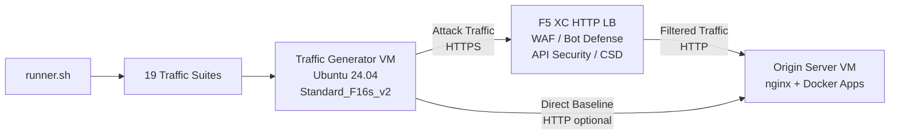

## Scopo

Questo componente fornisce una piattaforma automatizzata di generazione del traffico che produce traffico di attacco, scansioni di ricognizione, simulazione di bot e abuso delle API contro un HTTP load balancer di F5 Distributed Cloud. Rappresenta l'"attaccante" in una tipica architettura demo -- la sorgente di traffico malevolo e sospetto che le funzionalità di sicurezza di F5 XC sono progettate per rilevare e bloccare.

Nell'architettura demo:

```
Traffic Generator VM -> F5 XC HTTP LB (WAF/Bot/API/CSD) -> Origin Server VM
```

Il Traffic Generator invia richieste all'FQDN pubblico dell'HTTP load balancer di F5 XC. La piattaforma F5 XC ispeziona e filtra il traffico prima di inoltrare le richieste legittime all'origin server. L'operatore esamina quindi i log degli eventi di sicurezza di F5 XC per dimostrare il rilevamento e l'applicazione delle policy.

## Architettura



La VM del Traffic Generator viene eseguita su Azure con:

- **Ubuntu 24.04 LTS** come immagine base
- **Oltre 50 strumenti di sicurezza** installati tramite cloud-init durante il provisioning
- **19 suite di traffico organizzate** con script numerati eseguiti in ordine
- **runner.sh** come orchestratore per l'esecuzione delle suite con logging dei risultati
- **config.env** per la configurazione del target (FQDN, IP dell'origin)

## Categorie di strumenti

| Categoria | Strumenti | Scopo |
|---|---|---|
| Test delle applicazioni web | nikto, sqlmap, nuclei, dalfox, ffuf, gobuster, feroxbuster, dirb, whatweb | Generazione di payload di attacco WAF |
| Analisi di rete | nmap, masscan, tshark, hping3, tcpdump, netcat, ngrep, iperf3, mtr | Ricognizione e sondaggio della rete |
| MITM e Proxy | mitmproxy, socat | Intercettazione e manipolazione del traffico |
| Test SSL/TLS | sslscan, sslyze, testssl.sh | Scansione della configurazione TLS |
| Automazione browser | playwright, puppeteer, puppeteer-extra-plugin-stealth | Simulazione bot con Chrome headless |
| Sottodomini e DNS | subfinder, httpx, amass, dnsrecon, fierce, whois, dnsutils | Ricognizione ed enumerazione |
| Test delle credenziali | hydra, medusa, ncrack | Simulazione di attacchi di autenticazione |
| Test di evasione WAF | gotestwaf, waf-bypass, wfuzz | Evasione con codifica multilivello e valutazione del bypass WAF |
| Framework di exploit | ZAP, Metasploit (solo livello full) | Scansione completa delle vulnerabilità |

## Installazione a livelli

Il Traffic Generator supporta due livelli di installazione controllati dalla variabile Terraform `tool_tier`:

### Livello Standard (predefinito)

Installa tutti gli strumenti elencati nel catalogo ad eccezione di ZAP e Metasploit. Il provisioning si completa in 15-20 minuti. Questo livello copre tutte le 19 suite di traffico ed è sufficiente per la maggior parte degli scenari demo.

### Livello Full

Aggiunge OWASP ZAP e Metasploit Framework al livello standard. Il provisioning richiede circa 25 minuti. Questi strumenti sono pesanti (ZAP ~500 MiB, Metasploit ~1 GiB) e sono necessari solo per demo avanzate di scansione delle vulnerabilità.

Consultare il calcolatore dei prezzi Azure per i costi attuali delle VM. L'istanza predefinita Standard_F16s_v2 è un'istanza ottimizzata per il calcolo, adatta alla generazione sostenuta di traffico.

:::tip
Utilizzare `terraform destroy` quando il laboratorio non è in uso per evitare addebiti continuativi. Consultare [Teardown](../08-teardown/) per la procedura.
:::

## Punti di integrazione

Questo componente si integra con altri due componenti demo:

- **Origin Server** -- Il backend target che ospita Juice Shop, DVWA, VAmPI, httpbin e whoami. Il Traffic Generator invia traffico di attacco attraverso F5 XC per raggiungere queste applicazioni. Consultare [Integration](../07-integrate/) per i dettagli completi dell'architettura.

- **CSD Demo** -- L'applicazione demo Client-Side Defense sull'origin server. La suite di traffico `javascript-exploits` genera payload di iniezione di script in stile Magecart che F5 XC Client-Side Defense rileva. Questo valida la funzionalità CSD Phase 2.

## Design modulare dei componenti

Ogni componente del laboratorio è autonomo e distribuito in modo indipendente:

- **Traffic Generator** (questo componente) fornisce la sorgente di attacco
- **Origin Server** fornisce le applicazioni target vulnerabili
- **CDN Simulator** fornisce il livello di edge caching CDN (opzionale)
- **Configurazione F5 XC** fornisce le policy WAF, Bot Defense, API Security e CSD

L'operatore umano o l'assistente AI aggiunge i componenti uno alla volta. Distribuire prima l'origin server, configurare F5 XC davanti ad esso, quindi distribuire il traffic generator puntando all'FQDN dell'HTTP load balancer di F5 XC.
