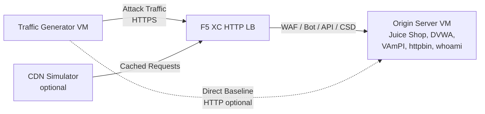

## Architettura completa

Il generatore di traffico è un componente in un ambiente demo multi-livello. L'architettura completa quando tutti i componenti sono distribuiti:

```
Traffic Generator -> F5 XC HTTP LB (WAF/Bot/API/CSD) -> Origin Server
                         |
               CDN Simulator (optional)
```



Ogni componente viene distribuito e configurato in modo indipendente tramite Terraform. Il generatore di traffico punta all'FQDN del load balancer F5 XC, non direttamente al server di origine.

## Integrazione con il Server di origine

Il [server di origine](https://f5xc-salesdemos.github.io/origin-server/) fornisce le applicazioni backend che le suite di attacco del generatore di traffico prendono come bersaglio:

| Suite di traffico | Applicazione di origine | Percorso |
|---|---|---|
| api-attacks | VAmPI | `/vampi/` |
| bot-simulation | Tutte le applicazioni | Tutti i percorsi |
| cdn-load-testing | Simulatore CDN | Endpoint CDN |
| crapi-exploits | crAPI | `/crapi/` |
| csd-demo-attacks | Demo CSD | `/csd-demo/` |
| dvga-exploits | DVGA | `/dvga/` |
| dvwa-exploits | DVWA | `/dvwa/` |
| javascript-exploits | Demo CSD | `/csd-demo/` |
| juice-shop-exploits | Juice Shop | `/juice-shop/` |
| mitre-attack | Tutte le applicazioni | Tutti i percorsi |
| owasp-scanning | Tutte le applicazioni | Tutti i percorsi |
| performance-testing | Tutte le applicazioni | Tutti i percorsi |
| reconnaissance | Tutte le applicazioni | Tutti i percorsi |
| restaurant-exploits | Restaurant API | `/restaurant/` |
| ssl-scanning | F5 XC LB (non l'origine direttamente) | N/A |
| traffic-generation | Tutte le applicazioni | Tutti i percorsi |
| web-app-attacks | Juice Shop, DVWA | `/juice-shop/`, `/dvwa/` |

### Ordine di distribuzione

1. Distribuire prima il **server di origine** -- fornisce le applicazioni backend
2. Configurare l'**F5 XC HTTP load balancer** con il server di origine come pool di origine
3. Collegare le **policy WAF, Difesa Bot, Sicurezza API e CSD** al load balancer
4. Distribuire il **generatore di traffico** con `target_fqdn` impostato sul dominio dell'F5 XC LB

### Configurazione del targeting

Il file `config.env` del generatore di traffico lo connette al resto dell'architettura:

```bash
# Target the F5 XC load balancer (traffic passes through security policies)
TARGET_FQDN=demo.example.com

# Optional: target the origin server directly (bypasses F5 XC)
TARGET_ORIGIN_IP=20.10.5.100
```

Quando `TARGET_FQDN` è impostato, tutti gli script delle suite inviano traffico a `https://<TARGET_FQDN>/...`. L'F5 XC load balancer riceve le richieste, applica le policy di sicurezza e inoltra il traffico consentito al server di origine.

## Integrazione con la demo CSD

La suite `javascript-exploits` è progettata specificamente per la demo di Difesa lato client sul server di origine. Questa suite valida la funzionalità della Fase 2 della CSD:

**Flusso della Fase 2:**

1. Il server di origine ospita la pagina della demo CSD in `/csd-demo/`
2. F5 XC CSD inietta il proprio JavaScript di monitoraggio nella pagina
3. La suite javascript-exploits del generatore di traffico tenta di:
   - Iniettare script inline che imitano gli skimmer Magecart
   - Modificare elementi DOM per reindirizzare l'invio dei moduli
   - Caricare JavaScript non autorizzato di terze parti
4. F5 XC CSD rileva queste modifiche e le segnala nella dashboard CSD

Per utilizzare la suite javascript-exploits:

```bash
# Ensure CSD is enabled on the F5 XC HTTP LB for the /csd-demo/ path
# Then run the suite
/opt/traffic-generator/suites/runner.sh javascript-exploits
```

## Integrazione con il Simulatore CDN

Quando il Simulatore CDN è distribuito, l'architettura aggiunge un livello di caching:

```
Traffic Generator -> CDN Simulator -> F5 XC HTTP LB -> Origin Server
```

Il Simulatore CDN si posiziona davanti all'F5 XC load balancer, memorizzando nella cache le risposte e aggiungendo intestazioni simili a quelle CDN. Per instradare il traffico attraverso la CDN:

```bash
# Set TARGET_FQDN to the CDN Simulator's endpoint instead of F5 XC directly
TARGET_FQDN=cdn.demo.example.com
```

Questo è utile per dimostrare come F5 XC gestisce il traffico che arriva attraverso una CDN, incluso:

- Identificare il vero IP del client dietro le intestazioni proxy CDN
- Applicare le regole WAF alle richieste che potrebbero essere state modificate dalla CDN
- Classificazione della Difesa Bot quando la CDN modifica le impronte digitali del browser

## Confronto tra traffico diretto e tramite LB

Il generatore di traffico supporta l'invio di traffico sia attraverso F5 XC che direttamente all'origine. Questo confronto dimostra il valore delle funzionalità di sicurezza di F5 XC:

### Attraverso F5 XC (predefinito)

```bash
# Traffic goes: Generator -> F5 XC LB -> Origin
TARGET_FQDN=demo.example.com /opt/traffic-generator/suites/runner.sh web-app-attacks
```

Risultato atteso: il WAF blocca i payload di SQL injection, XSS e command injection. La dashboard degli eventi di sicurezza mostra le richieste bloccate con i dettagli delle violazioni.

### Diretto all'origine (baseline)

```bash
# Traffic goes: Generator -> Origin (no security layer)
TARGET_FQDN=20.10.5.100 /opt/traffic-generator/suites/runner.sh web-app-attacks
```

Risultato atteso: tutti i payload raggiungono le applicazioni di origine senza filtri. Juice Shop e DVWA elaborano i payload degli attacchi. Questo dimostra cosa accade senza la protezione di F5 XC.

### Flusso demo affiancato

Per una demo convincente, eseguire la stessa suite in entrambe le modalità:

1. Eseguire `web-app-attacks` direttamente contro l'origine -- mostrare che gli attacchi hanno successo
2. Eseguire `web-app-attacks` attraverso F5 XC -- mostrare che gli attacchi vengono bloccati
3. Aprire la dashboard degli eventi di sicurezza di F5 XC per visualizzare le richieste bloccate
4. Confrontare i risultati `meta.json` della suite: le esecuzioni dirette mostrano più "passed" (attacchi riusciti), le esecuzioni tramite LB mostrano più "failed" (attacchi bloccati)

```bash
TGEN_IP=$(terraform output -raw public_ip)
ORIGIN_IP="20.10.5.100"
LB_FQDN="demo.example.com"

# Run 1: Direct (baseline)
ssh azureuser@${TGEN_IP} "TARGET_FQDN=${ORIGIN_IP} /opt/traffic-generator/suites/runner.sh web-app-attacks"

# Run 2: Through F5 XC
ssh azureuser@${TGEN_IP} "TARGET_FQDN=${LB_FQDN} /opt/traffic-generator/suites/runner.sh web-app-attacks"

# Compare results
ssh azureuser@${TGEN_IP} 'for d in $(ls -t /opt/traffic-generator/results/ | head -2); do echo "=== $d ==="; cat /opt/traffic-generator/results/$d/meta.json; echo; done'
```

## Distribuzione Terraform multi-componente

Quando si distribuisce l'intero ambiente lab, utilizzare workspace o directory Terraform separate per ogni componente:

```bash
# 1. Deploy origin server
cd origin-server
terraform apply -var="subscription_id=YOUR_SUB_ID"
ORIGIN_IP=$(terraform output -raw public_ip)

# 2. Configure F5 XC (manual or via separate Terraform)
# Create origin pool -> HTTP LB -> attach WAF/Bot/API/CSD policies
# LB_FQDN=demo.example.com

# 3. Deploy traffic generator targeting the F5 XC LB
cd ../traffic-generator
terraform apply \
  -var="subscription_id=YOUR_SUB_ID" \
  -var="target_fqdn=demo.example.com" \
  -var="target_origin_ip=${ORIGIN_IP}"

# 4. Generate traffic
TGEN_IP=$(terraform output -raw public_ip)
ssh azureuser@${TGEN_IP} '/opt/traffic-generator/suites/runner.sh web-app-attacks'
```
