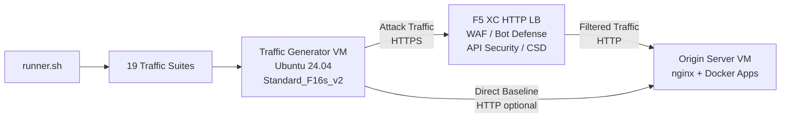

## 目的

このコンポーネントは、F5 Distributed Cloud HTTPロードバランサーに対して攻撃トラフィック、偵察スキャン、ボットシミュレーション、API悪用を生成する自動トラフィック生成プラットフォームを提供します。これは一般的なデモアーキテクチャにおける「攻撃者」であり、F5 XCセキュリティ機能が検出およびブロックするように設計された悪意のある・不審なトラフィックの発生源です。

デモアーキテクチャの構成：

```
Traffic Generator VM -> F5 XC HTTP LB (WAF/Bot/API/CSD) -> Origin Server VM
```

トラフィックジェネレーターはF5 XCロードバランサーのパブリックFQDNにリクエストを送信します。F5 XCプラットフォームはトラフィックを検査・フィルタリングし、正当なリクエストのみをオリジンサーバーに転送します。オペレーターはF5 XCセキュリティイベントログを確認して、検出と適用を実演します。

## アーキテクチャ



トラフィックジェネレーターVMはAzure上で以下の構成で動作します：

- **Ubuntu 24.04 LTS** をベースイメージとして使用
- **50以上のセキュリティツール** をプロビジョニング時にcloud-initでインストール
- **19の整理されたトラフィックスイート** を番号付きスクリプトで順番に実行
- **runner.sh** オーケストレーターによるスイート実行と結果ログ記録
- **config.env** によるターゲット設定（FQDN、オリジンIP）

## ツールカテゴリ

| カテゴリ | ツール | 目的 |
|---|---|---|
| Webアプリケーションテスト | nikto, sqlmap, nuclei, dalfox, ffuf, gobuster, feroxbuster, dirb, whatweb | WAF攻撃ペイロード生成 |
| ネットワーク分析 | nmap, masscan, tshark, hping3, tcpdump, netcat, ngrep, iperf3, mtr | 偵察とネットワークプロービング |
| MITMとプロキシ | mitmproxy, socat | トラフィックの傍受と操作 |
| SSL/TLSテスト | sslscan, sslyze, testssl.sh | TLS構成スキャン |
| ブラウザ自動化 | playwright, puppeteer, puppeteer-extra-plugin-stealth | ヘッドレスChromeによるボットシミュレーション |
| サブドメインとDNS | subfinder, httpx, amass, dnsrecon, fierce, whois, dnsutils | 偵察と列挙 |
| 認証情報テスト | hydra, medusa, ncrack | 認証攻撃シミュレーション |
| WAF回避テスト | gotestwaf, waf-bypass, wfuzz | 多層エンコーディング回避とWAFバイパス評価 |
| エクスプロイトフレームワーク | ZAP, Metasploit（fullティアのみ） | 包括的な脆弱性スキャン |

## ティア別インストール

トラフィックジェネレーターは、Terraform変数 `tool_tier` で制御される2つのインストールティアをサポートしています：

### Standardティア（デフォルト）

ZAPとMetasploitを除く、ツールカタログに記載されたすべてのツールをインストールします。プロビジョニングは15〜20分で完了します。このティアは19のトラフィックスイートすべてをカバーし、ほとんどのデモシナリオに十分です。

### Fullティア

Standardティアに加えて、OWASP ZAPとMetasploit Frameworkを追加します。プロビジョニングには約25分かかります。これらのツールは大容量（ZAP約500 MiB、Metasploit約1 GiB）であり、高度な脆弱性スキャンデモでのみ必要です。

現在のVMコストについてはAzure料金計算ツールをご参照ください。デフォルトのStandard_F16s_v2は、持続的なトラフィック生成に適したコンピューティング最適化インスタンスです。

:::tip
ラボを使用していない場合は `terraform destroy` を実行して、継続的な課金を回避してください。手順については[環境の破棄](../08-teardown/)をご参照ください。
:::

## 統合ポイント

このコンポーネントは、他の2つのデモコンポーネントと統合されます：

- **オリジンサーバー** -- Juice Shop、DVWA、VAmPI、httpbin、whoamiをホストするターゲットバックエンドです。トラフィックジェネレーターはF5 XCを通じて攻撃トラフィックを送信し、これらのアプリケーションに到達します。完全なアーキテクチャの詳細については[統合](../07-integrate/)をご参照ください。

- **CSDデモ** -- オリジンサーバー上のClient-Side Defenseデモアプリケーションです。`javascript-exploits` トラフィックスイートは、F5 XC Client-Side Defenseが検出するMagecartスタイルのスクリプトインジェクションペイロードを生成します。これによりCSDフェーズ2の機能が検証されます。

## モジュラーコンポーネント設計

各ラボコンポーネントは自己完結型であり、独立してデプロイされます：

- **トラフィックジェネレーター**（本コンポーネント）は攻撃ソースを提供します
- **オリジンサーバー** は脆弱なアプリケーションターゲットを提供します
- **CDNシミュレーター** はCDNエッジキャッシュレイヤーを提供します（オプション）
- **F5 XC構成** はWAF、Bot Defense、APIセキュリティ、CSDポリシーを提供します

人間のオペレーターまたはAIアシスタントがコンポーネントを1つずつ追加します。まずオリジンサーバーをデプロイし、その前にF5 XCを構成してから、F5 XCロードバランサーFQDNをターゲットとするトラフィックジェネレーターをデプロイします。
