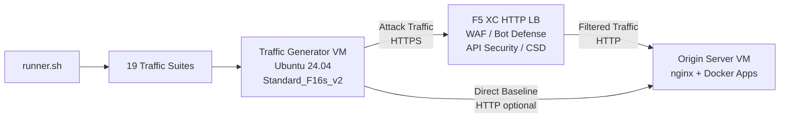

## 目的

このコンポーネントは、F5 Distributed Cloud HTTP ロードバランサーに対して攻撃トラフィック、偵察スキャン、ボットシミュレーション、および API 悪用を生成する自動化されたトラフィック生成プラットフォームを提供します。これは典型的なデモアーキテクチャにおける「攻撃者」であり、F5 XC セキュリティ機能が検出・ブロックするよう設計された悪意のある不審なトラフィックの発生源です。

デモアーキテクチャにおける構成:

```
Traffic Generator VM -> F5 XC HTTP LB (WAF/Bot/API/CSD) -> Origin Server VM
```

トラフィックジェネレーターは F5 XC ロードバランサーのパブリック FQDN にリクエストを送信します。F5 XC プラットフォームはトラフィックを検査・フィルタリングした後、正規のリクエストをオリジンサーバーに転送します。オペレーターはその後、F5 XC セキュリティイベントログを確認して検出および適用を実証します。

## アーキテクチャ



トラフィックジェネレーター VM は Azure 上で動作し、以下の構成となっています:

- **Ubuntu 24.04 LTS** をベースイメージとして使用
- **50以上のセキュリティツール** をプロビジョニング時に cloud-init 経由でインストール
- **19の整理されたトラフィックスイート** と番号順に実行されるスクリプト
- **runner.sh** によるスイート実行と結果ログのオーケストレーター
- **config.env** によるターゲット設定（FQDN、オリジン IP）

## ツールカテゴリ

| カテゴリ | ツール | 目的 |
|---|---|---|
| Web アプリケーションテスト | nikto, sqlmap, nuclei, dalfox, ffuf, gobuster, feroxbuster, dirb, whatweb | Web アプリファイアウォール (WAF) 攻撃ペイロード生成 |
| ネットワーク分析 | nmap, masscan, tshark, hping3, tcpdump, netcat, ngrep, iperf3, mtr | 偵察とネットワークプロービング |
| MITM およびプロキシ | mitmproxy, socat | トラフィックの傍受と操作 |
| SSL/TLS テスト | sslscan, sslyze, testssl.sh | TLS 設定スキャン |
| ブラウザ自動化 | playwright, puppeteer, puppeteer-extra-plugin-stealth | ヘッドレス Chrome によるボットシミュレーション |
| サブドメインおよび DNS | subfinder, httpx, amass, dnsrecon, fierce, whois, dnsutils | 偵察と列挙 |
| クレデンシャルテスト | hydra, medusa, ncrack | 認証攻撃シミュレーション |
| Web アプリファイアウォール (WAF) 回避テスト | gotestwaf, waf-bypass, wfuzz | マルチレイヤーエンコーディング回避および WAF バイパス評価 |
| エクスプロイトフレームワーク | ZAP, Metasploit（フルティアのみ） | 包括的な脆弱性スキャン |

## 階層型インストール

トラフィックジェネレーターは、`tool_tier` Terraform 変数によって制御される2つのインストール階層をサポートしています。

### スタンダードティア（デフォルト）

ZAP および Metasploit を除くツールカタログに記載されたすべてのツールをインストールします。プロビジョニングは15〜20分で完了します。このティアはすべての19のトラフィックスイートに対応しており、ほとんどのデモシナリオで十分です。

### フルティア

スタンダードティアに加えて OWASP ZAP および Metasploit Framework を追加インストールします。プロビジョニングには約25分かかります。これらのツールは容量が大きく（ZAP 約500 MiB、Metasploit 約1 GiB）、高度な脆弱性スキャンデモにのみ必要です。

現在の VM コストについては Azure 料金計算ツールを参照してください。デフォルトの Standard_F16s_v2 は、継続的なトラフィック生成に適したコンピューティング最適化インスタンスです。

:::tip
ラボを使用しない場合は `terraform destroy` を実行して継続的な課金を回避してください。手順については[ティアダウン](../08-teardown/)を参照してください。
:::

## インテグレーションポイント

このコンポーネントは他の2つのデモコンポーネントと連携します:

- **オリジンサーバー** -- Juice Shop、DVWA、VAmPI、httpbin、および whoami をホストするターゲットバックエンド。トラフィックジェネレーターは F5 XC を経由してこれらのアプリケーションに攻撃トラフィックを送信します。完全なアーキテクチャの詳細については[インテグレーション](../07-integrate/)を参照してください。

- **CSD デモ** -- オリジンサーバー上のクライアントサイド防御デモアプリケーション。`javascript-exploits` トラフィックスイートは Magecart スタイルのスクリプトインジェクションペイロードを生成し、F5 XC クライアントサイド防御がこれを検出します。これにより CSD フェーズ2の機能が検証されます。

## モジュラーコンポーネント設計

各ラボコンポーネントは自己完結型で独立してデプロイされます:

- **トラフィックジェネレーター**（このコンポーネント）は攻撃ソースを提供します
- **オリジンサーバー**は脆弱なアプリケーションターゲットを提供します
- **CDN シミュレーター**は CDN エッジキャッシュレイヤーを提供します（オプション）
- **F5 XC 設定**は Web アプリファイアウォール (WAF)、Bot 防御、API セキュリティ、および CSD ポリシーを提供します

人間のオペレーターまたは AI アシスタントは、コンポーネントを一度に1つずつ追加します。まずオリジンサーバーをデプロイし、その前に F5 XC を設定してから、F5 XC ロードバランサー FQDN を対象とするトラフィックジェネレーターをデプロイしてください。
