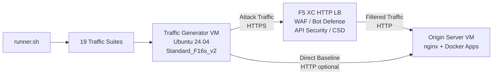

## 目的

このコンポーネントは、F5 Distributed Cloud HTTPロードバランサーに対して攻撃トラフィック、偵察スキャン、ボットシミュレーション、API悪用を生成する自動トラフィック生成プラットフォームを提供します。これは典型的なデモアーキテクチャにおける「攻撃者」であり、F5 XCセキュリティ機能が検出およびブロックするように設計された悪意のある・不審なトラフィックの発生源です。

デモアーキテクチャにおいて：

```
Traffic Generator VM -> F5 XC HTTP LB (WAF/Bot/API/CSD) -> Origin Server VM
```

Traffic GeneratorはF5 XCロードバランサーのパブリックFQDNにリクエストを送信します。F5 XCプラットフォームはトラフィックを検査・フィルタリングした後、正当なリクエストをオリジンサーバーに転送します。オペレーターはF5 XCのセキュリティイベントログを確認し、検出と適用を実演します。

## アーキテクチャ



Traffic Generator VMはAzure上で以下の構成で動作します：

- **Ubuntu 24.04 LTS** をベースイメージとして使用
- **50以上のセキュリティツール** がプロビジョニング時にcloud-initを通じてインストール
- **19の整理されたトラフィックスイート** が番号付きスクリプトで順番に実行
- **runner.sh** がスイート実行と結果ログのオーケストレーターとして機能
- **config.env** でターゲット設定（FQDN、オリジンIP）を管理

## ツールカテゴリ

| カテゴリ | ツール | 目的 |
|---|---|---|
| Webアプリケーションテスト | nikto, sqlmap, nuclei, dalfox, ffuf, gobuster, feroxbuster, dirb, whatweb | WAF攻撃ペイロード生成 |
| ネットワーク分析 | nmap, masscan, tshark, hping3, tcpdump, netcat, ngrep, iperf3, mtr | 偵察およびネットワークプロービング |
| MITMおよびプロキシ | mitmproxy, socat | トラフィック傍受と操作 |
| SSL/TLSテスト | sslscan, sslyze, testssl.sh | TLS設定スキャン |
| ブラウザ自動化 | playwright, puppeteer, puppeteer-extra-plugin-stealth | ヘッドレスChromeによるボットシミュレーション |
| サブドメインおよびDNS | subfinder, httpx, amass, dnsrecon, fierce, whois, dnsutils | 偵察と列挙 |
| 認証情報テスト | hydra, medusa, ncrack | 認証攻撃シミュレーション |
| WAF回避テスト | gotestwaf, waf-bypass, wfuzz | マルチレイヤーエンコーディング回避およびWAFバイパス評価 |
| エクスプロイトフレームワーク | ZAP, Metasploit（fullティアのみ） | 包括的な脆弱性スキャン |

## 階層化インストール

Traffic Generatorは、Terraform変数 `tool_tier` で制御される2つのインストールティアをサポートしています：

### Standardティア（デフォルト）

ZAPとMetasploitを除く、ツールカタログに記載されたすべてのツールをインストールします。プロビジョニングは15〜20分で完了します。このティアは19のトラフィックスイートすべてをカバーし、ほとんどのデモシナリオに十分です。

### Fullティア

Standardティアに加えて、OWASP ZAPとMetasploit Frameworkを追加します。プロビジョニングには約25分かかります。これらのツールは大容量（ZAP 約500 MiB、Metasploit 約1 GiB）であり、高度な脆弱性スキャンデモでのみ必要です。

現在のVMコストについてはAzure料金計算ツールをご確認ください。デフォルトのStandard_F16s_v2は、持続的なトラフィック生成に適したコンピューティング最適化インスタンスです。

:::tip
ラボを使用していない場合は `terraform destroy` を実行して、継続的な課金を避けてください。手順については[環境の破棄](../08-teardown/)を参照してください。
:::

## 統合ポイント

このコンポーネントは他の2つのデモコンポーネントと統合されます：

- **Origin Server** -- Juice Shop、DVWA、VAmPI、httpbin、whoamiをホストするターゲットバックエンドです。Traffic GeneratorはF5 XCを通じてこれらのアプリケーションに攻撃トラフィックを送信します。完全なアーキテクチャの詳細については[統合](../07-integrate/)を参照してください。

- **CSDデモ** -- オリジンサーバー上のClient-Side Defenseデモアプリケーションです。`javascript-exploits` トラフィックスイートは、F5 XC Client-Side Defenseが検出するMagecartスタイルのスクリプトインジェクションペイロードを生成します。これによりCSDフェーズ2の機能を検証します。

## モジュラーコンポーネント設計

各ラボコンポーネントは自己完結型で、独立してデプロイされます：

- **Traffic Generator**（このコンポーネント）が攻撃ソースを提供
- **Origin Server** が脆弱なアプリケーションターゲットを提供
- **CDN Simulator** がCDNエッジキャッシュレイヤーを提供（オプション）
- **F5 XC設定** がWAF、Bot Defense、APIセキュリティ、CSDポリシーを提供

人間のオペレーターまたはAIアシスタントがコンポーネントを1つずつ追加します。まずオリジンサーバーをデプロイし、その前にF5 XCを設定してから、F5 XCロードバランサーのFQDNをターゲットとしてTraffic Generatorをデプロイします。
