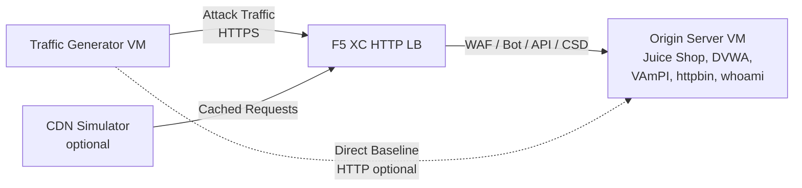

## 全体アーキテクチャ

トラフィックジェネレーターは、多層デモ環境の1つのコンポーネントです。すべてのコンポーネントがデプロイされた場合の完全なアーキテクチャは以下の通りです：

```
Traffic Generator -> F5 XC HTTP LB (WAF/Bot/API/CSD) -> Origin Server
                         |
               CDN Simulator (optional)
```



各コンポーネントは独立してデプロイされ、Terraform を介して設定されます。トラフィックジェネレーターはオリジンサーバーに直接ではなく、F5 XC ロードバランサーの FQDN をターゲットにします。

## オリジンサーバー統合

[オリジンサーバー](https://f5xc-salesdemos.github.io/origin-server/) は、トラフィックジェネレーターの攻撃スイートがターゲットとするバックエンドアプリケーションを提供します：

| トラフィックスイート | オリジンアプリケーション | パス |
|---|---|---|
| api-attacks | VAmPI | `/vampi/` |
| bot-simulation | すべてのアプリケーション | すべてのパス |
| cdn-load-testing | CDN Simulator | CDN エンドポイント |
| crapi-exploits | crAPI | `/crapi/` |
| csd-demo-attacks | CSD Demo | `/csd-demo/` |
| dvga-exploits | DVGA | `/dvga/` |
| dvwa-exploits | DVWA | `/dvwa/` |
| javascript-exploits | CSD Demo | `/csd-demo/` |
| juice-shop-exploits | Juice Shop | `/juice-shop/` |
| mitre-attack | すべてのアプリケーション | すべてのパス |
| owasp-scanning | すべてのアプリケーション | すべてのパス |
| performance-testing | すべてのアプリケーション | すべてのパス |
| reconnaissance | すべてのアプリケーション | すべてのパス |
| restaurant-exploits | Restaurant API | `/restaurant/` |
| ssl-scanning | F5 XC LB（オリジンへの直接接続ではない） | N/A |
| traffic-generation | すべてのアプリケーション | すべてのパス |
| web-app-attacks | Juice Shop, DVWA | `/juice-shop/`, `/dvwa/` |

### デプロイ順序

1. まず**オリジンサーバー**をデプロイします -- バックエンドアプリケーションを提供します
2. オリジンサーバーをオリジンプールとして **F5 XC HTTP ロードバランサー**を設定します
3. ロードバランサーに **WAF、Bot Defense、API Security、および CSD ポリシー**をアタッチします
4. `target_fqdn` を F5 XC LB ドメインに設定して**トラフィックジェネレーター**をデプロイします

### ターゲット設定

トラフィックジェネレーターの `config.env` は、アーキテクチャの他のコンポーネントとの接続を定義します：

```bash
# Target the F5 XC load balancer (traffic passes through security policies)
TARGET_FQDN=demo.example.com

# Optional: target the origin server directly (bypasses F5 XC)
TARGET_ORIGIN_IP=20.10.5.100
```

`TARGET_FQDN` が設定されている場合、すべてのスイートスクリプトは `https://<TARGET_FQDN>/...` にトラフィックを送信します。F5 XC ロードバランサーがリクエストを受信し、セキュリティポリシーを適用して、許可されたトラフィックをオリジンサーバーに転送します。

## CSD デモ統合

`javascript-exploits` スイートは、オリジンサーバー上の Client-Side Defense デモ向けに特別に設計されています。このスイートは CSD フェーズ 2 の機能を検証します：

**フェーズ 2 のフロー：**

1. オリジンサーバーが `/csd-demo/` で CSD デモページをホストします
2. F5 XC CSD がページに監視用 JavaScript を注入します
3. トラフィックジェネレーターの javascript-exploits スイートが以下を試みます：
   - Magecart スキマーを模倣したインラインスクリプトの注入
   - フォーム送信をリダイレクトするための DOM 要素の変更
   - 未承認のサードパーティ JavaScript の読み込み
4. F5 XC CSD がこれらの変更を検出し、CSD ダッシュボードに報告します

javascript-exploits スイートを使用するには：

```bash
# Ensure CSD is enabled on the F5 XC HTTP LB for the /csd-demo/ path
# Then run the suite
/opt/traffic-generator/suites/runner.sh javascript-exploits
```

## CDN シミュレーター統合

CDN シミュレーターがデプロイされている場合、アーキテクチャにキャッシングレイヤーが追加されます：

```
Traffic Generator -> CDN Simulator -> F5 XC HTTP LB -> Origin Server
```

CDN シミュレーターは F5 XC ロードバランサーの前段に配置され、レスポンスをキャッシュして CDN のようなヘッダーを追加します。CDN 経由でトラフィックを送信するには：

```bash
# Set TARGET_FQDN to the CDN Simulator's endpoint instead of F5 XC directly
TARGET_FQDN=cdn.demo.example.com
```

これは、CDN を経由して到着するトラフィックを F5 XC がどのように処理するかをデモンストレーションするのに役立ちます。以下が含まれます：

- CDN プロキシヘッダーの背後にある真のクライアント IP の識別
- CDN によって変更された可能性があるリクエストへの WAF ルールの適用
- CDN がブラウザフィンガープリントを変更した場合の Bot Defense の分類

## 直接接続と LB 経由トラフィックの比較

トラフィックジェネレーターは、F5 XC 経由とオリジンへの直接接続の両方でトラフィックを送信することをサポートしています。この比較により、F5 XC セキュリティ機能の価値をデモンストレーションできます：

### F5 XC 経由（デフォルト）

```bash
# Traffic goes: Generator -> F5 XC LB -> Origin
TARGET_FQDN=demo.example.com /opt/traffic-generator/suites/runner.sh web-app-attacks
```

期待される結果：WAF が SQL インジェクション、XSS、コマンドインジェクションのペイロードをブロックします。Security Events ダッシュボードに、違反の詳細とともにブロックされたリクエストが表示されます。

### オリジンへの直接接続（ベースライン）

```bash
# Traffic goes: Generator -> Origin (no security layer)
TARGET_FQDN=20.10.5.100 /opt/traffic-generator/suites/runner.sh web-app-attacks
```

期待される結果：すべてのペイロードがフィルタリングされずにオリジンアプリケーションに到達します。Juice Shop と DVWA が攻撃ペイロードを処理します。これは F5 XC の保護がない場合に何が起こるかをデモンストレーションします。

### サイドバイサイドデモフロー

説得力のあるデモのために、同じスイートを両方の方法で実行します：

1. オリジンに対して直接 `web-app-attacks` を実行します -- 攻撃が成功することを示します
2. F5 XC 経由で `web-app-attacks` を実行します -- 攻撃がブロックされることを示します
3. F5 XC Security Events ダッシュボードを開き、ブロックされたリクエストを表示します
4. スイートの `meta.json` 結果を比較します：直接実行では "passed"（攻撃成功）が多く、LB 経由の実行では "failed"（攻撃ブロック）が多くなります

```bash
TGEN_IP=$(terraform output -raw public_ip)
ORIGIN_IP="20.10.5.100"
LB_FQDN="demo.example.com"

# Run 1: Direct (baseline)
ssh azureuser@${TGEN_IP} "TARGET_FQDN=${ORIGIN_IP} /opt/traffic-generator/suites/runner.sh web-app-attacks"

# Run 2: Through F5 XC
ssh azureuser@${TGEN_IP} "TARGET_FQDN=${LB_FQDN} /opt/traffic-generator/suites/runner.sh web-app-attacks"

# Compare results
ssh azureuser@${TGEN_IP} 'for d in $(ls -t /opt/traffic-generator/results/ | head -2); do echo "=== $d ==="; cat /opt/traffic-generator/results/$d/meta.json; echo; done'
```

## マルチコンポーネント Terraform デプロイメント

フルラボ環境をデプロイする場合、各コンポーネントに対して別々の Terraform ワークスペースまたはディレクトリを使用します：

```bash
# 1. Deploy origin server
cd origin-server
terraform apply -var="subscription_id=YOUR_SUB_ID"
ORIGIN_IP=$(terraform output -raw public_ip)

# 2. Configure F5 XC (manual or via separate Terraform)
# Create origin pool -> HTTP LB -> attach WAF/Bot/API/CSD policies
# LB_FQDN=demo.example.com

# 3. Deploy traffic generator targeting the F5 XC LB
cd ../traffic-generator
terraform apply \
  -var="subscription_id=YOUR_SUB_ID" \
  -var="target_fqdn=demo.example.com" \
  -var="target_origin_ip=${ORIGIN_IP}"

# 4. Generate traffic
TGEN_IP=$(terraform output -raw public_ip)
ssh azureuser@${TGEN_IP} '/opt/traffic-generator/suites/runner.sh web-app-attacks'
```
