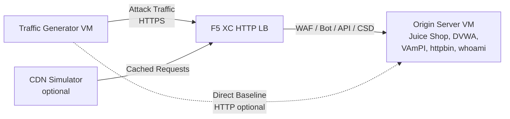

## 完全なアーキテクチャ

トラフィックジェネレーターは、多層デモ環境における一つのコンポーネントです。すべてのコンポーネントがデプロイされた場合の完全なアーキテクチャは以下のとおりです：

```
Traffic Generator -> F5 XC HTTP LB (WAF/Bot/API/CSD) -> Origin Server
                         |
               CDN Simulator (optional)
```



各コンポーネントは独立してデプロイされ、Terraform を通じて設定されます。トラフィックジェネレーターは、オリジンサーバーに直接ではなく、F5 XC ロードバランサーの FQDN をターゲットとします。

## オリジンサーバーの統合

[オリジンサーバー](https://f5xc-salesdemos.github.io/origin-server/)は、トラフィックジェネレーターのアタックスイートがターゲットとするバックエンドアプリケーションを提供します：

| トラフィックスイート | オリジンアプリケーション | パス |
|---|---|---|
| api-attacks | VAmPI | `/vampi/` |
| bot-simulation | すべてのアプリケーション | すべてのパス |
| cdn-load-testing | CDN シミュレーター | CDN エンドポイント |
| crapi-exploits | crAPI | `/crapi/` |
| csd-demo-attacks | CSD デモ | `/csd-demo/` |
| dvga-exploits | DVGA | `/dvga/` |
| dvwa-exploits | DVWA | `/dvwa/` |
| javascript-exploits | CSD デモ | `/csd-demo/` |
| juice-shop-exploits | Juice Shop | `/juice-shop/` |
| mitre-attack | すべてのアプリケーション | すべてのパス |
| owasp-scanning | すべてのアプリケーション | すべてのパス |
| performance-testing | すべてのアプリケーション | すべてのパス |
| reconnaissance | すべてのアプリケーション | すべてのパス |
| restaurant-exploits | Restaurant API | `/restaurant/` |
| ssl-scanning | F5 XC LB（オリジンに直接ではない） | N/A |
| traffic-generation | すべてのアプリケーション | すべてのパス |
| web-app-attacks | Juice Shop、DVWA | `/juice-shop/`、`/dvwa/` |

### デプロイの順序

1. まず**オリジンサーバー**をデプロイする -- バックエンドアプリケーションを提供します
2. オリジンサーバーをオリジンプールとして **F5 XC HTTP ロードバランサー**を設定する
3. **WAF、Bot 高度防御、API セキュリティ、CSD ポリシー**をロードバランサーにアタッチする
4. `target_fqdn` を F5 XC LB ドメインに設定して**トラフィックジェネレーター**をデプロイする

### ターゲット設定

トラフィックジェネレーターの `config.env` により、残りのアーキテクチャに接続します：

```bash
# Target the F5 XC load balancer (traffic passes through security policies)
TARGET_FQDN=demo.example.com

# Optional: target the origin server directly (bypasses F5 XC)
TARGET_ORIGIN_IP=20.10.5.100
```

`TARGET_FQDN` が設定されている場合、すべてのスイートスクリプトは `https://<TARGET_FQDN>/...` へトラフィックを送信します。F5 XC ロードバランサーがリクエストを受信し、セキュリティポリシーを適用して、許可されたトラフィックをオリジンサーバーに転送します。

## CSD デモの統合

`javascript-exploits` スイートは、オリジンサーバー上のクライアントサイド防御デモ専用に設計されています。このスイートは CSD フェーズ 2 の機能を検証します：

**フェーズ 2 のフロー：**

1. オリジンサーバーが `/csd-demo/` に CSD デモページをホストする
2. F5 XC CSD がページに監視用 JavaScript を挿入する
3. トラフィックジェネレーターの javascript-exploits スイートが以下を試みる：
   - Magecart スキマーを模倣したインラインスクリプトの挿入
   - フォーム送信先をリダイレクトする DOM 要素の変更
   - 許可されていないサードパーティ JavaScript の読み込み
4. F5 XC CSD がこれらの変更を検知し、CSD ダッシュボードにレポートする

javascript-exploits スイートを使用するには：

```bash
# Ensure CSD is enabled on the F5 XC HTTP LB for the /csd-demo/ path
# Then run the suite
/opt/traffic-generator/suites/runner.sh javascript-exploits
```

## CDN シミュレーターの統合

CDN シミュレーターがデプロイされている場合、アーキテクチャにキャッシュレイヤーが追加されます：

```
Traffic Generator -> CDN Simulator -> F5 XC HTTP LB -> Origin Server
```

CDN シミュレーターは F5 XC ロードバランサーの前段に位置し、レスポンスをキャッシュして CDN 的なヘッダーを付加します。CDN 経由でトラフィックをターゲットするには：

```bash
# Set TARGET_FQDN to the CDN Simulator's endpoint instead of F5 XC directly
TARGET_FQDN=cdn.demo.example.com
```

これは、CDN を経由して届くトラフィックを F5 XC がどのように処理するかを示す場合に有用です。具体的には以下が含まれます：

- CDN プロキシヘッダー背後の実際のクライアント IP の特定
- CDN によって変更された可能性があるリクエストへの WAF ルールの適用
- CDN がブラウザフィンガープリントを変更した場合の Bot 高度防御による分類

## 直接接続とロードバランサー経由のトラフィック比較

トラフィックジェネレーターは、F5 XC 経由とオリジンへの直接接続の両方でトラフィックを送信することをサポートしています。この比較により、F5 XC セキュリティ機能の価値を実証できます：

### F5 XC 経由（デフォルト）

```bash
# Traffic goes: Generator -> F5 XC LB -> Origin
TARGET_FQDN=demo.example.com /opt/traffic-generator/suites/runner.sh web-app-attacks
```

期待される結果：WAF が SQL インジェクション、XSS、コマンドインジェクションのペイロードをブロックします。セキュリティイベントダッシュボードに、違反の詳細とともにブロックされたリクエストが表示されます。

### オリジンへの直接接続（ベースライン）

```bash
# Traffic goes: Generator -> Origin (no security layer)
TARGET_FQDN=20.10.5.100 /opt/traffic-generator/suites/runner.sh web-app-attacks
```

期待される結果：すべてのペイロードがフィルタリングされずにオリジンアプリケーションに到達します。Juice Shop と DVWA がアタックペイロードを処理します。これは F5 XC による保護がない場合に何が起こるかを示します。

### 並行デモフロー

説得力のあるデモを行うには、同じスイートを両方の方法で実行します：

1. `web-app-attacks` をオリジンに直接実行する -- 攻撃が成功することを示す
2. `web-app-attacks` を F5 XC 経由で実行する -- 攻撃がブロックされることを示す
3. F5 XC セキュリティイベントダッシュボードを開いてブロックされたリクエストを表示する
4. スイートの `meta.json` 結果を比較する：直接実行は「passed」（攻撃が成功）が多く、LB 経由は「failed」（攻撃がブロック）が多くなる

```bash
TGEN_IP=$(terraform output -raw public_ip)
ORIGIN_IP="20.10.5.100"
LB_FQDN="demo.example.com"

# Run 1: Direct (baseline)
ssh azureuser@${TGEN_IP} "TARGET_FQDN=${ORIGIN_IP} /opt/traffic-generator/suites/runner.sh web-app-attacks"

# Run 2: Through F5 XC
ssh azureuser@${TGEN_IP} "TARGET_FQDN=${LB_FQDN} /opt/traffic-generator/suites/runner.sh web-app-attacks"

# Compare results
ssh azureuser@${TGEN_IP} 'for d in $(ls -t /opt/traffic-generator/results/ | head -2); do echo "=== $d ==="; cat /opt/traffic-generator/results/$d/meta.json; echo; done'
```

## マルチコンポーネント Terraform デプロイ

完全なラボ環境をデプロイする際は、各コンポーネントに対して個別の Terraform ワークスペースまたはディレクトリを使用します：

```bash
# 1. Deploy origin server
cd origin-server
terraform apply -var="subscription_id=YOUR_SUB_ID"
ORIGIN_IP=$(terraform output -raw public_ip)

# 2. Configure F5 XC (manual or via separate Terraform)
# Create origin pool -> HTTP LB -> attach WAF/Bot/API/CSD policies
# LB_FQDN=demo.example.com

# 3. Deploy traffic generator targeting the F5 XC LB
cd ../traffic-generator
terraform apply \
  -var="subscription_id=YOUR_SUB_ID" \
  -var="target_fqdn=demo.example.com" \
  -var="target_origin_ip=${ORIGIN_IP}"

# 4. Generate traffic
TGEN_IP=$(terraform output -raw public_ip)
ssh azureuser@${TGEN_IP} '/opt/traffic-generator/suites/runner.sh web-app-attacks'
```
