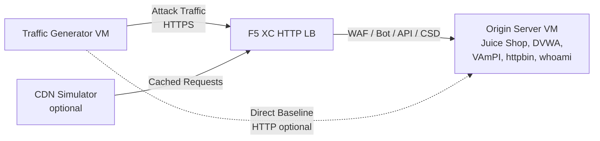

## 完全なアーキテクチャ

トラフィックジェネレーターは、多層デモ環境における1つのコンポーネントです。すべてのコンポーネントがデプロイされた場合の完全なアーキテクチャは以下の通りです：

```
Traffic Generator -> F5 XC HTTP LB (WAF/Bot/API/CSD) -> Origin Server
                         |
               CDN Simulator (optional)
```



各コンポーネントは独立してデプロイされ、Terraform経由で設定されます。トラフィックジェネレーターはオリジンサーバーではなく、F5 XCロードバランサーのFQDNをターゲットとします。

## オリジンサーバーとの統合

[オリジンサーバー](https://f5xc-salesdemos.github.io/origin-server/)は、トラフィックジェネレーターの攻撃スイートがターゲットとするバックエンドアプリケーションを提供します：

| トラフィックスイート | オリジンアプリケーション | パス |
|---|---|---|
| api-attacks | VAmPI | `/vampi/` |
| bot-simulation | すべてのアプリケーション | すべてのパス |
| cdn-load-testing | CDN Simulator | CDNエンドポイント |
| crapi-exploits | crAPI | `/crapi/` |
| csd-demo-attacks | CSD Demo | `/csd-demo/` |
| dvga-exploits | DVGA | `/dvga/` |
| dvwa-exploits | DVWA | `/dvwa/` |
| javascript-exploits | CSD Demo | `/csd-demo/` |
| juice-shop-exploits | Juice Shop | `/juice-shop/` |
| mitre-attack | すべてのアプリケーション | すべてのパス |
| owasp-scanning | すべてのアプリケーション | すべてのパス |
| performance-testing | すべてのアプリケーション | すべてのパス |
| reconnaissance | すべてのアプリケーション | すべてのパス |
| restaurant-exploits | Restaurant API | `/restaurant/` |
| ssl-scanning | F5 XC LB（オリジンへの直接アクセスではない） | N/A |
| traffic-generation | すべてのアプリケーション | すべてのパス |
| web-app-attacks | Juice Shop, DVWA | `/juice-shop/`, `/dvwa/` |

### デプロイ順序

1. 最初に**オリジンサーバー**をデプロイします -- バックエンドアプリケーションを提供します
2. オリジンサーバーをオリジンプールとして**F5 XC HTTPロードバランサー**を設定します
3. ロードバランサーに**WAF、Bot Defense、API Security、CSDポリシー**をアタッチします
4. `target_fqdn`をF5 XC LBドメインに設定して**トラフィックジェネレーター**をデプロイします

### ターゲティング設定

トラフィックジェネレーターの`config.env`は、アーキテクチャの他のコンポーネントとの接続を定義します：

```bash
# Target the F5 XC load balancer (traffic passes through security policies)
TARGET_FQDN=demo.example.com

# Optional: target the origin server directly (bypasses F5 XC)
TARGET_ORIGIN_IP=20.10.5.100
```

`TARGET_FQDN`が設定されている場合、すべてのスイートスクリプトは`https://<TARGET_FQDN>/...`にトラフィックを送信します。F5 XCロードバランサーはリクエストを受信し、セキュリティポリシーを適用した後、許可されたトラフィックをオリジンサーバーに転送します。

## CSDデモとの統合

`javascript-exploits`スイートは、オリジンサーバー上のClient-Side Defenseデモ向けに特別に設計されています。このスイートはCSDフェーズ2の機能を検証します：

**フェーズ2のフロー：**

1. オリジンサーバーが`/csd-demo/`でCSDデモページをホストします
2. F5 XC CSDがそのモニタリングJavaScriptをページに挿入します
3. トラフィックジェネレーターのjavascript-exploitsスイートが以下を試みます：
   - Magecartスキマーを模倣するインラインスクリプトの挿入
   - フォーム送信をリダイレクトするためのDOM要素の変更
   - 未承認のサードパーティJavaScriptの読み込み
4. F5 XC CSDがこれらの変更を検出し、CSDダッシュボードに報告します

javascript-exploitsスイートを使用するには：

```bash
# Ensure CSD is enabled on the F5 XC HTTP LB for the /csd-demo/ path
# Then run the suite
/opt/traffic-generator/suites/runner.sh javascript-exploits
```

## CDNシミュレーターとの統合

CDNシミュレーターがデプロイされている場合、アーキテクチャにキャッシュレイヤーが追加されます：

```
Traffic Generator -> CDN Simulator -> F5 XC HTTP LB -> Origin Server
```

CDNシミュレーターはF5 XCロードバランサーの前段に配置され、レスポンスをキャッシュしてCDNライクなヘッダーを追加します。CDN経由でトラフィックを送信するには：

```bash
# Set TARGET_FQDN to the CDN Simulator's endpoint instead of F5 XC directly
TARGET_FQDN=cdn.demo.example.com
```

これは、CDN経由で到着するトラフィックをF5 XCがどのように処理するかをデモンストレーションする際に有用です。以下が含まれます：

- CDNプロキシヘッダーの背後にある真のクライアントIPの識別
- CDNによって変更された可能性のあるリクエストへのWAFルールの適用
- CDNがブラウザフィンガープリントを変更した場合のBot Defense分類

## 直接アクセスとLB経由トラフィックの比較

トラフィックジェネレーターは、F5 XC経由とオリジンへの直接アクセスの両方でトラフィック送信をサポートしています。この比較により、F5 XCセキュリティ機能の価値を実証できます：

### F5 XC経由（デフォルト）

```bash
# Traffic goes: Generator -> F5 XC LB -> Origin
TARGET_FQDN=demo.example.com /opt/traffic-generator/suites/runner.sh web-app-attacks
```

期待される結果：WAFがSQLインジェクション、XSS、コマンドインジェクションのペイロードをブロックします。Security Eventsダッシュボードにブロックされたリクエストと違反の詳細が表示されます。

### オリジンへの直接アクセス（ベースライン）

```bash
# Traffic goes: Generator -> Origin (no security layer)
TARGET_FQDN=20.10.5.100 /opt/traffic-generator/suites/runner.sh web-app-attacks
```

期待される結果：すべてのペイロードがフィルタリングされずにオリジンアプリケーションに到達します。Juice ShopとDVWAが攻撃ペイロードを処理します。これは、F5 XCの保護がない場合に何が起こるかを実証します。

### サイドバイサイドデモフロー

説得力のあるデモのために、同じスイートを両方の方法で実行します：

1. オリジンに対して直接`web-app-attacks`を実行 -- 攻撃が成功することを示します
2. F5 XC経由で`web-app-attacks`を実行 -- 攻撃がブロックされることを示します
3. F5 XC Security Eventsダッシュボードを開いて、ブロックされたリクエストを表示します
4. スイートの`meta.json`結果を比較：直接実行では「passed」（攻撃成功）が多く表示され、LB経由の実行では「failed」（攻撃ブロック）が多く表示されます

```bash
TGEN_IP=$(terraform output -raw public_ip)
ORIGIN_IP="20.10.5.100"
LB_FQDN="demo.example.com"

# Run 1: Direct (baseline)
ssh azureuser@${TGEN_IP} "TARGET_FQDN=${ORIGIN_IP} /opt/traffic-generator/suites/runner.sh web-app-attacks"

# Run 2: Through F5 XC
ssh azureuser@${TGEN_IP} "TARGET_FQDN=${LB_FQDN} /opt/traffic-generator/suites/runner.sh web-app-attacks"

# Compare results
ssh azureuser@${TGEN_IP} 'for d in $(ls -t /opt/traffic-generator/results/ | head -2); do echo "=== $d ==="; cat /opt/traffic-generator/results/$d/meta.json; echo; done'
```

## マルチコンポーネントTerraformデプロイ

完全なラボ環境をデプロイする場合は、各コンポーネントに対して個別のTerraformワークスペースまたはディレクトリを使用してください：

```bash
# 1. Deploy origin server
cd origin-server
terraform apply -var="subscription_id=YOUR_SUB_ID"
ORIGIN_IP=$(terraform output -raw public_ip)

# 2. Configure F5 XC (manual or via separate Terraform)
# Create origin pool -> HTTP LB -> attach WAF/Bot/API/CSD policies
# LB_FQDN=demo.example.com

# 3. Deploy traffic generator targeting the F5 XC LB
cd ../traffic-generator
terraform apply \
  -var="subscription_id=YOUR_SUB_ID" \
  -var="target_fqdn=demo.example.com" \
  -var="target_origin_ip=${ORIGIN_IP}"

# 4. Generate traffic
TGEN_IP=$(terraform output -raw public_ip)
ssh azureuser@${TGEN_IP} '/opt/traffic-generator/suites/runner.sh web-app-attacks'
```
