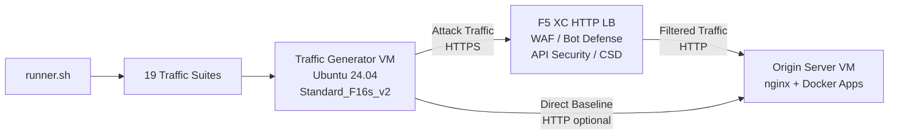

## 목적

이 컴포넌트는 F5 Distributed Cloud HTTP 로드 밸런서를 대상으로 공격 트래픽, 정찰 스캔, 봇 시뮬레이션 및 API 악용을 생성하는 자동화된 트래픽 생성 플랫폼을 제공합니다. 이는 일반적인 데모 아키텍처에서 "공격자" 역할을 하며, F5 XC 보안 기능이 탐지하고 차단하도록 설계된 악성 및 의심스러운 트래픽의 소스입니다.

데모 아키텍처 구성:

```
Traffic Generator VM -> F5 XC HTTP LB (WAF/Bot/API/CSD) -> Origin Server VM
```

Traffic Generator는 F5 XC 로드 밸런서의 공개 FQDN으로 요청을 보냅니다. F5 XC 플랫폼은 트래픽을 검사하고 필터링한 후 정상적인 요청을 오리진 서버로 전달합니다. 운영자는 F5 XC 보안 이벤트 로그를 검토하여 탐지 및 적용을 시연합니다.

## 아키텍처



Traffic Generator VM은 Azure에서 다음과 같이 실행됩니다:

- **Ubuntu 24.04 LTS** 기본 이미지
- **50개 이상의 보안 도구**가 프로비저닝 중 cloud-init을 통해 설치
- **19개의 체계적으로 구성된 트래픽 스위트**가 번호 순서대로 실행되는 스크립트로 구성
- **runner.sh** 오케스트레이터로 스위트 실행 및 결과 로깅 수행
- **config.env**로 대상 구성 (FQDN, 오리진 IP)

## 도구 분류

| 분류 | 도구 | 목적 |
|---|---|---|
| 웹 애플리케이션 테스트 | nikto, sqlmap, nuclei, dalfox, ffuf, gobuster, feroxbuster, dirb, whatweb | WAF 공격 페이로드 생성 |
| 네트워크 분석 | nmap, masscan, tshark, hping3, tcpdump, netcat, ngrep, iperf3, mtr | 정찰 및 네트워크 탐색 |
| MITM 및 프록시 | mitmproxy, socat | 트래픽 가로채기 및 조작 |
| SSL/TLS 테스트 | sslscan, sslyze, testssl.sh | TLS 구성 스캐닝 |
| 브라우저 자동화 | playwright, puppeteer, puppeteer-extra-plugin-stealth | 헤드리스 Chrome을 사용한 봇 시뮬레이션 |
| 서브도메인 및 DNS | subfinder, httpx, amass, dnsrecon, fierce, whois, dnsutils | 정찰 및 열거 |
| 자격 증명 테스트 | hydra, medusa, ncrack | 인증 공격 시뮬레이션 |
| WAF 우회 테스트 | gotestwaf, waf-bypass, wfuzz | 다중 레이어 인코딩 우회 및 WAF 바이패스 평가 |
| 익스플로잇 프레임워크 | ZAP, Metasploit (full 티어만 해당) | 종합적인 취약점 스캐닝 |

## 계층별 설치

Traffic Generator는 `tool_tier` Terraform 변수로 제어되는 두 가지 설치 계층을 지원합니다:

### 표준 계층 (기본값)

ZAP과 Metasploit을 제외한 도구 카탈로그에 나열된 모든 도구를 설치합니다. 프로비저닝은 15-20분 내에 완료됩니다. 이 계층은 19개의 모든 트래픽 스위트를 포함하며 대부분의 데모 시나리오에 충분합니다.

### 전체 계층

표준 계층 위에 OWASP ZAP과 Metasploit Framework를 추가합니다. 프로비저닝에 약 25분이 소요됩니다. 이 도구들은 용량이 크고(ZAP ~500 MiB, Metasploit ~1 GiB) 고급 취약점 스캐닝 데모에서만 필요합니다.

현재 VM 비용은 Azure 가격 계산기를 참조하십시오. 기본 Standard_F16s_v2는 지속적인 트래픽 생성에 적합한 컴퓨팅 최적화 인스턴스입니다.

:::tip
실습 환경을 사용하지 않을 때는 `terraform destroy`를 실행하여 지속적인 요금 발생을 방지하십시오. 절차는 [환경 제거](../08-teardown/)를 참조하십시오.
:::

## 통합 지점

이 컴포넌트는 두 가지 다른 데모 컴포넌트와 통합됩니다:

- **Origin Server** -- Juice Shop, DVWA, VAmPI, httpbin, whoami를 호스팅하는 대상 백엔드입니다. Traffic Generator는 F5 XC를 통해 공격 트래픽을 보내 이러한 애플리케이션에 도달합니다. 전체 아키텍처 세부 사항은 [통합](../07-integrate/)을 참조하십시오.

- **CSD 데모** -- 오리진 서버의 Client-Side Defense 데모 애플리케이션입니다. `javascript-exploits` 트래픽 스위트는 F5 XC Client-Side Defense가 탐지하는 Magecart 스타일의 스크립트 인젝션 페이로드를 생성합니다. 이를 통해 CSD Phase 2 기능을 검증합니다.

## 모듈형 컴포넌트 설계

각 실습 컴포넌트는 자체적으로 완결되며 독립적으로 배포됩니다:

- **Traffic Generator** (이 컴포넌트)는 공격 소스를 제공합니다
- **Origin Server**는 취약한 애플리케이션 대상을 제공합니다
- **CDN Simulator**는 CDN 엣지 캐싱 레이어를 제공합니다 (선택 사항)
- **F5 XC 구성**은 WAF, Bot Defense, API Security, CSD 정책을 제공합니다

운영자 또는 AI 어시스턴트가 컴포넌트를 하나씩 추가합니다. 먼저 오리진 서버를 배포하고, 그 앞에 F5 XC를 구성한 다음, F5 XC 로드 밸런서 FQDN을 대상으로 하는 Traffic Generator를 배포합니다.
