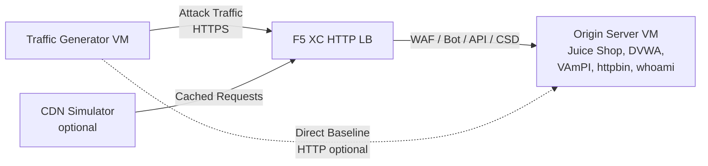

## 전체 아키텍처

트래픽 생성기는 다계층 데모 환경의 하나의 구성 요소입니다. 모든 구성 요소가 배포된 경우의 전체 아키텍처는 다음과 같습니다:

```
Traffic Generator -> F5 XC HTTP LB (WAF/Bot/API/CSD) -> Origin Server
                         |
               CDN Simulator (optional)
```



각 구성 요소는 Terraform을 통해 독립적으로 배포 및 구성됩니다. 트래픽 생성기는 오리진 서버가 아닌 F5 XC 로드 밸런서 FQDN을 대상으로 합니다.

## 오리진 서버 통합

[오리진 서버](https://f5xc-salesdemos.github.io/origin-server/)는 트래픽 생성기의 공격 스위트가 대상으로 하는 백엔드 애플리케이션을 제공합니다:

| 트래픽 스위트 | 오리진 애플리케이션 | 경로 |
|---|---|---|
| api-attacks | VAmPI | `/vampi/` |
| bot-simulation | 모든 애플리케이션 | 모든 경로 |
| cdn-load-testing | CDN Simulator | CDN 엔드포인트 |
| crapi-exploits | crAPI | `/crapi/` |
| csd-demo-attacks | CSD Demo | `/csd-demo/` |
| dvga-exploits | DVGA | `/dvga/` |
| dvwa-exploits | DVWA | `/dvwa/` |
| javascript-exploits | CSD Demo | `/csd-demo/` |
| juice-shop-exploits | Juice Shop | `/juice-shop/` |
| mitre-attack | 모든 애플리케이션 | 모든 경로 |
| owasp-scanning | 모든 애플리케이션 | 모든 경로 |
| performance-testing | 모든 애플리케이션 | 모든 경로 |
| reconnaissance | 모든 애플리케이션 | 모든 경로 |
| restaurant-exploits | Restaurant API | `/restaurant/` |
| ssl-scanning | F5 XC LB (오리진 직접 아님) | N/A |
| traffic-generation | 모든 애플리케이션 | 모든 경로 |
| web-app-attacks | Juice Shop, DVWA | `/juice-shop/`, `/dvwa/` |

### 배포 순서

1. **오리진 서버**를 먼저 배포합니다 -- 백엔드 애플리케이션을 제공합니다
2. 오리진 서버를 오리진 풀로 하여 **F5 XC HTTP 로드 밸런서**를 구성합니다
3. 로드 밸런서에 **WAF, Bot Defense, API Security 및 CSD 정책**을 연결합니다
4. `target_fqdn`을 F5 XC LB 도메인으로 설정하여 **트래픽 생성기**를 배포합니다

### 대상 구성

트래픽 생성기의 `config.env`는 나머지 아키텍처와의 연결을 설정합니다:

```bash
# Target the F5 XC load balancer (traffic passes through security policies)
TARGET_FQDN=demo.example.com

# Optional: target the origin server directly (bypasses F5 XC)
TARGET_ORIGIN_IP=20.10.5.100
```

`TARGET_FQDN`이 설정되면 모든 스위트 스크립트는 `https://<TARGET_FQDN>/...`으로 트래픽을 전송합니다. F5 XC 로드 밸런서가 요청을 수신하고 보안 정책을 적용한 후 허용된 트래픽을 오리진 서버로 전달합니다.

## CSD 데모 통합

`javascript-exploits` 스위트는 오리진 서버의 Client-Side Defense 데모를 위해 특별히 설계되었습니다. 이 스위트는 CSD Phase 2 기능을 검증합니다:

**Phase 2 흐름:**

1. 오리진 서버가 `/csd-demo/`에서 CSD 데모 페이지를 호스팅합니다
2. F5 XC CSD가 페이지에 모니터링 JavaScript를 주입합니다
3. 트래픽 생성기의 javascript-exploits 스위트가 다음을 시도합니다:
   - Magecart 스키머를 모방하는 인라인 스크립트 주입
   - 폼 제출을 리다이렉트하기 위한 DOM 요소 수정
   - 허가되지 않은 서드파티 JavaScript 로드
4. F5 XC CSD가 이러한 수정을 감지하고 CSD 대시보드에 보고합니다

javascript-exploits 스위트를 사용하려면:

```bash
# Ensure CSD is enabled on the F5 XC HTTP LB for the /csd-demo/ path
# Then run the suite
/opt/traffic-generator/suites/runner.sh javascript-exploits
```

## CDN 시뮬레이터 통합

CDN 시뮬레이터가 배포되면 아키텍처에 캐싱 레이어가 추가됩니다:

```
Traffic Generator -> CDN Simulator -> F5 XC HTTP LB -> Origin Server
```

CDN 시뮬레이터는 F5 XC 로드 밸런서 앞단에 위치하여 응답을 캐시하고 CDN 유사 헤더를 추가합니다. CDN을 통해 트래픽을 전송하려면:

```bash
# Set TARGET_FQDN to the CDN Simulator's endpoint instead of F5 XC directly
TARGET_FQDN=cdn.demo.example.com
```

이는 CDN을 통해 도착하는 트래픽을 F5 XC가 어떻게 처리하는지 시연하는 데 유용하며, 다음을 포함합니다:

- CDN 프록시 헤더 뒤에 있는 실제 클라이언트 IP 식별
- CDN에 의해 수정되었을 수 있는 요청에 WAF 규칙 적용
- CDN이 브라우저 핑거프린트를 수정하는 경우의 Bot Defense 분류

## 직접 연결 vs LB 트래픽 비교

트래픽 생성기는 F5 XC를 통한 트래픽 전송과 오리진으로의 직접 전송을 모두 지원합니다. 이 비교를 통해 F5 XC 보안 기능의 가치를 시연할 수 있습니다:

### F5 XC를 통한 전송 (기본값)

```bash
# Traffic goes: Generator -> F5 XC LB -> Origin
TARGET_FQDN=demo.example.com /opt/traffic-generator/suites/runner.sh web-app-attacks
```

예상 결과: WAF가 SQL 인젝션, XSS 및 명령 주입 페이로드를 차단합니다. Security Events 대시보드에 차단된 요청과 위반 세부 정보가 표시됩니다.

### 오리진으로 직접 전송 (기준선)

```bash
# Traffic goes: Generator -> Origin (no security layer)
TARGET_FQDN=20.10.5.100 /opt/traffic-generator/suites/runner.sh web-app-attacks
```

예상 결과: 모든 페이로드가 필터링 없이 오리진 애플리케이션에 도달합니다. Juice Shop과 DVWA가 공격 페이로드를 처리합니다. 이는 F5 XC 보호 없이 어떤 일이 발생하는지 시연합니다.

### 나란히 비교 데모 흐름

설득력 있는 데모를 위해 동일한 스위트를 두 가지 방식으로 실행합니다:

1. 오리진에 직접 `web-app-attacks`를 실행합니다 -- 공격이 성공하는 것을 보여줍니다
2. F5 XC를 통해 `web-app-attacks`를 실행합니다 -- 공격이 차단되는 것을 보여줍니다
3. F5 XC Security Events 대시보드를 열어 차단된 요청을 표시합니다
4. 스위트 `meta.json` 결과를 비교합니다: 직접 실행은 더 많은 "passed"(공격 성공)를 보여주고, LB 실행은 더 많은 "failed"(공격 차단)를 보여줍니다

```bash
TGEN_IP=$(terraform output -raw public_ip)
ORIGIN_IP="20.10.5.100"
LB_FQDN="demo.example.com"

# Run 1: Direct (baseline)
ssh azureuser@${TGEN_IP} "TARGET_FQDN=${ORIGIN_IP} /opt/traffic-generator/suites/runner.sh web-app-attacks"

# Run 2: Through F5 XC
ssh azureuser@${TGEN_IP} "TARGET_FQDN=${LB_FQDN} /opt/traffic-generator/suites/runner.sh web-app-attacks"

# Compare results
ssh azureuser@${TGEN_IP} 'for d in $(ls -t /opt/traffic-generator/results/ | head -2); do echo "=== $d ==="; cat /opt/traffic-generator/results/$d/meta.json; echo; done'
```

## 다중 구성 요소 Terraform 배포

전체 랩 환경을 배포할 때는 각 구성 요소에 대해 별도의 Terraform 워크스페이스 또는 디렉토리를 사용합니다:

```bash
# 1. Deploy origin server
cd origin-server
terraform apply -var="subscription_id=YOUR_SUB_ID"
ORIGIN_IP=$(terraform output -raw public_ip)

# 2. Configure F5 XC (manual or via separate Terraform)
# Create origin pool -> HTTP LB -> attach WAF/Bot/API/CSD policies
# LB_FQDN=demo.example.com

# 3. Deploy traffic generator targeting the F5 XC LB
cd ../traffic-generator
terraform apply \
  -var="subscription_id=YOUR_SUB_ID" \
  -var="target_fqdn=demo.example.com" \
  -var="target_origin_ip=${ORIGIN_IP}"

# 4. Generate traffic
TGEN_IP=$(terraform output -raw public_ip)
ssh azureuser@${TGEN_IP} '/opt/traffic-generator/suites/runner.sh web-app-attacks'
```
