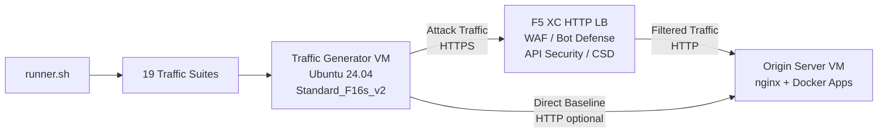

## Finalidade

Este componente fornece uma plataforma automatizada de geração de tráfego que produz tráfego de ataque, varreduras de reconhecimento, simulação de bots e abuso de API contra um load balancer HTTP F5 Distributed Cloud. É o "atacante" em uma arquitetura de demonstração típica -- a fonte de tráfego malicioso e suspeito que os recursos de segurança do F5 XC são projetados para detectar e bloquear.

Na arquitetura de demonstração:

```
VM Geradora de Tráfego -> F5 XC HTTP LB (WAF/Bot/API/CSD) -> VM do Servidor de Origem
```

O Gerador de Tráfego envia requisições para o FQDN público do load balancer F5 XC. A plataforma F5 XC inspeciona e filtra o tráfego antes de encaminhar as requisições legítimas ao servidor de origem. O operador então revisa os logs de eventos de segurança do F5 XC para demonstrar a detecção e a aplicação das políticas.

## Arquitetura



A VM Geradora de Tráfego é executada no Azure com:

- **Ubuntu 24.04 LTS** como imagem base
- **Mais de 50 ferramentas de segurança** instaladas via cloud-init durante o provisionamento
- **19 suítes de tráfego organizadas** com scripts numerados executados em ordem
- Orquestrador **runner.sh** para execução de suítes com registro de resultados
- **config.env** para configuração do alvo (FQDN, IP de origem)

## Categorias de Ferramentas

| Categoria | Ferramentas | Finalidade |
|---|---|---|
| Testes de Aplicação Web | nikto, sqlmap, nuclei, dalfox, ffuf, gobuster, feroxbuster, dirb, whatweb | Geração de payloads de ataque para WAF |
| Análise de Rede | nmap, masscan, tshark, hping3, tcpdump, netcat, ngrep, iperf3, mtr | Reconhecimento e sondagem de rede |
| MITM e Proxy | mitmproxy, socat | Interceptação e manipulação de tráfego |
| Testes SSL/TLS | sslscan, sslyze, testssl.sh | Varredura de configuração TLS |
| Automação de Navegador | playwright, puppeteer, puppeteer-extra-plugin-stealth | Simulação de bots com Chrome headless |
| Subdomínio e DNS | subfinder, httpx, amass, dnsrecon, fierce, whois, dnsutils | Reconhecimento e enumeração |
| Testes de Credenciais | hydra, medusa, ncrack | Simulação de ataques de autenticação |
| Testes de Evasão de WAF | gotestwaf, waf-bypass, wfuzz | Evasão com codificação em múltiplas camadas e avaliação de bypass de WAF |
| Frameworks de Exploração | ZAP, Metasploit (somente nível completo) | Varredura abrangente de vulnerabilidades |

## Instalação em Níveis

O Gerador de Tráfego suporta dois níveis de instalação controlados pela variável Terraform `tool_tier`:

### Nível Padrão (padrão)

Instala todas as ferramentas listadas no catálogo de ferramentas, exceto ZAP e Metasploit. O provisionamento é concluído em 15 a 20 minutos. Este nível abrange todas as 19 suítes de tráfego e é suficiente para a maioria dos cenários de demonstração.

### Nível Completo

Adiciona o OWASP ZAP e o Metasploit Framework além do nível padrão. O provisionamento leva aproximadamente 25 minutos. Essas ferramentas são grandes (ZAP ~500 MiB, Metasploit ~1 GiB) e são necessárias apenas para demonstrações avançadas de varredura de vulnerabilidades.

Consulte a calculadora de preços do Azure para os custos atuais da VM. O Standard_F16s_v2 padrão é uma instância otimizada para computação, adequada para geração de tráfego sustentada.

:::tip
Use `terraform destroy` quando o laboratório não estiver em uso para evitar cobranças contínuas. Consulte [Encerramento](../08-teardown/) para o procedimento.
:::

## Pontos de Integração

Este componente se integra com outros dois componentes de demonstração:

- **Servidor de Origem** -- O backend alvo que hospeda Juice Shop, DVWA, VAmPI, httpbin e whoami. O Gerador de Tráfego envia tráfego de ataque através do F5 XC para alcançar essas aplicações. Consulte [Integração](../07-integrate/) para detalhes completos da arquitetura.

- **Demo CSD** -- A aplicação de demonstração Client-Side Defense no servidor de origem. A suíte de tráfego `javascript-exploits` gera payloads de injeção de scripts no estilo Magecart que o F5 XC Client-Side Defense detecta. Isso valida a funcionalidade CSD Fase 2.

## Design de Componentes Modulares

Cada componente do laboratório é independente e implantado separadamente:

- **Gerador de Tráfego** (este componente) fornece a fonte de ataque
- **Servidor de Origem** fornece os alvos de aplicação vulneráveis
- **Simulador de CDN** fornece a camada de cache de borda CDN (opcional)
- **Configuração do F5 XC** fornece as políticas de WAF, Bot Defense, API Security e CSD

O operador humano ou assistente de IA adiciona componentes um de cada vez. Implante o servidor de origem primeiro, configure o F5 XC à sua frente e, em seguida, implante o gerador de tráfego direcionado ao FQDN do load balancer F5 XC.
