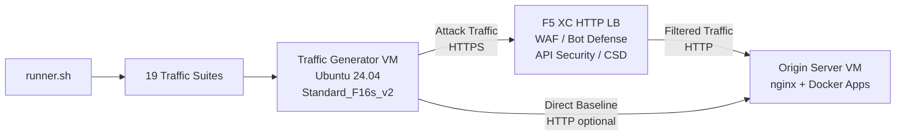

## Objetivo

Este componente fornece uma plataforma automatizada de geração de tráfego que produz tráfego de ataque, varreduras de reconhecimento, simulação de bots e abuso de API contra um balanceador de carga HTTP do F5 Distributed Cloud. Ele é o "atacante" em uma arquitetura de demonstração típica -- a origem do tráfego malicioso e suspeito que os recursos de segurança do F5 XC são projetados para detectar e bloquear.

Na arquitetura de demonstração:

```
Traffic Generator VM -> F5 XC HTTP LB (WAF/Bot/API/CSD) -> Origin Server VM
```

O Traffic Generator envia requisições para o FQDN público do balanceador de carga do F5 XC. A plataforma F5 XC inspeciona e filtra o tráfego antes de encaminhar as requisições legítimas ao servidor de origem. O operador então revisa os logs de eventos de segurança do F5 XC para demonstrar a detecção e a aplicação das políticas.

## Arquitetura



A VM do Traffic Generator é executada no Azure com:

- **Ubuntu 24.04 LTS** como imagem base
- **Mais de 50 ferramentas de segurança** instaladas via cloud-init durante o provisionamento
- **19 suítes de tráfego organizadas** com scripts numerados executados em ordem
- **runner.sh** como orquestrador para execução das suítes com registro de resultados
- **config.env** para configuração do alvo (FQDN, IP de origem)

## Categorias de Ferramentas

| Categoria | Ferramentas | Finalidade |
|---|---|---|
| Teste de Aplicações Web | nikto, sqlmap, nuclei, dalfox, ffuf, gobuster, feroxbuster, dirb, whatweb | Geração de payloads de ataque para WAF |
| Análise de Rede | nmap, masscan, tshark, hping3, tcpdump, netcat, ngrep, iperf3, mtr | Reconhecimento e sondagem de rede |
| MITM e Proxy | mitmproxy, socat | Interceptação e manipulação de tráfego |
| Teste de SSL/TLS | sslscan, sslyze, testssl.sh | Varredura de configuração TLS |
| Automação de Navegador | playwright, puppeteer, puppeteer-extra-plugin-stealth | Simulação de bots com Chrome headless |
| Subdomínio e DNS | subfinder, httpx, amass, dnsrecon, fierce, whois, dnsutils | Reconhecimento e enumeração |
| Teste de Credenciais | hydra, medusa, ncrack | Simulação de ataques de autenticação |
| Teste de Evasão de WAF | gotestwaf, waf-bypass, wfuzz | Evasão por codificação multicamada e avaliação de bypass de WAF |
| Frameworks de Exploração | ZAP, Metasploit (apenas no tier completo) | Varredura abrangente de vulnerabilidades |

## Instalação por Níveis

O Traffic Generator suporta dois níveis de instalação controlados pela variável Terraform `tool_tier`:

### Nível Standard (padrão)

Instala todas as ferramentas listadas no catálogo de ferramentas, exceto ZAP e Metasploit. O provisionamento é concluído em 15-20 minutos. Este nível cobre todas as 19 suítes de tráfego e é suficiente para a maioria dos cenários de demonstração.

### Nível Full

Adiciona o OWASP ZAP e o Metasploit Framework além do nível standard. O provisionamento leva aproximadamente 25 minutos. Essas ferramentas são grandes (ZAP ~500 MiB, Metasploit ~1 GiB) e são necessárias apenas para demonstrações avançadas de varredura de vulnerabilidades.

Consulte a calculadora de preços do Azure para custos atuais de VMs. O padrão Standard_F16s_v2 é uma instância otimizada para computação, adequada para geração sustentada de tráfego.

:::tip
Use `terraform destroy` quando o laboratório não estiver em uso para evitar cobranças contínuas. Consulte [Desativação](../08-teardown/) para o procedimento.
:::

## Pontos de Integração

Este componente integra-se com dois outros componentes de demonstração:

- **Origin Server** -- O backend alvo que hospeda Juice Shop, DVWA, VAmPI, httpbin e whoami. O Traffic Generator envia tráfego de ataque através do F5 XC para alcançar essas aplicações. Consulte [Integração](../07-integrate/) para detalhes completos da arquitetura.

- **Demonstração CSD** -- A aplicação de demonstração do Client-Side Defense no servidor de origem. A suíte de tráfego `javascript-exploits` gera payloads de injeção de script no estilo Magecart que o F5 XC Client-Side Defense detecta. Isso valida a funcionalidade da Fase 2 do CSD.

## Design Modular de Componentes

Cada componente do laboratório é autocontido e implantado independentemente:

- **Traffic Generator** (este componente) fornece a origem dos ataques
- **Origin Server** fornece os alvos de aplicações vulneráveis
- **CDN Simulator** fornece a camada de cache de borda CDN (opcional)
- **Configuração do F5 XC** fornece as políticas de WAF, Bot Defense, API Security e CSD

O operador humano ou assistente de IA adiciona componentes um de cada vez. Implante o servidor de origem primeiro, configure o F5 XC na frente dele e então implante o traffic generator direcionado ao FQDN do balanceador de carga do F5 XC.
