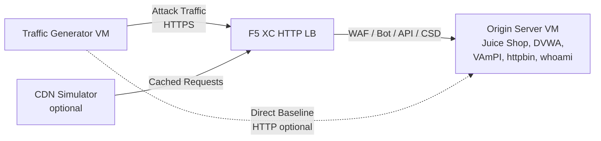

## Arquitetura Completa

O gerador de tráfego é um componente em um ambiente de demonstração multicamadas. A arquitetura completa quando todos os componentes são implantados:

```
Traffic Generator -> F5 XC HTTP LB (WAF/Bot/API/CSD) -> Origin Server
                         |
               CDN Simulator (optional)
```



Cada componente é implantado e configurado independentemente via Terraform. O gerador de tráfego aponta para o FQDN do load balancer do F5 XC, não diretamente para o servidor de origem.

## Integração com o Servidor de Origem

O [servidor de origem](https://f5xc-salesdemos.github.io/origin-server/) fornece as aplicações backend que as suítes de ataque do gerador de tráfego visam:

| Suíte de Tráfego | Aplicação de Origem | Caminho |
|---|---|---|
| api-attacks | VAmPI | `/vampi/` |
| bot-simulation | Todas as aplicações | Todos os caminhos |
| cdn-load-testing | CDN Simulator | Endpoint CDN |
| crapi-exploits | crAPI | `/crapi/` |
| csd-demo-attacks | CSD Demo | `/csd-demo/` |
| dvga-exploits | DVGA | `/dvga/` |
| dvwa-exploits | DVWA | `/dvwa/` |
| javascript-exploits | CSD Demo | `/csd-demo/` |
| juice-shop-exploits | Juice Shop | `/juice-shop/` |
| mitre-attack | Todas as aplicações | Todos os caminhos |
| owasp-scanning | Todas as aplicações | Todos os caminhos |
| performance-testing | Todas as aplicações | Todos os caminhos |
| reconnaissance | Todas as aplicações | Todos os caminhos |
| restaurant-exploits | Restaurant API | `/restaurant/` |
| ssl-scanning | F5 XC LB (não diretamente a origem) | N/A |
| traffic-generation | Todas as aplicações | Todos os caminhos |
| web-app-attacks | Juice Shop, DVWA | `/juice-shop/`, `/dvwa/` |

### Ordem de Implantação

1. Implante o **servidor de origem** primeiro -- ele fornece as aplicações backend
2. Configure o **F5 XC HTTP load balancer** com o servidor de origem como pool de origem
3. Vincule as **políticas de WAF, Bot Defense, API Security e CSD** ao load balancer
4. Implante o **gerador de tráfego** com `target_fqdn` definido para o domínio do F5 XC LB

### Configuração de Destino

O `config.env` do gerador de tráfego o conecta ao restante da arquitetura:

```bash
# Target the F5 XC load balancer (traffic passes through security policies)
TARGET_FQDN=demo.example.com

# Optional: target the origin server directly (bypasses F5 XC)
TARGET_ORIGIN_IP=20.10.5.100
```

Quando `TARGET_FQDN` está definido, todos os scripts das suítes enviam tráfego para `https://<TARGET_FQDN>/...`. O load balancer do F5 XC recebe as requisições, aplica as políticas de segurança e encaminha o tráfego permitido para o servidor de origem.

## Integração com o CSD Demo

A suíte `javascript-exploits` é especificamente projetada para a demonstração do Client-Side Defense no servidor de origem. Esta suíte valida a funcionalidade da Fase 2 do CSD:

**Fluxo da Fase 2:**

1. O servidor de origem hospeda a página de demonstração do CSD em `/csd-demo/`
2. O F5 XC CSD injeta seu JavaScript de monitoramento na página
3. A suíte javascript-exploits do gerador de tráfego tenta:
   - Injetar scripts inline que imitam skimmers Magecart
   - Modificar elementos DOM para redirecionar envios de formulários
   - Carregar JavaScript de terceiros não autorizado
4. O F5 XC CSD detecta essas modificações e as reporta no painel do CSD

Para usar a suíte javascript-exploits:

```bash
# Ensure CSD is enabled on the F5 XC HTTP LB for the /csd-demo/ path
# Then run the suite
/opt/traffic-generator/suites/runner.sh javascript-exploits
```

## Integração com o CDN Simulator

Quando o CDN Simulator é implantado, a arquitetura adiciona uma camada de cache:

```
Traffic Generator -> CDN Simulator -> F5 XC HTTP LB -> Origin Server
```

O CDN Simulator fica à frente do load balancer do F5 XC, armazenando respostas em cache e adicionando cabeçalhos semelhantes aos de CDN. Para direcionar o tráfego através do CDN:

```bash
# Set TARGET_FQDN to the CDN Simulator's endpoint instead of F5 XC directly
TARGET_FQDN=cdn.demo.example.com
```

Isso é útil para demonstrar como o F5 XC lida com tráfego que chega através de um CDN, incluindo:

- Identificar o IP real do cliente por trás dos cabeçalhos de proxy do CDN
- Aplicar regras WAF a requisições que podem ter sido modificadas pelo CDN
- Classificação de Bot Defense quando o CDN modifica fingerprints do navegador

## Comparação de Tráfego Direto vs LB

O gerador de tráfego suporta o envio de tráfego tanto através do F5 XC quanto diretamente para a origem. Essa comparação demonstra o valor dos recursos de segurança do F5 XC:

### Através do F5 XC (padrão)

```bash
# Traffic goes: Generator -> F5 XC LB -> Origin
TARGET_FQDN=demo.example.com /opt/traffic-generator/suites/runner.sh web-app-attacks
```

Esperado: O WAF bloqueia payloads de SQL injection, XSS e injeção de comandos. O painel de Security Events mostra as requisições bloqueadas com detalhes das violações.

### Direto para a Origem (baseline)

```bash
# Traffic goes: Generator -> Origin (no security layer)
TARGET_FQDN=20.10.5.100 /opt/traffic-generator/suites/runner.sh web-app-attacks
```

Esperado: Todos os payloads alcançam as aplicações de origem sem filtro. Juice Shop e DVWA processam os payloads de ataque. Isso demonstra o que acontece sem a proteção do F5 XC.

### Fluxo de Demonstração Lado a Lado

Para uma demonstração impactante, execute a mesma suíte de ambas as formas:

1. Execute `web-app-attacks` diretamente contra a origem -- mostre que os ataques são bem-sucedidos
2. Execute `web-app-attacks` através do F5 XC -- mostre que os ataques são bloqueados
3. Abra o painel de Security Events do F5 XC para exibir as requisições bloqueadas
4. Compare os resultados do `meta.json` da suíte: execuções diretas mostram mais "passed" (ataques bem-sucedidos), execuções via LB mostram mais "failed" (ataques bloqueados)

```bash
TGEN_IP=$(terraform output -raw public_ip)
ORIGIN_IP="20.10.5.100"
LB_FQDN="demo.example.com"

# Run 1: Direct (baseline)
ssh azureuser@${TGEN_IP} "TARGET_FQDN=${ORIGIN_IP} /opt/traffic-generator/suites/runner.sh web-app-attacks"

# Run 2: Through F5 XC
ssh azureuser@${TGEN_IP} "TARGET_FQDN=${LB_FQDN} /opt/traffic-generator/suites/runner.sh web-app-attacks"

# Compare results
ssh azureuser@${TGEN_IP} 'for d in $(ls -t /opt/traffic-generator/results/ | head -2); do echo "=== $d ==="; cat /opt/traffic-generator/results/$d/meta.json; echo; done'
```

## Implantação Terraform Multi-Componente

Ao implantar o ambiente de laboratório completo, utilize workspaces ou diretórios Terraform separados para cada componente:

```bash
# 1. Deploy origin server
cd origin-server
terraform apply -var="subscription_id=YOUR_SUB_ID"
ORIGIN_IP=$(terraform output -raw public_ip)

# 2. Configure F5 XC (manual or via separate Terraform)
# Create origin pool -> HTTP LB -> attach WAF/Bot/API/CSD policies
# LB_FQDN=demo.example.com

# 3. Deploy traffic generator targeting the F5 XC LB
cd ../traffic-generator
terraform apply \
  -var="subscription_id=YOUR_SUB_ID" \
  -var="target_fqdn=demo.example.com" \
  -var="target_origin_ip=${ORIGIN_IP}"

# 4. Generate traffic
TGEN_IP=$(terraform output -raw public_ip)
ssh azureuser@${TGEN_IP} '/opt/traffic-generator/suites/runner.sh web-app-attacks'
```
