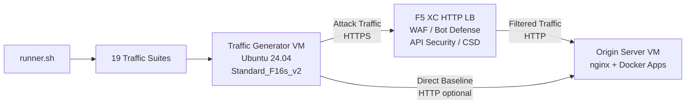

## วัตถุประสงค์

ส่วนประกอบนี้มอบแพลตฟอร์มการสร้างทราฟฟิกอัตโนมัติที่สร้างทราฟฟิกโจมตี การสแกนลาดตระเวน การจำลอง bot และการใช้ API ในทางที่ผิดต่อ F5 Distributed Cloud HTTP load balancer โดยทำหน้าที่เป็น "ผู้โจมตี" ในสถาปัตยกรรมสาธิตทั่วไป -- เป็นแหล่งที่มาของทราฟฟิกที่เป็นอันตรายและน่าสงสัยที่ฟีเจอร์ความปลอดภัยของ F5 XC ได้รับการออกแบบมาเพื่อตรวจจับและบล็อก

ในสถาปัตยกรรมสาธิต:

```
Traffic Generator VM -> F5 XC HTTP LB (WAF/Bot/API/CSD) -> Origin Server VM
```

ตัวสร้างทราฟฟิกส่งคำขอไปยัง public FQDN ของ F5 XC load balancer แพลตฟอร์ม F5 XC จะตรวจสอบและกรองทราฟฟิกก่อนส่งต่อคำขอที่ถูกต้องไปยังเซิร์ฟเวอร์ต้นทาง จากนั้นผู้ดำเนินการจะตรวจสอบบันทึกเหตุการณ์ความปลอดภัยของ F5 XC เพื่อสาธิตการตรวจจับและการบังคับใช้

## สถาปัตยกรรม



Traffic Generator VM ทำงานบน Azure โดยมี:

- **Ubuntu 24.04 LTS** เป็น base image
- **เครื่องมือความปลอดภัยมากกว่า 50 รายการ** ติดตั้งผ่าน cloud-init ในระหว่างการจัดเตรียม
- **19 ชุดทราฟฟิกที่จัดระเบียบ** พร้อมสคริปต์ที่มีหมายเลขกำกับและดำเนินการตามลำดับ
- **runner.sh** ตัวจัดการสำหรับการดำเนินการชุดพร้อมบันทึกผลลัพธ์
- **config.env** สำหรับการกำหนดค่าเป้าหมาย (FQDN, origin IP)

## หมวดหมู่เครื่องมือ

| หมวดหมู่ | เครื่องมือ | วัตถุประสงค์ |
|---|---|---|
| การทดสอบแอปพลิเคชันเว็บ | nikto, sqlmap, nuclei, dalfox, ffuf, gobuster, feroxbuster, dirb, whatweb | การสร้าง payload โจมตี WAF |
| การวิเคราะห์เครือข่าย | nmap, masscan, tshark, hping3, tcpdump, netcat, ngrep, iperf3, mtr | การลาดตระเวนและการตรวจสอบเครือข่าย |
| MITM และ Proxy | mitmproxy, socat | การดักฟังและจัดการทราฟฟิก |
| การทดสอบ SSL/TLS | sslscan, sslyze, testssl.sh | การสแกนการกำหนดค่า TLS |
| การทำงานอัตโนมัติของเบราว์เซอร์ | playwright, puppeteer, puppeteer-extra-plugin-stealth | การจำลอง bot ด้วย headless Chrome |
| Subdomain และ DNS | subfinder, httpx, amass, dnsrecon, fierce, whois, dnsutils | การลาดตระเวนและการระบุข้อมูล |
| การทดสอบข้อมูลประจำตัว | hydra, medusa, ncrack | การจำลองการโจมตีการยืนยันตัวตน |
| การทดสอบการหลบเลี่ยง WAF | gotestwaf, waf-bypass, wfuzz | การทดสอบการเข้ารหัสหลายชั้นและการประเมินการหลบเลี่ยง WAF |
| Exploit Frameworks | ZAP, Metasploit (เฉพาะ full tier) | การสแกนช่องโหว่อย่างครอบคลุม |

## การติดตั้งแบบแบ่งระดับ

ตัวสร้างทราฟฟิกรองรับการติดตั้งสองระดับซึ่งควบคุมโดยตัวแปร Terraform `tool_tier`:

### Standard Tier (ค่าเริ่มต้น)

ติดตั้งเครื่องมือทั้งหมดที่ระบุในแคตาล็อกเครื่องมือ ยกเว้น ZAP และ Metasploit การจัดเตรียมเสร็จสมบูรณ์ภายใน 15-20 นาที ระดับนี้ครอบคลุม 19 ชุดทราฟฟิกทั้งหมดและเพียงพอสำหรับสถานการณ์สาธิตส่วนใหญ่

### Full Tier

เพิ่ม OWASP ZAP และ Metasploit Framework บนพื้นฐานของ standard tier การจัดเตรียมใช้เวลาประมาณ 25 นาที เครื่องมือเหล่านี้มีขนาดใหญ่ (ZAP ~500 MiB, Metasploit ~1 GiB) และจำเป็นเฉพาะสำหรับการสาธิตการสแกนช่องโหว่ขั้นสูงเท่านั้น

ดูเครื่องคำนวณราคา Azure สำหรับค่าใช้จ่าย VM ปัจจุบัน Standard_F16s_v2 เริ่มต้นเป็น instance ที่ปรับให้เหมาะสมสำหรับการประมวลผลซึ่งเหมาะสำหรับการสร้างทราฟฟิกต่อเนื่อง

:::tip
ใช้ `terraform destroy` เมื่อไม่ได้ใช้งาน lab เพื่อหลีกเลี่ยงค่าใช้จ่ายที่เกิดขึ้นต่อเนื่อง ดู [Teardown](../08-teardown/) สำหรับขั้นตอน
:::

## จุดบูรณาการ

ส่วนประกอบนี้บูรณาการกับส่วนประกอบสาธิตอื่นอีกสองรายการ:

- **เซิร์ฟเวอร์ต้นทาง** -- backend เป้าหมายที่โฮสต์ Juice Shop, DVWA, VAmPI, httpbin และ whoami ตัวสร้างทราฟฟิกส่งทราฟฟิกโจมตีผ่าน F5 XC เพื่อเข้าถึงแอปพลิเคชันเหล่านี้ ดู [Integration](../07-integrate/) สำหรับรายละเอียดสถาปัตยกรรมทั้งหมด

- **CSD Demo** -- แอปพลิเคชันสาธิตการป้องกันฝั่งไคลเอนต์บนเซิร์ฟเวอร์ต้นทาง ชุดทราฟฟิก `javascript-exploits` สร้าง payload การฉีดสคริปต์แบบ Magecart ที่ F5 XC การป้องกันฝั่งไคลเอนต์ตรวจจับ ซึ่งยืนยันฟังก์ชันการทำงาน CSD Phase 2

## การออกแบบส่วนประกอบแบบโมดูลาร์

ส่วนประกอบ lab แต่ละรายการเป็นอิสระในตัวเองและถูกนำไปใช้งานแยกกัน:

- **ตัวสร้างทราฟฟิก** (ส่วนประกอบนี้) มอบแหล่งโจมตี
- **เซิร์ฟเวอร์ต้นทาง** มอบเป้าหมายแอปพลิเคชันที่มีช่องโหว่
- **ตัวจำลอง CDN** มอบชั้น CDN edge caching (ทางเลือก)
- **การกำหนดค่า F5 XC** มอบนโยบาย ไฟร์วอลล์แอปเว็บ (WAF), Bot Defense, ความปลอดภัย API และ CSD

ผู้ดำเนินการที่เป็นมนุษย์หรือผู้ช่วย AI เพิ่มส่วนประกอบทีละรายการ นำเซิร์ฟเวอร์ต้นทางไปใช้งานก่อน กำหนดค่า F5 XC ไว้หน้าเซิร์ฟเวอร์ต้นทาง จากนั้นนำตัวสร้างทราฟฟิกไปใช้งานโดยมุ่งเป้าไปที่ FQDN ของ F5 XC load balancer
