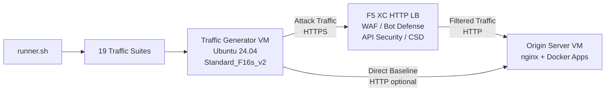

## วัตถุประสงค์

คอมโพเนนต์นี้ให้แพลตฟอร์มสร้างทราฟฟิกอัตโนมัติที่สร้างทราฟฟิกโจมตี, การสแกนตรวจสอบ, การจำลองบอท และการใช้งาน API ในทางที่ผิดต่อ F5 Distributed Cloud HTTP load balancer คอมโพเนนต์นี้ทำหน้าที่เป็น "ผู้โจมตี" ในสถาปัตยกรรมสาธิตทั่วไป -- เป็นแหล่งที่มาของทราฟฟิกที่เป็นอันตรายและน่าสงสัยซึ่งคุณสมบัติความปลอดภัยของ F5 XC ได้รับการออกแบบมาเพื่อตรวจจับและบล็อก

ในสถาปัตยกรรมสาธิต:

```
Traffic Generator VM -> F5 XC HTTP LB (WAF/Bot/API/CSD) -> Origin Server VM
```

Traffic Generator ส่งคำร้องขอไปยัง FQDN สาธารณะของ F5 XC load balancer แพลตฟอร์ม F5 XC ตรวจสอบและกรองทราฟฟิกก่อนส่งต่อคำร้องขอที่ถูกต้องไปยัง origin server จากนั้นผู้ดำเนินการจะตรวจสอบบันทึกเหตุการณ์ความปลอดภัยของ F5 XC เพื่อสาธิตการตรวจจับและการบังคับใช้นโยบาย

## สถาปัตยกรรม



Traffic Generator VM ทำงานบน Azure ด้วย:

- **Ubuntu 24.04 LTS** เป็นอิมเมจพื้นฐาน
- **เครื่องมือความปลอดภัยกว่า 50 รายการ** ติดตั้งผ่าน cloud-init ระหว่างการจัดเตรียม
- **19 ชุดทราฟฟิกที่จัดระเบียบแล้ว** พร้อมสคริปต์ที่มีหมายเลขลำดับซึ่งทำงานตามลำดับ
- **runner.sh** ตัวจัดการสำหรับการรันชุดทราฟฟิกพร้อมบันทึกผลลัพธ์
- **config.env** สำหรับการกำหนดค่าเป้าหมาย (FQDN, origin IP)

## หมวดหมู่เครื่องมือ

| หมวดหมู่ | เครื่องมือ | วัตถุประสงค์ |
|---|---|---|
| การทดสอบเว็บแอปพลิเคชัน | nikto, sqlmap, nuclei, dalfox, ffuf, gobuster, feroxbuster, dirb, whatweb | การสร้าง payload โจมตีสำหรับ WAF |
| การวิเคราะห์เครือข่าย | nmap, masscan, tshark, hping3, tcpdump, netcat, ngrep, iperf3, mtr | การตรวจสอบและสอดแนมเครือข่าย |
| MITM และ Proxy | mitmproxy, socat | การดักจับและจัดการทราฟฟิก |
| การทดสอบ SSL/TLS | sslscan, sslyze, testssl.sh | การสแกนการกำหนดค่า TLS |
| การทำงานอัตโนมัติของเบราว์เซอร์ | playwright, puppeteer, puppeteer-extra-plugin-stealth | การจำลองบอทด้วย headless Chrome |
| ซับโดเมนและ DNS | subfinder, httpx, amass, dnsrecon, fierce, whois, dnsutils | การตรวจสอบและการแจกแจง |
| การทดสอบข้อมูลรับรอง | hydra, medusa, ncrack | การจำลองการโจมตีการยืนยันตัวตน |
| การทดสอบการหลบเลี่ยง WAF | gotestwaf, waf-bypass, wfuzz | การหลบเลี่ยงด้วยการเข้ารหัสหลายชั้นและการประเมินการข้าม WAF |
| เฟรมเวิร์กการโจมตี | ZAP, Metasploit (เฉพาะระดับ full เท่านั้น) | การสแกนช่องโหว่อย่างครอบคลุม |

## การติดตั้งแบบแบ่งระดับ

Traffic Generator รองรับสองระดับการติดตั้งที่ควบคุมโดยตัวแปร Terraform `tool_tier`:

### ระดับ Standard (ค่าเริ่มต้น)

ติดตั้งเครื่องมือทั้งหมดที่ระบุในแคตตาล็อกเครื่องมือยกเว้น ZAP และ Metasploit การจัดเตรียมเสร็จสิ้นใน 15-20 นาที ระดับนี้ครอบคลุมชุดทราฟฟิกทั้ง 19 ชุดและเพียงพอสำหรับสถานการณ์สาธิตส่วนใหญ่

### ระดับ Full

เพิ่ม OWASP ZAP และ Metasploit Framework เพิ่มเติมจากระดับ standard การจัดเตรียมใช้เวลาประมาณ 25 นาที เครื่องมือเหล่านี้มีขนาดใหญ่ (ZAP ~500 MiB, Metasploit ~1 GiB) และจำเป็นเฉพาะสำหรับการสาธิตการสแกนช่องโหว่ขั้นสูงเท่านั้น

ดู Azure pricing calculator สำหรับค่าใช้จ่าย VM ปัจจุบัน Standard_F16s_v2 ค่าเริ่มต้นเป็นอินสแตนซ์ที่ปรับให้เหมาะสมสำหรับการประมวลผล เหมาะสำหรับการสร้างทราฟฟิกอย่างต่อเนื่อง

:::tip
ใช้ `terraform destroy` เมื่อไม่ได้ใช้งานแล็บเพื่อหลีกเลี่ยงค่าใช้จ่ายที่เกิดขึ้นอย่างต่อเนื่อง ดู [การรื้อถอน](../08-teardown/) สำหรับขั้นตอน
:::

## จุดเชื่อมต่อ

คอมโพเนนต์นี้เชื่อมต่อกับคอมโพเนนต์สาธิตอีกสองส่วน:

- **Origin Server** -- เป้าหมายแบ็กเอนด์ที่โฮสต์ Juice Shop, DVWA, VAmPI, httpbin และ whoami Traffic Generator ส่งทราฟฟิกโจมตีผ่าน F5 XC เพื่อเข้าถึงแอปพลิเคชันเหล่านี้ ดู [การเชื่อมต่อ](../07-integrate/) สำหรับรายละเอียดสถาปัตยกรรมทั้งหมด

- **CSD Demo** -- แอปพลิเคชันสาธิต Client-Side Defense บน origin server ชุดทราฟฟิก `javascript-exploits` สร้าง payload การแทรกสคริปต์แบบ Magecart ที่ F5 XC Client-Side Defense ตรวจจับ ซึ่งเป็นการตรวจสอบฟังก์ชันการทำงานของ CSD Phase 2

## การออกแบบคอมโพเนนต์แบบโมดูลาร์

คอมโพเนนต์แล็บแต่ละตัวเป็นอิสระและถูกปรับใช้แยกกัน:

- **Traffic Generator** (คอมโพเนนต์นี้) เป็นแหล่งที่มาของการโจมตี
- **Origin Server** เป็นเป้าหมายแอปพลิเคชันที่มีช่องโหว่
- **CDN Simulator** เป็นชั้นแคช CDN edge (ไม่บังคับ)
- **การกำหนดค่า F5 XC** ให้นโยบาย WAF, Bot Defense, API Security และ CSD

ผู้ดำเนินการหรือผู้ช่วย AI เพิ่มคอมโพเนนต์ทีละตัว ปรับใช้ origin server ก่อน กำหนดค่า F5 XC ด้านหน้า จากนั้นปรับใช้ traffic generator โดยกำหนดเป้าหมายไปที่ FQDN ของ F5 XC load balancer
