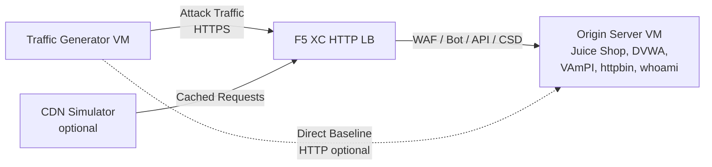

## สถาปัตยกรรมแบบเต็มรูปแบบ

ตัวสร้างทราฟฟิกเป็นหนึ่งในส่วนประกอบของสภาพแวดล้อมสาธิตแบบหลายชั้น สถาปัตยกรรมที่สมบูรณ์เมื่อปรับใช้ส่วนประกอบทั้งหมดจะเป็นดังนี้:

```
Traffic Generator -> F5 XC HTTP LB (WAF/Bot/API/CSD) -> Origin Server
                         |
               CDN Simulator (optional)
```



แต่ละส่วนประกอบถูกปรับใช้และกำหนดค่าแยกกันผ่าน Terraform ตัวสร้างทราฟฟิกจะกำหนดเป้าหมายไปที่ FQDN ของ F5 XC load balancer ไม่ใช่เซิร์ฟเวอร์ต้นทางโดยตรง

## การรวมกับเซิร์ฟเวอร์ต้นทาง

[เซิร์ฟเวอร์ต้นทาง](https://f5xc-salesdemos.github.io/origin-server/) จัดเตรียมแอปพลิเคชันแบ็กเอนด์ที่ชุดการโจมตีของตัวสร้างทราฟฟิกกำหนดเป้าหมาย:

| ชุดทราฟฟิก | แอปพลิเคชันต้นทาง | เส้นทาง |
|---|---|---|
| api-attacks | VAmPI | `/vampi/` |
| bot-simulation | แอปพลิเคชันทั้งหมด | เส้นทางทั้งหมด |
| cdn-load-testing | CDN Simulator | CDN endpoint |
| crapi-exploits | crAPI | `/crapi/` |
| csd-demo-attacks | CSD Demo | `/csd-demo/` |
| dvga-exploits | DVGA | `/dvga/` |
| dvwa-exploits | DVWA | `/dvwa/` |
| javascript-exploits | CSD Demo | `/csd-demo/` |
| juice-shop-exploits | Juice Shop | `/juice-shop/` |
| mitre-attack | แอปพลิเคชันทั้งหมด | เส้นทางทั้งหมด |
| owasp-scanning | แอปพลิเคชันทั้งหมด | เส้นทางทั้งหมด |
| performance-testing | แอปพลิเคชันทั้งหมด | เส้นทางทั้งหมด |
| reconnaissance | แอปพลิเคชันทั้งหมด | เส้นทางทั้งหมด |
| restaurant-exploits | Restaurant API | `/restaurant/` |
| ssl-scanning | F5 XC LB (ไม่ใช่เซิร์ฟเวอร์ต้นทางโดยตรง) | N/A |
| traffic-generation | แอปพลิเคชันทั้งหมด | เส้นทางทั้งหมด |
| web-app-attacks | Juice Shop, DVWA | `/juice-shop/`, `/dvwa/` |

### ลำดับการปรับใช้

1. ปรับใช้**เซิร์ฟเวอร์ต้นทาง**ก่อน -- เป็นตัวจัดเตรียมแอปพลิเคชันแบ็กเอนด์
2. กำหนดค่า **F5 XC HTTP load balancer** โดยใช้เซิร์ฟเวอร์ต้นทางเป็น origin pool
3. แนบ**นโยบาย WAF, Bot Defense, API Security และ CSD** เข้ากับ load balancer
4. ปรับใช้**ตัวสร้างทราฟฟิก**โดยตั้งค่า `target_fqdn` เป็นโดเมน F5 XC LB

### การกำหนดค่าเป้าหมาย

ไฟล์ `config.env` ของตัวสร้างทราฟฟิกเชื่อมต่อกับส่วนอื่นๆ ของสถาปัตยกรรม:

```bash
# Target the F5 XC load balancer (traffic passes through security policies)
TARGET_FQDN=demo.example.com

# Optional: target the origin server directly (bypasses F5 XC)
TARGET_ORIGIN_IP=20.10.5.100
```

เมื่อตั้งค่า `TARGET_FQDN` แล้ว สคริปต์ชุดทั้งหมดจะส่งทราฟฟิกไปที่ `https://<TARGET_FQDN>/...` โดย F5 XC load balancer จะรับคำร้องขอ ใช้นโยบายความปลอดภัย และส่งต่อทราฟฟิกที่อนุญาตไปยังเซิร์ฟเวอร์ต้นทาง

## การรวมกับ CSD Demo

ชุด `javascript-exploits` ถูกออกแบบมาโดยเฉพาะสำหรับการสาธิต Client-Side Defense บนเซิร์ฟเวอร์ต้นทาง ชุดนี้ตรวจสอบการทำงานของ CSD Phase 2:

**ขั้นตอน Phase 2:**

1. เซิร์ฟเวอร์ต้นทางโฮสต์หน้า CSD demo ที่ `/csd-demo/`
2. F5 XC CSD ฉีด JavaScript สำหรับตรวจสอบเข้าไปในหน้าเว็บ
3. ชุด javascript-exploits ของตัวสร้างทราฟฟิกพยายาม:
   - ฉีดสคริปต์แบบ inline ที่เลียนแบบ Magecart skimmers
   - แก้ไของค์ประกอบ DOM เพื่อเปลี่ยนเส้นทางการส่งฟอร์ม
   - โหลด JavaScript จากบุคคลที่สามที่ไม่ได้รับอนุญาต
4. F5 XC CSD ตรวจจับการแก้ไขเหล่านี้และรายงานใน CSD dashboard

วิธีใช้ชุด javascript-exploits:

```bash
# Ensure CSD is enabled on the F5 XC HTTP LB for the /csd-demo/ path
# Then run the suite
/opt/traffic-generator/suites/runner.sh javascript-exploits
```

## การรวมกับ CDN Simulator

เมื่อปรับใช้ CDN Simulator สถาปัตยกรรมจะเพิ่มชั้นแคช:

```
Traffic Generator -> CDN Simulator -> F5 XC HTTP LB -> Origin Server
```

CDN Simulator อยู่ด้านหน้า F5 XC load balancer ทำหน้าที่แคชการตอบกลับและเพิ่มเฮดเดอร์แบบ CDN วิธีกำหนดเป้าหมายทราฟฟิกผ่าน CDN:

```bash
# Set TARGET_FQDN to the CDN Simulator's endpoint instead of F5 XC directly
TARGET_FQDN=cdn.demo.example.com
```

สิ่งนี้มีประโยชน์สำหรับการสาธิตวิธีที่ F5 XC จัดการทราฟฟิกที่เข้ามาผ่าน CDN ซึ่งรวมถึง:

- การระบุ IP จริงของไคลเอนต์ที่อยู่เบื้องหลังเฮดเดอร์พร็อกซีของ CDN
- การใช้กฎ WAF กับคำร้องขอที่อาจถูกแก้ไขโดย CDN
- การจำแนกประเภท Bot Defense เมื่อ CDN แก้ไข browser fingerprints

## การเปรียบเทียบทราฟฟิกแบบตรงกับผ่าน LB

ตัวสร้างทราฟฟิกรองรับการส่งทราฟฟิกทั้งผ่าน F5 XC และโดยตรงไปยังเซิร์ฟเวอร์ต้นทาง การเปรียบเทียบนี้แสดงให้เห็นคุณค่าของคุณสมบัติความปลอดภัยของ F5 XC:

### ผ่าน F5 XC (ค่าเริ่มต้น)

```bash
# Traffic goes: Generator -> F5 XC LB -> Origin
TARGET_FQDN=demo.example.com /opt/traffic-generator/suites/runner.sh web-app-attacks
```

ผลที่คาดหวัง: WAF บล็อกเพย์โหลด SQL injection, XSS และ command injection แดชบอร์ด Security Events แสดงคำร้องขอที่ถูกบล็อกพร้อมรายละเอียดการละเมิด

### ตรงไปยังเซิร์ฟเวอร์ต้นทาง (เส้นฐาน)

```bash
# Traffic goes: Generator -> Origin (no security layer)
TARGET_FQDN=20.10.5.100 /opt/traffic-generator/suites/runner.sh web-app-attacks
```

ผลที่คาดหวัง: เพย์โหลดทั้งหมดเข้าถึงแอปพลิเคชันต้นทางโดยไม่ถูกกรอง Juice Shop และ DVWA ประมวลผลเพย์โหลดการโจมตี สิ่งนี้แสดงให้เห็นสิ่งที่เกิดขึ้นเมื่อไม่มีการป้องกันจาก F5 XC

### ขั้นตอนการสาธิตแบบเปรียบเทียบ

สำหรับการสาธิตที่น่าสนใจ ให้เรียกใช้ชุดเดียวกันทั้งสองวิธี:

1. เรียกใช้ `web-app-attacks` โดยตรงไปยังเซิร์ฟเวอร์ต้นทาง -- แสดงว่าการโจมตีสำเร็จ
2. เรียกใช้ `web-app-attacks` ผ่าน F5 XC -- แสดงว่าการโจมตีถูกบล็อก
3. เปิดแดชบอร์ด F5 XC Security Events เพื่อแสดงคำร้องขอที่ถูกบล็อก
4. เปรียบเทียบผลลัพธ์ `meta.json` ของชุด: การเรียกใช้แบบตรงแสดง "passed" มากกว่า (การโจมตีสำเร็จ) การเรียกใช้ผ่าน LB แสดง "failed" มากกว่า (การโจมตีถูกบล็อก)

```bash
TGEN_IP=$(terraform output -raw public_ip)
ORIGIN_IP="20.10.5.100"
LB_FQDN="demo.example.com"

# Run 1: Direct (baseline)
ssh azureuser@${TGEN_IP} "TARGET_FQDN=${ORIGIN_IP} /opt/traffic-generator/suites/runner.sh web-app-attacks"

# Run 2: Through F5 XC
ssh azureuser@${TGEN_IP} "TARGET_FQDN=${LB_FQDN} /opt/traffic-generator/suites/runner.sh web-app-attacks"

# Compare results
ssh azureuser@${TGEN_IP} 'for d in $(ls -t /opt/traffic-generator/results/ | head -2); do echo "=== $d ==="; cat /opt/traffic-generator/results/$d/meta.json; echo; done'
```

## การปรับใช้ Terraform แบบหลายส่วนประกอบ

เมื่อปรับใช้สภาพแวดล้อมแล็บทั้งหมด ให้ใช้ Terraform workspaces หรือไดเรกทอรีแยกกันสำหรับแต่ละส่วนประกอบ:

```bash
# 1. Deploy origin server
cd origin-server
terraform apply -var="subscription_id=YOUR_SUB_ID"
ORIGIN_IP=$(terraform output -raw public_ip)

# 2. Configure F5 XC (manual or via separate Terraform)
# Create origin pool -> HTTP LB -> attach WAF/Bot/API/CSD policies
# LB_FQDN=demo.example.com

# 3. Deploy traffic generator targeting the F5 XC LB
cd ../traffic-generator
terraform apply \
  -var="subscription_id=YOUR_SUB_ID" \
  -var="target_fqdn=demo.example.com" \
  -var="target_origin_ip=${ORIGIN_IP}"

# 4. Generate traffic
TGEN_IP=$(terraform output -raw public_ip)
ssh azureuser@${TGEN_IP} '/opt/traffic-generator/suites/runner.sh web-app-attacks'
```
