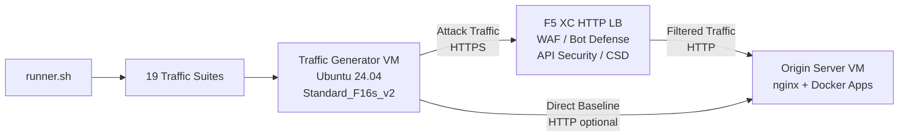

## 用途

本组件提供自动化流量生成平台，可针对 F5 Distributed Cloud HTTP 负载均衡器产生攻击流量、侦察扫描、Bot 模拟及 API 滥用。在典型演示架构中，它扮演"攻击者"角色——即 F5 XC 安全功能所设计用于检测和拦截的恶意及可疑流量的来源。

在演示架构中：

```
流量生成器虚拟机 -> F5 XC HTTP LB（WAF/Bot/API/CSD）-> 源服务器虚拟机
```

流量生成器向 F5 XC 负载均衡器的公共 FQDN 发送请求。F5 XC 平台在将合法请求转发至源服务器之前，对流量进行检查和过滤。操作员随后查阅 F5 XC 安全事件日志，以演示检测与执行效果。

## 架构



流量生成器虚拟机在 Azure 上运行，具备以下特性：

- **Ubuntu 24.04 LTS** 作为基础镜像
- **50+ 安全工具**，在预配过程中通过 cloud-init 安装
- **19 个有序流量套件**，按编号顺序执行脚本
- **runner.sh** 编排器，用于套件执行及结果日志记录
- **config.env** 用于目标配置（FQDN、源服务器 IP）

## 工具分类

| 分类 | 工具 | 用途 |
|---|---|---|
| Web 应用测试 | nikto, sqlmap, nuclei, dalfox, ffuf, gobuster, feroxbuster, dirb, whatweb | WAF 攻击载荷生成 |
| 网络分析 | nmap, masscan, tshark, hping3, tcpdump, netcat, ngrep, iperf3, mtr | 侦察与网络探测 |
| 中间人与代理 | mitmproxy, socat | 流量拦截与操控 |
| SSL/TLS 测试 | sslscan, sslyze, testssl.sh | TLS 配置扫描 |
| 浏览器自动化 | playwright, puppeteer, puppeteer-extra-plugin-stealth | 使用无头 Chrome 模拟 Bot |
| 子域名与 DNS | subfinder, httpx, amass, dnsrecon, fierce, whois, dnsutils | 侦察与枚举 |
| 凭证测试 | hydra, medusa, ncrack | 身份验证攻击模拟 |
| WAF 规避测试 | gotestwaf, waf-bypass, wfuzz | 多层编码规避与 WAF 绕过评估 |
| 漏洞利用框架 | ZAP, Metasploit（仅完整版） | 综合漏洞扫描 |

## 分级安装

流量生成器支持两种安装层级，由 `tool_tier` Terraform 变量控制：

### 标准层级（默认）

安装工具目录中除 ZAP 和 Metasploit 之外的所有工具。预配在 15–20 分钟内完成。该层级涵盖全部 19 个流量套件，适用于大多数演示场景。

### 完整层级

在标准层级的基础上，额外添加 OWASP ZAP 和 Metasploit Framework。预配时间约为 25 分钟。这些工具体积较大（ZAP 约 500 MiB，Metasploit 约 1 GiB），仅在需要进行高级漏洞扫描演示时使用。

请参阅 Azure 定价计算器了解当前虚拟机费用。默认的 Standard_F16s_v2 是一款计算优化实例，适合持续流量生成。

:::tip
在实验室不使用时，请执行 `terraform destroy` 以避免持续产生费用。操作流程请参阅[拆除](../08-teardown/)。
:::

## 集成点

本组件与其他两个演示组件集成：

- **源服务器** —— 托管 Juice Shop、DVWA、VAmPI、httpbin 和 whoami 的目标后端。流量生成器通过 F5 XC 向这些应用发送攻击流量。完整架构详情请参阅[集成](../07-integrate/)。

- **CSD 演示** —— 源服务器上的客户端防御演示应用。`javascript-exploits` 流量套件生成 Magecart 风格的脚本注入载荷，由 F5 XC Client-Side Defense 进行检测。此操作用于验证 CSD 第二阶段功能。

## 模块化组件设计

每个实验室组件均独立自成体系，可独立部署：

- **流量生成器**（本组件）提供攻击源
- **源服务器**提供存在漏洞的应用目标
- **CDN 模拟器**提供 CDN 边缘缓存层（可选）
- **F5 XC 配置**提供 WAF、Bot Defense、API Security 和 CSD 策略

人工操作员或 AI 助手可逐一添加组件。请先部署源服务器，在其前端配置 F5 XC，然后部署以 F5 XC 负载均衡器 FQDN 为目标的流量生成器。
