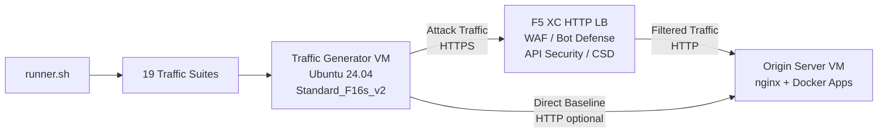

## 用途

该组件提供一个自动化流量生成平台，能够针对 F5 Distributed Cloud HTTP 负载均衡器生成攻击流量、侦察扫描、Bot 模拟和 API 滥用。它是典型演示架构中的"攻击者"——即 F5 XC 安全功能旨在检测和阻断的恶意和可疑流量的来源。

在演示架构中：

```
Traffic Generator VM -> F5 XC HTTP LB (WAF/Bot/API/CSD) -> Origin Server VM
```

流量生成器向 F5 XC 负载均衡器的公共 FQDN 发送请求。F5 XC 平台在将合法请求转发到源服务器之前，会对流量进行检查和过滤。操作人员随后查看 F5 XC 安全事件日志，以演示检测和防护效果。

## 架构



流量生成器虚拟机运行在 Azure 上，具有以下特点：

- **Ubuntu 24.04 LTS** 作为基础镜像
- **50 多种安全工具**，在预配置期间通过 cloud-init 安装
- **19 个有序组织的流量套件**，包含按顺序执行的编号脚本
- **runner.sh** 编排器，用于套件执行和结果记录
- **config.env** 用于目标配置（FQDN、源站 IP）

## 工具分类

| 分类 | 工具 | 用途 |
|---|---|---|
| Web 应用测试 | nikto, sqlmap, nuclei, dalfox, ffuf, gobuster, feroxbuster, dirb, whatweb | WAF 攻击载荷生成 |
| 网络分析 | nmap, masscan, tshark, hping3, tcpdump, netcat, ngrep, iperf3, mtr | 侦察和网络探测 |
| 中间人和代理 | mitmproxy, socat | 流量拦截和操控 |
| SSL/TLS 测试 | sslscan, sslyze, testssl.sh | TLS 配置扫描 |
| 浏览器自动化 | playwright, puppeteer, puppeteer-extra-plugin-stealth | 使用无头 Chrome 进行 Bot 模拟 |
| 子域名和 DNS | subfinder, httpx, amass, dnsrecon, fierce, whois, dnsutils | 侦察和枚举 |
| 凭据测试 | hydra, medusa, ncrack | 认证攻击模拟 |
| WAF 绕过测试 | gotestwaf, waf-bypass, wfuzz | 多层编码绕过和 WAF 旁路评估 |
| 漏洞利用框架 | ZAP, Metasploit（仅完整层级） | 全面的漏洞扫描 |

## 分层安装

流量生成器支持两个安装层级，通过 `tool_tier` Terraform 变量控制：

### 标准层级（默认）

安装工具目录中列出的所有工具，ZAP 和 Metasploit 除外。预配置在 15-20 分钟内完成。该层级覆盖全部 19 个流量套件，能够满足大多数演示场景的需求。

### 完整层级

在标准层级基础上添加 OWASP ZAP 和 Metasploit Framework。预配置大约需要 25 分钟。这些工具体积较大（ZAP 约 500 MiB，Metasploit 约 1 GiB），仅在高级漏洞扫描演示时需要。

请参阅 Azure 定价计算器了解当前虚拟机费用。默认的 Standard_F16s_v2 是计算优化实例，适合持续的流量生成。

:::tip
实验室不使用时，请使用 `terraform destroy` 以避免持续产生费用。相关操作步骤请参阅[环境清理](../08-teardown/)。
:::

## 集成点

该组件与另外两个演示组件集成：

- **源服务器** -- 托管 Juice Shop、DVWA、VAmPI、httpbin 和 whoami 的目标后端。流量生成器通过 F5 XC 发送攻击流量以到达这些应用。完整的架构详情请参阅[集成](../07-integrate/)。

- **CSD 演示** -- 源服务器上的客户端防御演示应用。`javascript-exploits` 流量套件生成 Magecart 风格的脚本注入载荷，由 F5 XC 客户端防御功能检测。这用于验证 CSD 第 2 阶段功能。

## 模块化组件设计

每个实验室组件都是自包含的，独立部署：

- **流量生成器**（本组件）提供攻击源
- **源服务器** 提供易受攻击的应用目标
- **CDN 模拟器** 提供 CDN 边缘缓存层（可选）
- **F5 XC 配置** 提供 WAF、Bot 防御、API 安全和 CSD 策略

由人工操作员或 AI 助手逐一添加组件。首先部署源服务器，在其前面配置 F5 XC，然后部署流量生成器并将其指向 F5 XC 负载均衡器的 FQDN。
