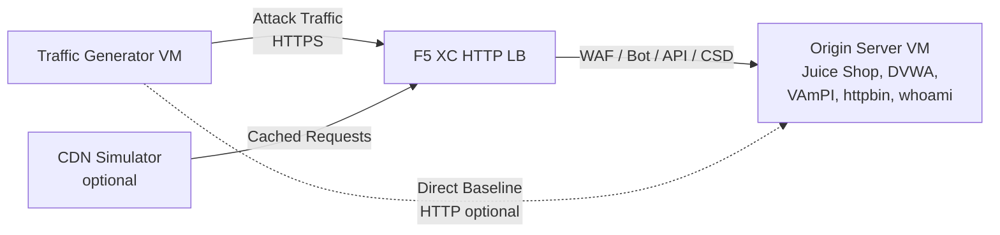

## 完整架构

流量生成器是多层演示环境中的一个组件。当所有组件均已部署时，完整架构如下：

```
Traffic Generator -> F5 XC HTTP LB (WAF/Bot/API/CSD) -> Origin Server
                         |
               CDN Simulator (optional)
```



每个组件均通过 Terraform 独立部署和配置。流量生成器以 F5 XC 负载均衡器的 FQDN 为目标，而非直接指向源服务器。

## 源服务器集成

[源服务器](https://f5-sales-demo.github.io/origin-server/) 提供流量生成器攻击套件所针对的后端应用程序：

| 流量套件 | 源应用程序 | 路径 |
|---|---|---|
| api-attacks | VAmPI | `/vampi/` |
| bot-simulation | 所有应用程序 | 所有路径 |
| cdn-load-testing | CDN 模拟器 | CDN 端点 |
| crapi-exploits | crAPI | `/crapi/` |
| csd-demo-attacks | CSD 演示 | `/csd-demo/` |
| dvga-exploits | DVGA | `/dvga/` |
| dvwa-exploits | DVWA | `/dvwa/` |
| javascript-exploits | CSD 演示 | `/csd-demo/` |
| juice-shop-exploits | Juice Shop | `/juice-shop/` |
| mitre-attack | 所有应用程序 | 所有路径 |
| owasp-scanning | 所有应用程序 | 所有路径 |
| performance-testing | 所有应用程序 | 所有路径 |
| reconnaissance | 所有应用程序 | 所有路径 |
| restaurant-exploits | Restaurant API | `/restaurant/` |
| ssl-scanning | F5 XC LB（非直连源服务器） | 不适用 |
| traffic-generation | 所有应用程序 | 所有路径 |
| web-app-attacks | Juice Shop、DVWA | `/juice-shop/`、`/dvwa/` |

### 部署顺序

1. 首先部署**源服务器** —— 它提供后端应用程序
2. 以源服务器作为源池，配置 **F5 XC HTTP 负载均衡器**
3. 将 **WAF、Bot Defense、API Security 和 CSD 策略**附加到负载均衡器
4. 部署**流量生成器**，并将 `target_fqdn` 设置为 F5 XC LB 域名

### 目标配置

流量生成器的 `config.env` 将其连接到整体架构：

```bash
# Target the F5 XC load balancer (traffic passes through security policies)
TARGET_FQDN=demo.example.com

# Optional: target the origin server directly (bypasses F5 XC)
TARGET_ORIGIN_IP=20.10.5.100
```

设置 `TARGET_FQDN` 后，所有套件脚本均会将流量发送至 `https://<TARGET_FQDN>/...`。F5 XC 负载均衡器接收请求、应用安全策略，并将允许的流量转发至源服务器。

## CSD 演示集成

`javascript-exploits` 套件专为源服务器上的客户端防御（Client-Side Defense）演示而设计，用于验证 CSD 第二阶段功能：

**第二阶段流程：**

1. 源服务器在 `/csd-demo/` 路径托管 CSD 演示页面
2. F5 XC CSD 向页面注入其监控 JavaScript
3. 流量生成器的 javascript-exploits 套件尝试以下操作：
   - 注入模拟 Magecart 信息窃取器的内联脚本
   - 修改 DOM 元素以重定向表单提交
   - 加载未经授权的第三方 JavaScript
4. F5 XC CSD 检测到这些修改并将其上报至 CSD 控制面板

使用 javascript-exploits 套件：

```bash
# Ensure CSD is enabled on the F5 XC HTTP LB for the /csd-demo/ path
# Then run the suite
/opt/traffic-generator/suites/runner.sh javascript-exploits
```

## CDN 模拟器集成

部署 CDN 模拟器后，架构将增加一个缓存层：

```
Traffic Generator -> CDN Simulator -> F5 XC HTTP LB -> Origin Server
```

CDN 模拟器位于 F5 XC 负载均衡器前端，对响应进行缓存并添加类似 CDN 的请求头。若要将流量路由至 CDN：

```bash
# Set TARGET_FQDN to the CDN Simulator's endpoint instead of F5 XC directly
TARGET_FQDN=cdn.demo.example.com
```

此配置适用于演示 F5 XC 如何处理经由 CDN 到达的流量，包括：

- 识别 CDN 代理请求头背后的真实客户端 IP
- 对可能已被 CDN 修改的请求应用 WAF 规则
- 在 CDN 修改浏览器指纹时进行 Bot Defense 分类

## 直连与负载均衡流量对比

流量生成器支持通过 F5 XC 和直连源服务器两种方式发送流量。这种对比可展示 F5 XC 安全功能的价值：

### 通过 F5 XC（默认）

```bash
# Traffic goes: Generator -> F5 XC LB -> Origin
TARGET_FQDN=demo.example.com /opt/traffic-generator/suites/runner.sh web-app-attacks
```

预期结果：WAF 拦截 SQL 注入、XSS 及命令注入载荷。Security Events 控制面板显示包含违规详情的已拦截请求。

### 直连源服务器（基准）

```bash
# Traffic goes: Generator -> Origin (no security layer)
TARGET_FQDN=20.10.5.100 /opt/traffic-generator/suites/runner.sh web-app-attacks
```

预期结果：所有载荷未经过滤直接到达源应用程序。Juice Shop 和 DVWA 处理攻击载荷。这展示了在没有 F5 XC 防护的情况下会发生什么。

### 并排演示流程

为呈现更具说服力的演示，以两种方式运行相同的套件：

1. 直接对源服务器运行 `web-app-attacks` —— 展示攻击成功执行
2. 通过 F5 XC 运行 `web-app-attacks` —— 展示攻击被拦截
3. 打开 F5 XC Security Events 控制面板，显示已拦截的请求
4. 对比套件的 `meta.json` 结果：直连运行显示更多"passed"（攻击成功），LB 运行显示更多"failed"（攻击被拦截）

```bash
TGEN_IP=$(terraform output -raw public_ip)
ORIGIN_IP="20.10.5.100"
LB_FQDN="demo.example.com"

# Run 1: Direct (baseline)
ssh azureuser@${TGEN_IP} "TARGET_FQDN=${ORIGIN_IP} /opt/traffic-generator/suites/runner.sh web-app-attacks"

# Run 2: Through F5 XC
ssh azureuser@${TGEN_IP} "TARGET_FQDN=${LB_FQDN} /opt/traffic-generator/suites/runner.sh web-app-attacks"

# Compare results
ssh azureuser@${TGEN_IP} 'for d in $(ls -t /opt/traffic-generator/results/ | head -2); do echo "=== $d ==="; cat /opt/traffic-generator/results/$d/meta.json; echo; done'
```

## 多组件 Terraform 部署

部署完整实验环境时，请为每个组件使用单独的 Terraform 工作区或目录：

```bash
# 1. Deploy origin server
cd origin-server
terraform apply -var="subscription_id=YOUR_SUB_ID"
ORIGIN_IP=$(terraform output -raw public_ip)

# 2. Configure F5 XC (manual or via separate Terraform)
# Create origin pool -> HTTP LB -> attach WAF/Bot/API/CSD policies
# LB_FQDN=demo.example.com

# 3. Deploy traffic generator targeting the F5 XC LB
cd ../traffic-generator
terraform apply \
  -var="subscription_id=YOUR_SUB_ID" \
  -var="target_fqdn=demo.example.com" \
  -var="target_origin_ip=${ORIGIN_IP}"

# 4. Generate traffic
TGEN_IP=$(terraform output -raw public_ip)
ssh azureuser@${TGEN_IP} '/opt/traffic-generator/suites/runner.sh web-app-attacks'
```
