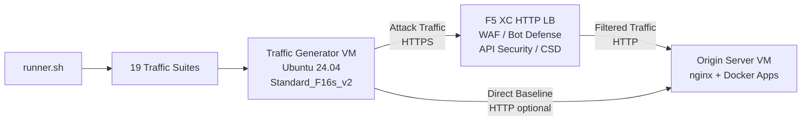

## 用途

此元件提供一個自動化流量生成平台，可對 F5 Distributed Cloud HTTP 負載平衡器產生攻擊流量、偵察掃描、Bot 模擬及 API 濫用。在典型的示範架構中，它扮演「攻擊者」的角色——即 F5 XC 安全功能所設計用來偵測與封鎖的惡意及可疑流量來源。

在示範架構中：

```
Traffic Generator VM -> F5 XC HTTP LB (WAF/Bot/API/CSD) -> Origin Server VM
```

流量生成器將請求發送至 F5 XC 負載平衡器的公開 FQDN。F5 XC 平台在將合法請求轉發至來源伺服器之前，會對流量進行檢查與過濾。操作人員隨後可查看 F5 XC 安全事件日誌，以示範偵測與執行效果。

## 架構



流量生成器 VM 在 Azure 上運行，具備以下特性：

- **Ubuntu 24.04 LTS** 作為基礎映像
- **50+ 安全工具**，於佈建期間透過 cloud-init 安裝
- **19 個有序的流量套件**，以編號順序執行腳本
- **runner.sh** 套件執行協調器，並記錄執行結果
- **config.env** 用於目標設定（FQDN、來源 IP）

## 工具類別

| 類別 | 工具 | 用途 |
|---|---|---|
| Web 應用程式測試 | nikto, sqlmap, nuclei, dalfox, ffuf, gobuster, feroxbuster, dirb, whatweb | WAF 攻擊有效載荷生成 |
| 網路分析 | nmap, masscan, tshark, hping3, tcpdump, netcat, ngrep, iperf3, mtr | 偵察與網路探測 |
| 中間人攻擊與代理 | mitmproxy, socat | 流量攔截與操控 |
| SSL/TLS 測試 | sslscan, sslyze, testssl.sh | TLS 設定掃描 |
| 瀏覽器自動化 | playwright, puppeteer, puppeteer-extra-plugin-stealth | 使用無頭 Chrome 的 Bot 模擬 |
| 子網域與 DNS | subfinder, httpx, amass, dnsrecon, fierce, whois, dnsutils | 偵察與列舉 |
| 憑證測試 | hydra, medusa, ncrack | 身份驗證攻擊模擬 |
| WAF 規避測試 | gotestwaf, waf-bypass, wfuzz | 多層編碼規避與 WAF 繞過評估 |
| 漏洞利用框架 | ZAP, Metasploit（僅完整版） | 全面漏洞掃描 |

## 分層安裝

流量生成器支援兩種安裝層級，由 `tool_tier` Terraform 變數控制：

### 標準版（預設）

安裝工具目錄中除 ZAP 和 Metasploit 以外的所有工具。佈建在 15–20 分鐘內完成。此層級涵蓋所有 19 個流量套件，適用於大多數示範情境。

### 完整版

在標準版的基礎上新增 OWASP ZAP 和 Metasploit Framework。佈建約需 25 分鐘。這些工具體積較大（ZAP 約 500 MiB，Metasploit 約 1 GiB），僅在進階漏洞掃描示範時才需要。

目前 VM 費用請參閱 Azure 定價計算機。預設的 Standard_F16s_v2 是適合持續流量生成的運算最佳化執行個體。

:::tip
實驗室未使用時請執行 `terraform destroy` 以避免持續計費。操作程序請參閱[拆除](../08-teardown/)。
:::

## 整合點

此元件與其他兩個示範元件整合：

- **來源伺服器** —— 目標後端，託管 Juice Shop、DVWA、VAmPI、httpbin 及 whoami。流量生成器透過 F5 XC 將攻擊流量發送至這些應用程式。完整架構詳情請參閱[整合](../07-integrate/)。

- **CSD 示範** —— 來源伺服器上的用戶端防禦示範應用程式。`javascript-exploits` 流量套件生成 Magecart 風格的腳本注入有效載荷，由 F5 XC 用戶端防禦（Client-Side Defense）加以偵測。這用於驗證 CSD 第二階段功能。

## 模組化元件設計

每個實驗室元件均為自包含且獨立部署：

- **流量生成器**（本元件）提供攻擊來源
- **來源伺服器**提供易受攻擊的應用程式目標
- **CDN 模擬器**提供 CDN 邊緣快取層（選用）
- **F5 XC 設定**提供 WAF、Bot Defense、API Security 及 CSD 策略

人工操作員或 AI 助理每次新增一個元件。請先部署來源伺服器，在其前方設定 F5 XC，再部署以 F5 XC 負載平衡器 FQDN 為目標的流量生成器。
