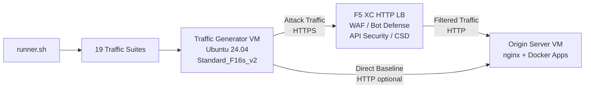

## 目的

此元件提供一個自動化流量產生平台，針對 F5 Distributed Cloud HTTP 負載平衡器產生攻擊流量、偵察掃描、機器人模擬和 API 濫用。它是典型展示架構中的「攻擊者」——F5 XC 安全功能旨在偵測和阻擋的惡意和可疑流量來源。

在展示架構中：

```
Traffic Generator VM -> F5 XC HTTP LB (WAF/Bot/API/CSD) -> Origin Server VM
```

流量產生器將請求發送至 F5 XC 負載平衡器的公開 FQDN。F5 XC 平台會在將合法請求轉發至源伺服器之前檢查和過濾流量。操作人員隨後檢閱 F5 XC 安全事件日誌，以展示偵測和執行效果。

## 架構



流量產生器 VM 在 Azure 上執行，具備：

- **Ubuntu 24.04 LTS** 作為基礎映像
- **超過 50 種安全工具** 在佈建期間透過 cloud-init 安裝
- **19 個組織化的流量套件** 包含依序執行的編號腳本
- **runner.sh** 套件執行編排器，具備結果記錄功能
- **config.env** 用於目標配置（FQDN、源 IP）

## 工具類別

| 類別 | 工具 | 目的 |
|---|---|---|
| 網頁應用程式測試 | nikto, sqlmap, nuclei, dalfox, ffuf, gobuster, feroxbuster, dirb, whatweb | WAF 攻擊載荷產生 |
| 網路分析 | nmap, masscan, tshark, hping3, tcpdump, netcat, ngrep, iperf3, mtr | 偵察和網路探測 |
| 中間人攻擊和代理 | mitmproxy, socat | 流量攔截和操控 |
| SSL/TLS 測試 | sslscan, sslyze, testssl.sh | TLS 配置掃描 |
| 瀏覽器自動化 | playwright, puppeteer, puppeteer-extra-plugin-stealth | 使用無頭 Chrome 的機器人模擬 |
| 子域名和 DNS | subfinder, httpx, amass, dnsrecon, fierce, whois, dnsutils | 偵察和列舉 |
| 憑證測試 | hydra, medusa, ncrack | 認證攻擊模擬 |
| WAF 繞過測試 | gotestwaf, waf-bypass, wfuzz | 多層編碼繞過和 WAF 旁路評估 |
| 漏洞利用框架 | ZAP, Metasploit（僅限完整層級） | 全面的弱點掃描 |

## 分層安裝

流量產生器支援兩個安裝層級，由 `tool_tier` Terraform 變數控制：

### 標準層級（預設）

安裝工具目錄中列出的所有工具，ZAP 和 Metasploit 除外。佈建在 15-20 分鐘內完成。此層級涵蓋所有 19 個流量套件，足以應對大多數展示場景。

### 完整層級

在標準層級之上額外新增 OWASP ZAP 和 Metasploit Framework。佈建大約需要 25 分鐘。這些工具體積龐大（ZAP 約 500 MiB、Metasploit 約 1 GiB），僅在進階弱點掃描展示時需要。

請參閱 Azure 定價計算器以了解目前的 VM 費用。預設的 Standard_F16s_v2 是適合持續流量產生的運算最佳化執行個體。

:::tip
在實驗室未使用時，請使用 `terraform destroy` 以避免持續產生費用。請參閱[拆除](../08-teardown/)以了解程序。
:::

## 整合節點

此元件與其他兩個展示元件整合：

- **源伺服器** —— 託管 Juice Shop、DVWA、VAmPI、httpbin 和 whoami 的目標後端。流量產生器透過 F5 XC 發送攻擊流量以觸及這些應用程式。請參閱[整合](../07-integrate/)以了解完整的架構詳情。

- **CSD 展示** —— 源伺服器上的用戶端防禦展示應用程式。`javascript-exploits` 流量套件產生 Magecart 風格的腳本注入載荷，供 F5 XC Client-Side Defense 偵測。這可驗證 CSD 第 2 階段功能。

## 模組化元件設計

每個實驗室元件皆為獨立且獨自部署：

- **流量產生器**（此元件）提供攻擊來源
- **源伺服器** 提供易受攻擊的應用程式目標
- **CDN 模擬器** 提供 CDN 邊緣快取層（選用）
- **F5 XC 配置** 提供 WAF、Bot Defense、API Security 和 CSD 政策

人類操作人員或 AI 助手逐一新增元件。首先部署源伺服器，在其前方配置 F5 XC，然後部署以 F5 XC 負載平衡器 FQDN 為目標的流量產生器。
