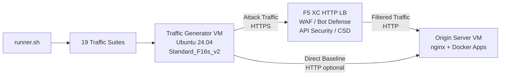

## 用途

此元件提供一個自動化流量產生平台，可針對 F5 Distributed Cloud HTTP 負載均衡器產生攻擊流量、偵察掃描、機器人模擬和 API 濫用。它是典型展示架構中的「攻擊者」——產生 F5 XC 安全功能所設計偵測和阻擋的惡意及可疑流量來源。

在展示架構中：

```
Traffic Generator VM -> F5 XC HTTP LB (WAF/Bot/API/CSD) -> Origin Server VM
```

流量產生器向 F5 XC 負載均衡器的公開 FQDN 發送請求。F5 XC 平台在將合法請求轉發至源站伺服器之前，會檢查並過濾流量。操作人員隨後可檢視 F5 XC 安全事件日誌，以展示偵測和執行效果。

## 架構



流量產生器虛擬機器在 Azure 上執行，具備：

- **Ubuntu 24.04 LTS** 作為基礎映像
- **50+ 安全工具** 在佈建期間透過 cloud-init 安裝
- **19 個組織化流量套件** 包含依序執行的編號腳本
- **runner.sh** 協調器，用於套件執行與結果記錄
- **config.env** 用於目標配置（FQDN、源站 IP）

## 工具分類

| 分類 | 工具 | 用途 |
|---|---|---|
| Web 應用程式測試 | nikto, sqlmap, nuclei, dalfox, ffuf, gobuster, feroxbuster, dirb, whatweb | WAF 攻擊載荷產生 |
| 網路分析 | nmap, masscan, tshark, hping3, tcpdump, netcat, ngrep, iperf3, mtr | 偵察與網路探測 |
| 中間人攻擊與代理 | mitmproxy, socat | 流量攔截與操控 |
| SSL/TLS 測試 | sslscan, sslyze, testssl.sh | TLS 配置掃描 |
| 瀏覽器自動化 | playwright, puppeteer, puppeteer-extra-plugin-stealth | 使用無頭 Chrome 的機器人模擬 |
| 子網域與 DNS | subfinder, httpx, amass, dnsrecon, fierce, whois, dnsutils | 偵察與列舉 |
| 憑證測試 | hydra, medusa, ncrack | 身分驗證攻擊模擬 |
| WAF 規避測試 | gotestwaf, waf-bypass, wfuzz | 多層編碼規避與 WAF 繞過評估 |
| 漏洞利用框架 | ZAP, Metasploit（僅完整層級） | 全面性弱點掃描 |

## 分層安裝

流量產生器支援兩個安裝層級，由 `tool_tier` Terraform 變數控制：

### 標準層級（預設）

安裝工具目錄中列出的所有工具，但不包含 ZAP 和 Metasploit。佈建約在 15-20 分鐘內完成。此層級涵蓋所有 19 個流量套件，足以應付大多數展示場景。

### 完整層級

在標準層級之上額外安裝 OWASP ZAP 和 Metasploit Framework。佈建大約需要 25 分鐘。這些工具體積較大（ZAP 約 500 MiB、Metasploit 約 1 GiB），僅在進階弱點掃描展示時需要。

請參閱 Azure 定價計算器以了解目前的虛擬機器費用。預設的 Standard_F16s_v2 是適合持續流量產生的運算最佳化執行個體。

:::tip
實驗室未使用時請使用 `terraform destroy` 以避免持續產生費用。請參閱[拆除](../08-teardown/)了解相關程序。
:::

## 整合點

此元件與其他兩個展示元件整合：

- **源站伺服器** —— 託管 Juice Shop、DVWA、VAmPI、httpbin 和 whoami 的目標後端。流量產生器透過 F5 XC 發送攻擊流量以存取這些應用程式。請參閱[整合](../07-integrate/)了解完整架構詳情。

- **CSD 展示** —— 源站伺服器上的用戶端防禦展示應用程式。`javascript-exploits` 流量套件會產生 Magecart 風格的腳本注入載荷，供 F5 XC Client-Side Defense 偵測。這可驗證 CSD 第 2 階段功能。

## 模組化元件設計

每個實驗室元件都是獨立且可單獨部署的：

- **流量產生器**（本元件）提供攻擊來源
- **源站伺服器** 提供易受攻擊的應用程式目標
- **CDN 模擬器** 提供 CDN 邊緣快取層（選用）
- **F5 XC 配置** 提供 WAF、Bot Defense、API Security 和 CSD 策略

人工操作人員或 AI 助手逐一新增元件。先部署源站伺服器，在其前方配置 F5 XC，然後部署以 F5 XC 負載均衡器 FQDN 為目標的流量產生器。
