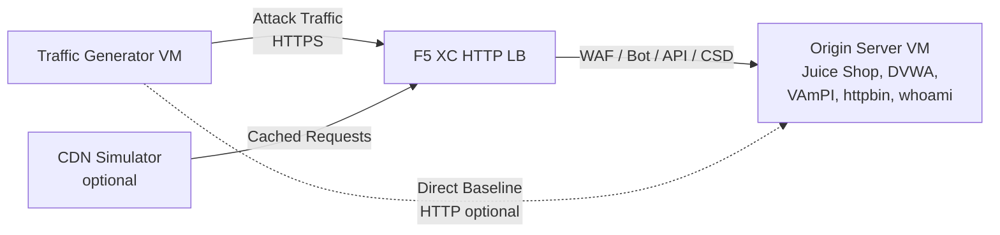

## 完整架構

流量產生器是多層級示範環境中的一個元件。所有元件部署後的完整架構如下：

```
Traffic Generator -> F5 XC HTTP LB (WAF/Bot/API/CSD) -> Origin Server
                         |
               CDN Simulator (optional)
```



每個元件都透過 Terraform 獨立部署和配置。流量產生器的目標是 F5 XC 負載平衡器的 FQDN，而非直接指向源站伺服器。

## 源站伺服器整合

[源站伺服器](https://f5xc-salesdemos.github.io/origin-server/)提供流量產生器攻擊套件所針對的後端應用程式：

| 流量套件 | 源站應用程式 | 路徑 |
|---|---|---|
| api-attacks | VAmPI | `/vampi/` |
| bot-simulation | 所有應用程式 | 所有路徑 |
| cdn-load-testing | CDN Simulator | CDN 端點 |
| crapi-exploits | crAPI | `/crapi/` |
| csd-demo-attacks | CSD Demo | `/csd-demo/` |
| dvga-exploits | DVGA | `/dvga/` |
| dvwa-exploits | DVWA | `/dvwa/` |
| javascript-exploits | CSD Demo | `/csd-demo/` |
| juice-shop-exploits | Juice Shop | `/juice-shop/` |
| mitre-attack | 所有應用程式 | 所有路徑 |
| owasp-scanning | 所有應用程式 | 所有路徑 |
| performance-testing | 所有應用程式 | 所有路徑 |
| reconnaissance | 所有應用程式 | 所有路徑 |
| restaurant-exploits | Restaurant API | `/restaurant/` |
| ssl-scanning | F5 XC LB（非直接指向源站） | N/A |
| traffic-generation | 所有應用程式 | 所有路徑 |
| web-app-attacks | Juice Shop, DVWA | `/juice-shop/`, `/dvwa/` |

### 部署順序

1. 首先部署**源站伺服器** -- 它提供後端應用程式
2. 配置 **F5 XC HTTP 負載平衡器**，將源站伺服器設定為源站池
3. 將 **WAF、Bot Defense、API Security 和 CSD 政策**附加到負載平衡器
4. 部署**流量產生器**，將 `target_fqdn` 設定為 F5 XC LB 網域

### 目標配置

流量產生器的 `config.env` 將其連接到架構的其他部分：

```bash
# Target the F5 XC load balancer (traffic passes through security policies)
TARGET_FQDN=demo.example.com

# Optional: target the origin server directly (bypasses F5 XC)
TARGET_ORIGIN_IP=20.10.5.100
```

當設定 `TARGET_FQDN` 時，所有套件腳本會將流量發送到 `https://<TARGET_FQDN>/...`。F5 XC 負載平衡器接收請求、套用安全政策，並將允許的流量轉發到源站伺服器。

## CSD 示範整合

`javascript-exploits` 套件專為源站伺服器上的 Client-Side Defense 示範而設計。此套件驗證 CSD Phase 2 功能：

**Phase 2 流程：**

1. 源站伺服器在 `/csd-demo/` 路徑託管 CSD 示範頁面
2. F5 XC CSD 將其監控 JavaScript 注入頁面
3. 流量產生器的 javascript-exploits 套件嘗試：
   - 注入模擬 Magecart 側錄程式的內嵌腳本
   - 修改 DOM 元素以重新導向表單提交
   - 載入未授權的第三方 JavaScript
4. F5 XC CSD 偵測這些修改並在 CSD 儀表板中回報

使用 javascript-exploits 套件：

```bash
# Ensure CSD is enabled on the F5 XC HTTP LB for the /csd-demo/ path
# Then run the suite
/opt/traffic-generator/suites/runner.sh javascript-exploits
```

## CDN 模擬器整合

當部署 CDN 模擬器時，架構會增加一個快取層：

```
Traffic Generator -> CDN Simulator -> F5 XC HTTP LB -> Origin Server
```

CDN 模擬器位於 F5 XC 負載平衡器前方，負責快取回應並新增類 CDN 的標頭。若要將流量導向通過 CDN：

```bash
# Set TARGET_FQDN to the CDN Simulator's endpoint instead of F5 XC directly
TARGET_FQDN=cdn.demo.example.com
```

這對於展示 F5 XC 如何處理透過 CDN 抵達的流量非常有用，包括：

- 透過 CDN 代理標頭識別真實的客戶端 IP
- 對可能已被 CDN 修改的請求套用 WAF 規則
- 當 CDN 修改瀏覽器指紋時的 Bot Defense 分類

## 直接流量與負載平衡器流量比較

流量產生器支援同時透過 F5 XC 和直接向源站發送流量。此比較展示了 F5 XC 安全功能的價值：

### 透過 F5 XC（預設）

```bash
# Traffic goes: Generator -> F5 XC LB -> Origin
TARGET_FQDN=demo.example.com /opt/traffic-generator/suites/runner.sh web-app-attacks
```

預期結果：WAF 阻擋 SQL 注入、XSS 和命令注入攻擊載荷。Security Events 儀表板顯示已阻擋的請求及違規詳情。

### 直接到源站（基準線）

```bash
# Traffic goes: Generator -> Origin (no security layer)
TARGET_FQDN=20.10.5.100 /opt/traffic-generator/suites/runner.sh web-app-attacks
```

預期結果：所有攻擊載荷未經過濾直接到達源站應用程式。Juice Shop 和 DVWA 處理攻擊載荷。這展示了在沒有 F5 XC 保護時會發生什麼情況。

### 並排示範流程

若要進行有說服力的示範，以兩種方式執行相同的套件：

1. 直接對源站執行 `web-app-attacks` -- 展示攻擊成功
2. 透過 F5 XC 執行 `web-app-attacks` -- 展示攻擊被阻擋
3. 開啟 F5 XC Security Events 儀表板以顯示已阻擋的請求
4. 比較套件 `meta.json` 結果：直接執行顯示更多「passed」（攻擊成功），LB 執行顯示更多「failed」（攻擊被阻擋）

```bash
TGEN_IP=$(terraform output -raw public_ip)
ORIGIN_IP="20.10.5.100"
LB_FQDN="demo.example.com"

# Run 1: Direct (baseline)
ssh azureuser@${TGEN_IP} "TARGET_FQDN=${ORIGIN_IP} /opt/traffic-generator/suites/runner.sh web-app-attacks"

# Run 2: Through F5 XC
ssh azureuser@${TGEN_IP} "TARGET_FQDN=${LB_FQDN} /opt/traffic-generator/suites/runner.sh web-app-attacks"

# Compare results
ssh azureuser@${TGEN_IP} 'for d in $(ls -t /opt/traffic-generator/results/ | head -2); do echo "=== $d ==="; cat /opt/traffic-generator/results/$d/meta.json; echo; done'
```

## 多元件 Terraform 部署

部署完整實驗環境時，請為每個元件使用獨立的 Terraform 工作區或目錄：

```bash
# 1. Deploy origin server
cd origin-server
terraform apply -var="subscription_id=YOUR_SUB_ID"
ORIGIN_IP=$(terraform output -raw public_ip)

# 2. Configure F5 XC (manual or via separate Terraform)
# Create origin pool -> HTTP LB -> attach WAF/Bot/API/CSD policies
# LB_FQDN=demo.example.com

# 3. Deploy traffic generator targeting the F5 XC LB
cd ../traffic-generator
terraform apply \
  -var="subscription_id=YOUR_SUB_ID" \
  -var="target_fqdn=demo.example.com" \
  -var="target_origin_ip=${ORIGIN_IP}"

# 4. Generate traffic
TGEN_IP=$(terraform output -raw public_ip)
ssh azureuser@${TGEN_IP} '/opt/traffic-generator/suites/runner.sh web-app-attacks'
```
